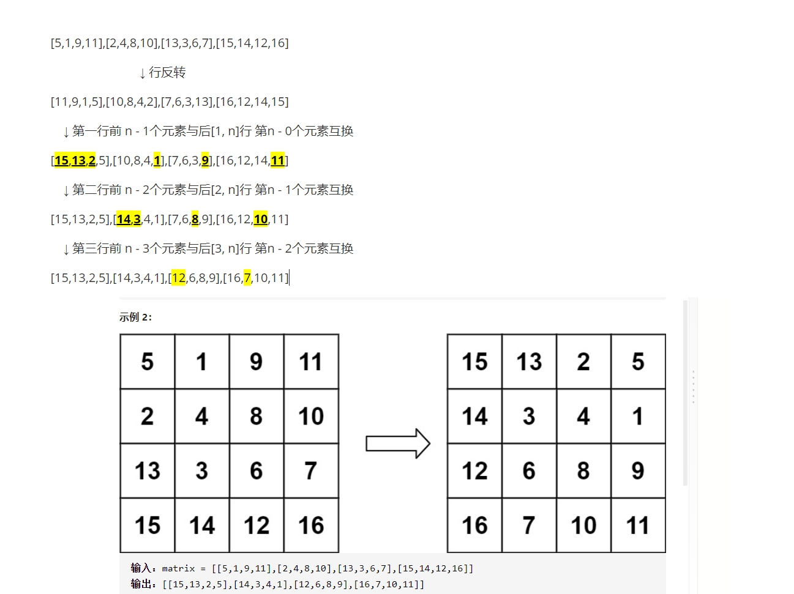
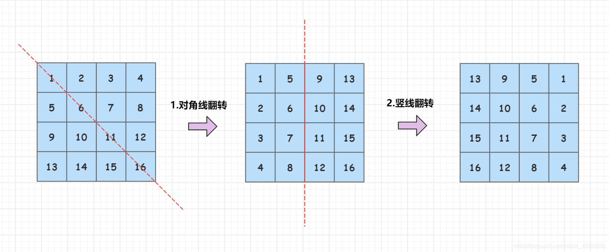

## 48.旋转图像

## [面试题 01.07. 旋转矩阵](https://leetcode-cn.com/problems/rotate-matrix-lcci/)

### 方法一：原地旋转



```js
/**
 * @param {number[][]} matrix
 * @return {void} Do not return anything, modify matrix in-place instead.
 */
var rotate = function(matrix) {
    // 双指针左右翻转，即每行反转
    let length = matrix.length - 1;
    for (let i = 0; i < matrix.length; i++) {
        let left = 0;
        let right = length;

        while(left < right){
            let temp = matrix[i][left];
            matrix[i][left] = matrix[i][right];
            matrix[i][right] = temp;
            left++;
            right--;
        }
    }

    // 原地替换
    for (let i = 0; i < length; i++) {
        for (let j = 0; j < length - i; j++) {
            let temp = matrix[i][j];
            matrix[i][j] = matrix[length - j][length - i];
            matrix[length - j][length - i] = temp;
        }
    }
}
```

### 方法二：左上-右下对角条线



因此可以得出一个结论，顺时针90度应该是左上/右下对角线翻转+左右翻转，或者右上/左下对角线翻转+上下翻转。

过程如下：

- 先以左上-右下对角条线为轴做翻转；
- 再以中心的竖线为轴做翻转；

```js
/**
 * @param {number[][]} matrix
 * @return {void} Do not return anything, modify matrix in-place instead.
 */
var rotate = function(matrix) {
    let n = matrix.length;
    // 先沿斜对角线翻转
    for(let i = 0;i < n; i++) {
        for(let j = 0;j < i; j++){
            let temp = matrix[i][j];
            matrix[i][j] = matrix[j][i];
            matrix[j][i] = temp;
        }
    }
    // 再沿垂直竖线翻转
    for(let i = 0;i < n; i++){
        for(let j = 0, k = n - 1; j < k ; j++, k--){
            let temp = matrix[i][k];
            matrix[i][k] = matrix[i][j];
            matrix[i][j] = temp;
        }
    }
}
```

