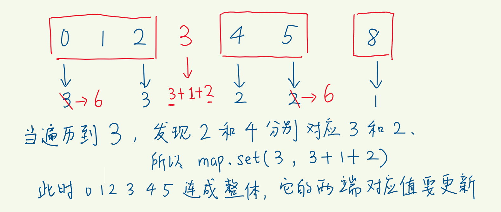
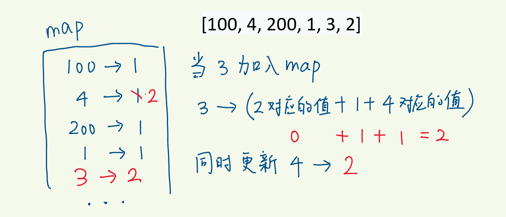

# hash表

## [128. 最长连续序列](https://leetcode-cn.com/problems/longest-consecutive-sequence/)

### 方法一：set查找

```js
/**
 * @param {number[]} nums
 * @return {number}
 */
var longestConsecutive = function(nums) {
    let num_set = new Set();
    for (const num of nums) {
        num_set.add(num);
    }

    let longestStreak = 0;

    for (const num of num_set) {
        // 如果num - 1不存在hash表中，说明当前num和上一个数是不连续
        if (!num_set.has(num - 1)) {
            let currentNum = num;
            let currentStreak = 1;
		   // 计算最大长度
            while (num_set.has(currentNum + 1)) {
                currentNum += 1;
                currentStreak += 1;
            }

            longestStreak = Math.max(longestStreak, currentStreak);
        }
    }

    return longestStreak;   
};
```

### 方法二：Hash表

- key存数字，value存什么？
- 新存入的数字，如果它找到相邻的数，它希望从邻居数那里获取什么信息？
- 很显然它希望，左邻居告诉它左边能提供的连续长度，右邻居告诉它右边能提供的连续长度
- 加上它自己的长度，就有了自己处在的连续序列的长度



- 同处一个连续序列的数字的value理应都相同，这是它们共同特征
- 但没有必要每个的value都是序列长度，只需要两端的数存序列的长度就好
- 因为靠的是两端和新数对接，序列是连续的，中间没有空位
- 序列的一端找到邻居后，将另一端对应的value更新为最新的序列长度



```js
var longestConsecutive = (nums) => {
  let map = new Map()
  let max = 0
  for (const num of nums) { // 遍历nums数组
    if (!map.has(num)) { // 重复的数字不考察，跳过
      let preLen = map.get(num - 1) || 0  // 获取左邻居所在序列的长度 
      let nextLen = map.get(num + 1) || 0 // 获取右邻居所在序列的长度 
      let curLen = preLen + 1 + nextLen   // 新序列的长度
      map.set(num, curLen) // 将自己存入 map
      max = Math.max(max, curLen) // 和 max 比较，试图刷新max
      map.set(num - preLen, curLen)  // 更新新序列的左端数字的value
      map.set(num + nextLen, curLen) // 更新新序列的右端数字的value
    }
  }
  return max
}
```

## [187. 重复的DNA序列](https://leetcode-cn.com/problems/repeated-dna-sequences/)

### 方法一：Hash表

```js
/**
 * @param {string} s
 * @return {string[]}
 */
var findRepeatedDnaSequences = function(s) {
    const L = 10
    const ans = []
    const cnt = new Map()
    const n = s.length
    for (let i = 0; i <= n - L; ++i) {
        const sub = s.slice(i, i + L)
        cnt.set(sub, (cnt.get(sub) || 0) + 1)
        if (cnt.get(sub) === 2) {
            ans.push(sub)
        }
    }
    return ans
}
```

### 方法二：哈希表 + 滑动窗口 + 位运算

由于 s 中只含有 4 种字符，我们可以将每个字符用 2 个比特表示，即：

- A 表示为二进制 00；
- C 表示为二进制 01；
- G 表示为二进制 10；
- T 表示为二进制 11。

如此一来，一个长为 10 的字符串就可以用 20 个比特表示，而一个 int 整数有 32 个比特，足够容纳该字符串，因此我们可以将 s 的每个长为 10 的子串用一个 int 整数表示（只用低 20 位）。

注意到上述字符串到整数的映射是一一映射，每个整数都对应着一个唯一的字符串，因此我们可以将方法一中的哈希表改为存储每个长为 10 的子串的整数表示。

如果我们对每个长为 10 的子串都单独计算其整数表示，那么时间复杂度仍然和方法一一样为 O(NL)。为了优化时间复杂度，我们可以用一个大小固定为 1010 的滑动窗口来计算子串的整数表示。设当前滑动窗口对应的整数表示为 xx，当我们要计算下一个子串时，就将滑动窗口向右移动一位，此时会有一个新的字符进入窗口，以及窗口最左边的字符离开窗口，这些操作对应的位运算，按计算顺序表示如下：

- 滑动窗口向右移动一位：x = x << 2，由于每个字符用 2 个比特表示，所以要左移 2 位；
- 一个新的字符 ch 进入窗口：x = x | bin[ch]，这里bin[ch] 为字符 ch 的对应二进制；
- 窗口最左边的字符离开窗口：x = x & ((1 << 20) - 1)，由于我们只考虑 x 的低 20 位比特，需要将其余位置零，即与上 (1 << 20) - 1。

将这三步合并，就可以用 O(1) 的时间计算出下一个子串的整数表示，即 x = ((x << 2) | bin[ch]) & ((1 << 20) - 1)。

```js
var findRepeatedDnaSequences = function(s) {
    const L = 10
    const bin = new Map()
    bin.set('A', 0)
    bin.set('C', 1)
    bin.set('G', 2)
    bin.set('T', 3)
    
    const ans = []
    const n = s.length
    if (n <= L) {
        return ans
    }
    let x = 0
    for (let i = 0; i < L - 1; ++i) {
        x = (x << 2) | bin.get(s[i])
    }
    const cnt = new Map()
    for (let i = 0; i <= n - L; ++i) {
        x = ((x << 2) | bin.get(s[i + L - 1])) & ((1 << (L * 2)) - 1)
        cnt.set(x, (cnt.get(x) || 0) + 1)
        if (cnt.get(x) === 2) {
            ans.push(s.slice(i, i + L))
        }
    }
    return ans
}
```

## [229. 求众数 II](https://leetcode-cn.com/problems/majority-element-ii/)

### 方法一：Hash表

很容易想到的方法

```js
/**
 * @param {number[]} nums
 * @return {number[]}
 */
var majorityElement = function(nums) {
   const map = new Map()

    for (let i = 0; i < nums.length; i++) {
        map.set(nums[i], (map.get(nums[i]) || 0) + 1)
    }

    const ans = []

    for (const x of map.keys()) {
        if (map.get(x) > Math.floor(nums.length / 3)) {
            ans.push(x)
        }
    }

    return ans
}
```

### 方法二：摩尔投票

这个方法才是这题的重点

```js
var majorityElement = function(nums) {
    let element1 = 0;
    let element2 = 0;
    let vote1 = 0;
    let vote2 = 0;

    for (const num of nums) {
        if (vote1 > 0 && num === element1) { //如果该元素为第一个元素，则计数加1
            vote1++;
        } else if (vote2 > 0 && num === element2) { //如果该元素为第二个元素，则计数加1
            vote2++;
        } else if (vote1 === 0) { // 选择第一个元素
            element1 = num;
            vote1++;
        } else if (vote2 === 0) { // 选择第二个元素
            element2 = num;
            vote2++;
        } else { //如果三个元素均不相同，则相互抵消1次
            vote1--;
            vote2--;
        }
    }

    let cnt1 = 0;
    let cnt2 = 0;
    for (const num of nums) {
        if (vote1 > 0 && num === element1) {
            cnt1++;
        }
        if (vote2 > 0 && num === element2) {
            cnt2++;
        }
    }
    // 检测元素出现的次数是否满足要求
    const ans = [];
    if (vote1 > 0 && cnt1 > Math.floor(nums.length / 3)) {
        ans.push(element1);
    }
    if (vote2 > 0 && cnt2 > Math.floor(nums.length / 3)) {
        ans.push(element2);
    }

    return ans;
};
```

## [869. 重新排序得到 2 的幂](https://leetcode-cn.com/problems/reordered-power-of-2/)

### 方法一：打表 + DFS

```js
```

### 方法二：预处理 + 哈希表

```js
const countDigits = (n) => {
    const cnt = new Array(10).fill(0);
    while (n) {
        cnt[n % 10]++;
        n = Math.floor(n / 10);
    }
    return cnt.join('');
}


var reorderedPowerOf2 = function(n) {
    const powerOf2Digits = new Set();

    for (let n = 1; n <= 1e9; n <<= 1) {
        powerOf2Digits.add(countDigits(n));
    }

    return powerOf2Digits.has(countDigits(n));
};
```

### 方法三：

```c++
class Solution {
public:
    bool reorderedPowerOf2(int n) {
        unordered_set<string> uset={"1", "2", "4", "8", "16", "23", "46", "128", "256", "125", "0124", "0248", "0469", "1289", "13468", "23678", "35566", "011237", "122446", "224588", "0145678", "0122579", "0134449", "0368888", "11266777", "23334455", "01466788", "112234778", "234455668", "012356789", "0112344778"};
        string s(to_string(n));
        sort(s.begin(), s.end());
        return uset.count(s);
    }
};
```

