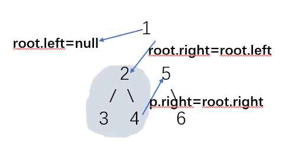
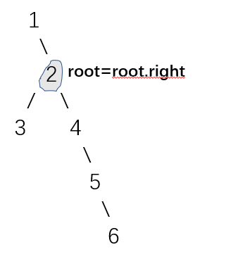

# 处理左子树二叉树

## 二叉树的前中后序遍历

### 前序遍历

#### 递归

```js
/**
 * @param {TreeNode} root
 * @return {number[]}
 */
var postorderTraversal = function(root) {
  let res = []
  const dfs = (node) => {
    if(!node) return
    res.push(node.val)
    dfs(node.left)
    dfs(node.right)
  }
  dfs(root)
  return res
}
```


#### 迭代

```js
/**
 * @param {TreeNode} root
 * @return {number[]}
 */
const preorderTraversal = function(root) {
  // 定义结果数组
  const res = []  
  // 处理边界条件
  if(!root) {
      return res
  }
  // 初始化栈结构
  const stack = [] 
  // 首先将根结点入栈
  stack.push(root)  
  // 若栈不为空，则重复出栈、入栈操作
  while(stack.length) {
      // 将栈顶结点记为当前结点
      const cur = stack.pop() 
      // 当前结点就是当前子树的根结点，把这个结点放在结果数组的尾部
      res.push(cur.val)
      // 若当前子树根结点有右孩子，则将右孩子入栈
      if(cur.right) {
          stack.push(cur.right)
      }
      // 若当前子树根结点有左孩子，则将左孩子入栈
      if(cur.left) {
          stack.push(cur.left)
      }
  }
  // 返回结果数组
  return res
}
```


### 中序遍历

#### 递归

```js
/**
 * @param {TreeNode} root
 * @return {number[]}
 */
var postorderTraversal = function(root) {
  let res = []
  const dfs = (node) => {
    if(!node) return
    dfs(node.left)
    res.push(node.val)
    dfs(node.right)
  }
  dfs(root)
  return res
}
```


#### 迭代

```js
/**
 * @param {TreeNode} root
 * @return {number[]}
 */
const inorderTraversal = function(root) {
  // 定义结果数组
  const res = []  
  // 初始化栈结构
  const stack = []   
  // 用一个 cur 结点充当游标
  let cur = root  
  // 当 cur 不为空、或者 stack 不为空时，重复以下逻辑
  while(cur || stack.length) {
      // 这个 while 的作用是把寻找最左叶子结点的过程中，途径的所有结点都记录下来 
      while(cur) {
          // 将途径的结点入栈
          stack.push(cur)  
          // 继续搜索当前结点的左孩子
          cur = cur.left  
      }
      // 取出栈顶元素
      cur = stack.pop()  
      // 将栈顶元素入栈
      res.push(cur.val)  
      // 尝试读取 cur 结点的右孩子
      cur = cur.right
  }
  // 返回结果数组
  return res
};
```


### 后序遍历

#### 递归

```js
/**
 * @param {TreeNode} root
 * @return {number[]}
 */
var postorderTraversal = function(root) {
  let res = []
  const dfs = (node) => {
    if(!node) return
    dfs(node.left)
    dfs(node.right)
    res.push(node.val)
  }
  dfs(root)
  return res
}
```


#### 迭代

```js
/**
 * @param {TreeNode} root
 * @return {number[]}
 */
const postorderTraversal = function(root) {
  // 定义结果数组
  const res = []  
  // 处理边界条件
  if(!root) {
      return res
  }
  // 初始化栈结构
  const stack = [] 
  // 首先将根结点入栈
  stack.push(root)  
  // 若栈不为空，则重复出栈、入栈操作
  while(stack.length) {
      // 将栈顶结点记为当前结点
      const cur = stack.pop() 
      // 当前结点就是当前子树的根结点，把这个结点放在结果数组的头部
      res.unshift(cur.val)
      // 若当前子树根结点有左孩子，则将左孩子入栈
      if(cur.left) {
        stack.push(cur.left)
      }  
      // 若当前子树根结点有右孩子，则将右孩子入栈
      if(cur.right) {
        stack.push(cur.right)
      }
  }
  // 返回结果数组
  return res
};
```


## [102. 二叉树的层序遍历](https://leetcode-cn.com/problems/binary-tree-level-order-traversal/)

## [剑指 Offer 32 - I. 从上到下打印二叉树](https://leetcode-cn.com/problems/cong-shang-dao-xia-da-yin-er-cha-shu-lcof/)

## [剑指 Offer 32 - II. 从上到下打印二叉树 II](https://leetcode-cn.com/problems/cong-shang-dao-xia-da-yin-er-cha-shu-ii-lcof/)

## [剑指 Offer 32 - III. 从上到下打印二叉树 III](https://leetcode-cn.com/problems/cong-shang-dao-xia-da-yin-er-cha-shu-iii-lcof/)


### 方法一：bfs

```js
var levelOrder = function(root) {
    if(!root) return []
    let queue = [root]
    let res = []
    while(queue.length > 0){
      let len = queue.length
      let arr = []
      while(len){
        let node = queue.shift()
        arr.push(node.val)
        if(node.left) queue.push(node.left)
        if(node.right) queue.push(node.right)
        len--
      }
      /**
        for (let i = 0; i < len; i++) { // 遍历当前层的节点
          let cur = queue.shift() // 出列
          subRes.push(cur.val) // 填充subRes数组
          if (cur.left) queue.push(cur.left) // 下层节点入列
          if (cur.right) queue.push(cur.right)
        }
      */
      res.push(arr)
    }
    return res
}
```

### 方法二：dfs

```js
/**
 * Definition for a binary tree node.
 * function TreeNode(val) {
 *     this.val = val;
 *     this.left = this.right = null;
 * }
 */
/**
 * @param {TreeNode} root
 * @return {number[][]}
 */
var levelOrder = function(root) {
    if(!root) return []
    let res = []
    dfs(root, 0, res)
    return res
};

function dfs(root, step, res){
  if(root){
    if(!res[step]) res[step] = []
    res[step].push(root.val)
    dfs(root.left, step + 1, res)
    dfs(root.right, step + 1, res)
  }
}
```

## [面试题 04.03. 特定深度节点链表](https://leetcode-cn.com/problems/list-of-depth-lcci/)

本题还是层序遍历，但是思路稍微有点不一样

采用层序遍历，对每一行节点生成一个链表，把链表头存入结果数组中，最后返回结果数组即可

```js
/**
 * Definition for a binary tree node.
 * function TreeNode(val) {
 *     this.val = val;
 *     this.left = this.right = null;
 * }
 */
/**
 * Definition for singly-linked list.
 * function ListNode(val) {
 *     this.val = val;
 *     this.next = null;
 * }
 */
/**
 * @param {TreeNode} tree
 * @return {ListNode[]}
 */
var listOfDepth = function(tree) {
    if(tree === null){
        return []
    }
    const queue = [ tree ] // 创建一个队列 queue 初始化树
    const result = [] // 结果数组
    while(queue.length){ // 迭代链表
        let len = queue.length
        let nowLen = len // 备份初始长度用于下面判断是否是当前行的第一个值
        let head = new ListNode(null) // 每行新建一个链表，初始化链表头 head
        // 遍历每一行
        while (len) {
            let node = queue.shift()
            if (len === nowLen) { // 每一行第一个作为链表头插入结果 result 数组
                head = new ListNode(node.val)
                result.push(head)
            } else {
                head.val = node.val
            }
            // 如果不是树的这一行的最后一个节点
            if(len > 1){
                // 把链表的节点的 next 指向以当前值创建的链表
                head.next = new ListNode(node.val)
                // 并把当前节点指向 next 节点
                head = head.next
            }
            node.left && queue.push(node.left) // 如果存在左节点
            node.right && queue.push(node.right) // 如果存在右节点
            len-- // 记得把 len 减一
        }
    }
    return result
};
```


## [236. 二叉树的最近公共祖先](https://leetcode-cn.com/problems/lowest-common-ancestor-of-a-binary-tree/)

## [剑指 Offer 68 - II. 二叉树的最近公共祖先](https://leetcode-cn.com/problems/er-cha-shu-de-zui-jin-gong-gong-zu-xian-lcof/)

### 方法一：递归

我们想一下，对于根节点 root，p、q 的分布，有两种可能：

- p、q 分居 root 的左右子树，则 LCA 为 root。
- p、q 在 root 的同一个子树中，问题转为规模小一点的相同问题。

定义递归函数
递归函数：返回当前子树中 p 和 q 的 LCA。如果没有 LCA，就返回 null。

从根root开始递归搜索，递归搜到各个子树……

- 如果遍历到 p 或 q，比方说 p，则 LCA 要么是当前的 p（q 在 p 的子树中），要么是 p 之上的节点（q 不在 p 的子树中），不可能是 p 之下的节点。不用继续往下遍历，返回当前的 p。

- 当遍历到 null 节点，空树不存在 p 和 q，不存在 LCA，返回 null。

- 当遍历的节点 root 不是 p 或 q 或 null，则递归搜寻 root 的左右子树：
  - 如果左右子树的递归都有结果，说明 p 和 q 分居 root 的左右子树，返回 root。
  - 如果只是一个子树递归调用有结果，说明 p 和 q 都在这个子树，返回该子树递归结果。
  - 如果两个子树递归结果都为 null，说明 p 和 q 都不在这俩子树中，返回 null。

```js
const lowestCommonAncestor = (root, p, q) => {
  if (root == null) { // 遇到null，返回null 没有LCA
    return null;
  }
  if (root == q || root == p) { // 遇到p或q，直接返回当前节点
    return root;
  }
  // 非null 非q 非p，则递归左右子树
  const left = lowestCommonAncestor(root.left, p, q);
  const right = lowestCommonAncestor(root.right, p, q);
  // 根据递归的结果，决定谁是LCA
  if (left && right) {
    return root;
  }

  return left || right
};


var lowestCommonAncestor = function(root, p, q) {
    // 编写 dfs 逻辑
    function dfs(root) {
        // 若当前结点不存在（意味着无效）或者等于p/q（意味着找到目标），则直接返回
        if(!root || root === p || root === q) {
            return root 
        }
        // 向左子树去寻找p和q
        const leftNode = dfs(root.left)  
        // 向右子树去寻找p和q
        const rightNode = dfs(root.right)  
        // 如果左子树和右子树同时包含了p和q，那么这个结点一定是最近公共祖先
        if(leftNode && rightNode) {
            return root 
        } 
        // 如果左子树和右子树其中一个包含了p或者q，则把对应的有效子树汇报上去，等待进一步的判断；否则返回空
        return leftNode || rightNode
    } 

    // 调用 dfs 方法 
    return dfs(root)  
}
```

### 方法二：[后序遍历 DFS ](https://leetcode-cn.com/problems/lowest-common-ancestor-of-a-binary-tree/solution/236-er-cha-shu-de-zui-jin-gong-gong-zu-xian-hou-xu/)

（1） 如果当前结点 `root` 等于 NULL，则直接返回 NULL
（2） 如果 root 等于 pp 或者 q ，那这棵树一定返回 p 或者 q
（3） 然后递归左右子树，**因为是递归，使用函数后可认为左右子树已经算出结果**，用 left 和 right 表示
（4） 此时若left为空，那最终结果只要看 right；若 right 为空，那最终结果只要看 left
（5） 如果 left 和 right 都非空，因为只给了 p 和 q 两个结点，都非空，说明一边一个，因此 root 是他们的最近公共祖先
（6） 如果 left 和 right 都为空，则返回空（其实已经包含在前面的情况中了）

这样理解可能更加清楚一点： `lowestCommonAncestor`这个函数不要理解为找公共祖先，而就理解为帮两个节点找祖先 传入的值是root, p, q，帮p和q找到一个祖先就行，找到两个就更好了，如果找不到就返回NULL 在root->left里面找一次，root->right里面再找一次，如果某一边返回值是NULL， 那么说明两个值都在另一边 由于找的时候，一定是找的最近的祖先返回，所以这里直接返回前面的返回值就行了，可以保证是最近的公共祖先 如果左右的返回值都不是NULL，那说明p和q分别在两边，则当前节点就是最近公共祖先 左右都找不到就直接返回NULL

```js
/**
 * @param {TreeNode} root
 * @param {TreeNode} p
 * @param {TreeNode} q
 * @return {TreeNode}
 */
var lowestCommonAncestor = function(root, p, q) {
  if(root == null || root == p || root == q) return root
  root.left = lowestCommonAncestor(root.left, p, q)
  root.right = lowestCommonAncestor(root.right, p, q)
  if(root.left == null) return root.right
  if(root.right == null) return root.left
  return root
}
```

## [297. 二叉树的序列化与反序列化](https://leetcode-cn.com/problems/serialize-and-deserialize-binary-tree/)

## [剑指 Offer 37. 序列化二叉树](https://leetcode-cn.com/problems/xu-lie-hua-er-cha-shu-lcof/)

### 方法一：深度优先搜索

```js
var serialize = function(root) {
    return rserialize(root, '');
};

var deserialize = function(data) {
    const dataArray = data.split(",");
    return rdeserialize(dataArray);
};

const rserialize = (root, str) => {
    if (root === null) {
        str += "None,";
    } else {
        str += root.val + '' + ",";
        str = rserialize(root.left, str);
        str = rserialize(root.right, str);
    }
    return str;
}

const rdeserialize = (dataList) => {
    if (dataList[0] === "None") {
        dataList.shift();
        return null;
    }

    const root = new TreeNode(parseInt(dataList[0]));
    dataList.shift();
    root.left = rdeserialize(dataList);
    root.right = rdeserialize(dataList);

    return root;
}
```

另一种写法

```js
const serialize = (root) => {
  if (root == null) {                  // 遍历到 null 节点
    return 'X';
  }
  const left = serialize(root.left);   // 左子树的序列化结果
  const right = serialize(root.right); // 右子树的序列化结果
  return root.val + ',' + left + ','+ right; // 按  根,左,右  拼接字符串
};

const deserialize = (data) => {
  const list = data.split(',');   // split成数组

  const buildTree = (list) => {   // 基于list构建当前子树
    const rootVal = list.shift(); // 弹出首项，获取它的“数据”
    if (rootVal == "X") {         // 是X，返回null节点
      return null;
    }
    const root = new TreeNode(rootVal); // 不是X，则创建节点
    root.left = buildTree(list);        // 递归构建左子树
    root.right = buildTree(list);       // 递归构建右子树
    return root;                        // 返回当前构建好的root
  };

  return buildTree(list); // 构建的入口
};
```


### 方法二：广度优先搜索

```js
const serialize = (root) => {
  const queue = [root];
  let res = [];
  while (queue.length) {
    const node = queue.shift(); // 考察出列的节点
    if (node) {                 // 是真实节点，带出子节点入列
      res.push(node.val);       // 节点值推入res
      queue.push(node.left);    // 子节点入列，不管是不是null节点都入列
      queue.push(node.right);    
    } else {                    // 是null节点，没有子节点入列
      res.push('X');            // X 推入res
    }
  }
  return res.join(',');  // 转成字符串
}


const deserialize = (data) => {
  if (data == 'X') return null;

  const list = data.split(',');  // 序列化字符串split成数组

  const root = new TreeNode(list[0]); // 获取首项，构建根节点
  const queue = [root];          // 根节点推入队列
  let cursor = 1;                // 初始指向list第二项

  while (cursor < list.length) { // 指针越界，即扫完了序列化字符串
    const node = queue.shift();  // 考察出列的节点

    const leftVal = list[cursor];      // 它的左儿子的值
    const rightVal = list[cursor + 1]; // 它的右儿子的值

    if (leftVal != 'X') {              // 是真实节点
      const leftNode = new TreeNode(leftVal); // 创建左儿子节点
      node.left = leftNode;                   // 认父亲
      queue.push(leftNode);                   // 自己也是父亲，入列
    }
    if (rightVal != 'X') {
      const rightNode = new TreeNode(rightVal);
      node.right = rightNode;
      queue.push(rightNode);
    }
    cursor += 2; // 一次考察一对儿子，指针加2
  }
  return root;  // BFS结束，构建结束，返回根节点
};
```


### 方法三：括号表示编码 + 递归下降解码

```js
var serialize = function(root) {
    if (root == null) {
        return "X";
    }
    const left = "(" + serialize(root.left) + ")";
    const right = "(" + serialize(root.right) + ")";
    return left + root.val + right;
};

var deserialize = function(data) {
    const ptr = [0];
    return parse(data, ptr);
};

const parse = (data, ptr) => {
    if (data[ptr[0]] === 'X') {
        ++ptr[0];
        return null;
    }
    let cur = new TreeNode(0);
    cur.left = parseSubtree(data, ptr);
    cur.val = parseInt(data, ptr);
    cur.right = parseSubtree(data, ptr);
    return cur;
}

const parseSubtree = (data, ptr) => {
    ++ptr[0]; // 跳过左括号
    const subtree = parse(data, ptr);
    ++ptr[0]; // 跳过右括号
    return subtree;
}

const parseInt = (data, ptr) => {
    let x = 0, sgn = 1;
    if (isNaN(Number(data[ptr[0]]))) {
        sgn = -1;
        ++ptr[0];
    }
    while (!isNaN(Number(data[ptr[0]]))) {
        x = x * 10 + data[ptr[0]++].charCodeAt() - '0'.charCodeAt();
    }
    return x * sgn;
}
```


## [450. 删除二叉搜索树中的节点](https://leetcode-cn.com/problems/delete-node-in-a-bst/)

想要删除某个结点，首先要找到这个结点。在定位结点后，我们需要考虑以下情况：

1. 结点不存在，定位到了空结点。直接返回即可。
2. 需要删除的目标结点没有左孩子也没有右孩子——它是一个叶子结点，删掉它不会对其它结点造成任何影响，直接删除即可。
3. 需要删除的目标结点存在左子树，那么就去左子树里寻找小于目标结点值的最大结点，用这个结点覆盖掉目标结点
4. 需要删除的目标结点存在右子树，那么就去右子树里寻找大于目标结点值的最小结点，用这个结点覆盖掉目标结点
5. 需要删除的目标结点既有左子树、又有右子树，这时就有两种做法了：要么取左子树中值最大的结点，要么取右子树中取值最小的结点。两个结点中任取一个覆盖掉目标结点，都可以维持二叉搜索树的数据有序性

```js
/**
 * @param {TreeNode} root
 * @param {number} key
 * @return {TreeNode}
 */
var deleteNode = function (root, n) {
    // 如果没找到目标结点，则直接返回
    if(!root) {
        return root
    }
    // 定位到目标结点，开始分情况处理删除动作
    if(root.val === n) {
        // 若是叶子结点，则不需要想太多，直接删除
        if(!root.left && !root.right) {
            root = null
        } else if(root.left) {
            // 寻找左子树里值最大的结点
            const maxLeft = findMax(root.left)
            // 用这个 maxLeft 覆盖掉需要删除的当前结点  
            root.val = maxLeft.val
            // 覆盖动作会消耗掉原有的 maxLeft 结点
            root.left = deleteNode(root.left, maxLeft.val)
        } else {
            // 寻找右子树里值最小的结点
            const minRight = findMin(root.right)
            // 用这个 minRight 覆盖掉需要删除的当前结点  
            root.val = minRight.val
            // 覆盖动作会消耗掉原有的 minRight 结点
            root.right = deleteNode(root.right, minRight.val)
        }
    } else if(root.val > n) {
        // 若当前结点的值比 n 大，则在左子树中继续寻找目标结点
        root.left = deleteNode(root.left, n)
    } else  {
        // 若当前结点的值比 n 小，则在右子树中继续寻找目标结点
        root.right = deleteNode(root.right, n)
    }
    return root
}

// 寻找左子树最大值
function findMax(root) {
    while(root.right) {
        root = root.right
    }
    return root 
}

// 寻找右子树的最小值
function findMin(root) {
    while(root.left) {
        root = root.left
    }
    return root
}
```

## [98. 验证二叉搜索树](https://leetcode-cn.com/problems/validate-binary-search-tree/)

```js
/**
 * @param {TreeNode} root
 * @return {boolean}
 */
const isValidBST = function(root) {
  // 定义递归函数
  function dfs(root, minValue, maxValue) {
      // 若是空树，则合法
      if(!root) {
          return true
      }
      // 若右孩子不大于根结点值，或者左孩子不小于根结点值，则不合法
      if(root.val <= minValue || root.val >= maxValue) return false
      // 左右子树必须都符合二叉搜索树的数据域大小关系
      return dfs(root.left, minValue,root.val) && dfs(root.right, root.val, maxValue)
  }
  // 初始化最小值和最大值为极小或极大
  return dfs(root, -Infinity, Infinity)
};
```


## [108. 将有序数组转换为二叉搜索树](https://leetcode-cn.com/problems/convert-sorted-array-to-binary-search-tree/)

```js
const sortedArrayToBST = function(nums) {
    // 处理边界条件
    if(!nums.length) {
        return null
    }
    
    // root 结点是递归“提”起数组的结果
    const root = buildBST(0, nums.length-1)

    // 定义二叉树构建函数，入参是子序列的索引范围
    function buildBST(low, high) {
        // 当 low > high 时，意味着当前范围的数字已经被递归处理完全了
        if(low > high) {
            return null
        }
        // 二分一下，取出当前子序列的中间元素
        const mid = Math.floor(low + (high - low)/2)  
        // 将中间元素的值作为当前子树的根结点值
        const cur = new TreeNode(nums[mid]) 
        // 递归构建左子树，范围二分为[low,mid)
        cur.left = buildBST(low,mid-1)
        // 递归构建左子树，范围二分为为(mid,high]
        cur.right = buildBST(mid+1, high)
        // 返回当前结点
        return cur
    }
    // 返回根结点
    return root
};
```

完全递归

```js
/**
 * @param {number[]} nums
 * @return {TreeNode}
 */
var sortedArrayToBST = function(nums) {
    // 处理边界条件
    if(!nums.length) {
        return null
    }
    const middle = Math.floor(nums.length / 2)
    let root = new TreeNode(nums[middle])
    root.left = sortedArrayToBST(nums.slice(0, middle))
    root.right = sortedArrayToBST(nums.slice(middle + 1))
    return root
};
```

## [110. 平衡二叉树

## [[剑指 Offer 55 - II. 平衡二叉树](https://leetcode-cn.com/problems/ping-heng-er-cha-shu-lcof/)](https://leetcode-cn.com/problems/balanced-binary-tree/)

### 方法一：自顶向下（暴力法）

自顶向下的比较每个节点的左右子树的最大高度差，如果二叉树中每个节点的左右子树最大高度差小于等于 `1` ，即每个子树都平衡时，此时二叉树才是平衡二叉树

```js
var isBalanced = function (root) {
  if(!root) return true
  return Math.abs(depth(root.left) - depth(root.right)) <= 1
        && isBalanced(root.left)
        && isBalanced(root.right)
}
var depth = function (node) {
    if(!node) return -1
    return 1 + Math.max(depth(node.left), depth(node.right))
}
```


### 方法二：自底向上（优化）

解题思路： 利用后续遍历二叉树（左右根），从底至顶返回子树最大高度，判定每个子树是不是平衡树 ，如果平衡，则使用它们的高度判断父节点是否平衡，并计算父节点的高度，如果不平衡，返回 -1 。

遍历比较二叉树每个节点 的左右子树深度：

比较左右子树的深度，若差值大于 1 则返回一个标记 -1 ，表示当前子树不平衡
左右子树有一个不是平衡的，或左右子树差值大于 1 ，则二叉树不平衡
若左右子树平衡，返回当前树的深度（左右子树的深度最大值 +1 ）

```js
const isBalanced = function(root) {
  // 立一个flag，只要有一个高度差绝对值大于1，这个flag就会被置为false
  let flag = true
  // 定义递归逻辑
  function dfs(root) {
      // 如果是空树，高度记为0；如果flag已经false了，那么就没必要往下走了，直接return
      if(!root || !flag) {
          return 0 
      }
      // 计算左子树的高度
      const left = dfs(root.left)  
      // 计算右子树的高度
      const right = dfs(root.right)  
      // 如果左右子树的高度差绝对值大于1，flag就破功了
      if(Math.abs(left-right) > 1) {
          flag = false
          // 后面再发生什么已经不重要了，返回一个不影响回溯计算的值
          return 0
      }
      // 返回当前子树的高度
      return Math.max(left, right) + 1
  }
  
  // 递归入口
  dfs(root) 
  // 返回flag的值
  return flag
};
```

## [1382. 将二叉搜索树变平衡](https://leetcode-cn.com/problems/balance-a-binary-search-tree/)

```js
/**
 * @param {TreeNode} root
 * @return {TreeNode}
 */
const balanceBST = function(root) {
    // 初始化中序遍历序列数组
    const nums = []
    // 定义中序遍历二叉树，得到有序数组
    function inorder(root) {
        if(!root) {
            return 
        }
        inorder(root.left)  
        nums.push(root.val)  
        inorder(root.right)
    }
    
    // 这坨代码的逻辑和上一节最后一题的代码一模一样
    function buildAVL(low, high) {
        // 若 low > high，则越界，说明当前索引范围对应的子树已经构建完毕
        if(low>high) {
            return null
        }
        // 取数组的中间值作为根结点值
        const mid = Math.floor((low + high)/2)
        // 创造当前树的根结点
        const cur = new TreeNode(nums[mid])  
        // 构建左子树
        cur.left = buildAVL(low, mid-1) 
        // 构建右子树
        cur.right = buildAVL(mid+1, high)  
        // 返回当前树的根结点 
        return cur
    }
    // 调用中序遍历方法，求出 nums
    inorder(root)
    // 基于 nums，构造平衡二叉树
    return buildAVL(0, nums.length-1)
};
```

完全二叉树是指同时满足下面两个条件的二叉树：

1. 从第一层到倒数第二层，每一层都是满的，也就是说每一层的结点数都达到了当前层所能达到的最大值
2. 最后一层的结点是从左到右连续排列的，不存在跳跃排列的情况（也就是说这一层的所有结点都集中排列在最左边）。

完全二叉树中有着这样的索引规律：假如我们从左到右、从上到下依次对完全二叉树中的结点从0开始进行编码：

那么对于索引为 `n` 的结点来说：

1. 索引为 `(n-1)/2` 的结点是它的父结点
2. 索引` 2*n+1` 的结点是它的左孩子结点
3. 索为引` 2*n+2` 的结点是它的右孩子结点

### 取出堆顶元素

```js
// 入参是堆元素在数组里的索引范围，low表示下界，high表示上界
function downHeap(low, high) {
    // 初始化 i 为当前结点，j 为当前结点的左孩子
    let i=low,j=i*2+1 
    // 当 j 不超过上界时，重复向下对比+交换的操作
    while(j <= high) {
        // 如果右孩子比左孩子更大，则用右孩子和根结点比较
        if(j+1 <= high && heap[j+1] > heap[j]) {
            j = j+1
        }
        
        // 若当前结点比孩子结点小，则交换两者的位置，把较大的结点“拱上去”
        if(heap[i] < heap[j]) {
            // 交换位置
            const temp = heap[j]  
            heap[j] = heap[i]  
            heap[i] = temp
            
            // i 更新为被交换的孩子结点的索引
            i=j  
            // j 更新为孩子结点的左孩子的索引
            j=j*2+1
        } else {
            break
        }
    }
}
```

### 往堆里追加一个元素

```js
// 入参是堆元素在数组里的索引范围，low表示下界，high表示上界
function upHeap(low, high) {
    // 初始化 i（当前结点索引）为上界
    let i = high  
    // 初始化 j 为 i 的父结点
    let j = Math.floor((i-1)/2)  
    // 当 j 不逾越下界时，重复向上对比+交换的过程
    while(j>=low)  {
        // 若当前结点比父结点大
        if(heap[j]<heap[i]) {
            // 交换当前结点与父结点，保持父结点是较大的一个
            const temp = heap[j] 
            heap[j] = heap[i]  
            heap[i] = temp
            
            // i更新为被交换父结点的位置
            i=j   
            // j更新为父结点的父结点
            j=Math.floor((i-1)/2)  
        } else {
            break
        }
    }
}
```

“**删除**”就是“**向下比较+交换**”，而“**添加**”则是“**向上比较+交换**”。


## [剑指 Offer 07. 重建二叉树](https://leetcode-cn.com/problems/zhong-jian-er-cha-shu-lcof/)

## [105. 从前序与中序遍历序列构造二叉树](https://leetcode-cn.com/problems/construct-binary-tree-from-preorder-and-inorder-traversal/)

### 方法一：递归

```js
/**
 * 预定义树的结点结构.
 * function TreeNode(val) {
 *     this.val = val;
 *     this.left = this.right = null;
 * }
 */
/**
 * @param {number[]} preorder
 * @param {number[]} inorder
 * @return {TreeNode}
 */
const buildTree = function(preorder, inorder) {
    // 缓存结点总个数（遍历序列的长度）
    const len = preorder.length
    // 定义构造二叉树结点的递归函数
    function build(preL, preR, inL, inR) {
        // 处理越界情况
        if(preL > preR) {
            return null
        }
        // 初始化目标结点
        const root = new TreeNode()  
        // 目标结点映射的是当前前序遍历序列的头部结点（也就是当前范围的根结点）
        root.val = preorder[preL]  
        // 定位到根结点在中序遍历序列中的位置
        const k = inorder.indexOf(root.val)  
        // 计算出左子树中结点的个数
        const numLeft = k - inL  
        // 构造左子树
        root.left = build(preL+1, preL+numLeft, inL, k-1)    
        // 构造右子树
        root.right = build(preL+numLeft+1, preR, k+1, inR)  
        // 返回当前结点
        return root
    }
    // 递归构造二叉树
    return build(0, len-1, 0, len-1)
};
```

递归优化

```js
/**
 * Definition for a binary tree node.
 * function TreeNode(val, left, right) {
 *     this.val = (val===undefined ? 0 : val)
 *     this.left = (left===undefined ? null : left)
 *     this.right = (right===undefined ? null : right)
 * }
 */
/**
 * @param {number[]} preorder
 * @param {number[]} inorder
 * @return {TreeNode}
 */
var buildTree = function(preorder, inorder) {
  const map = new Map()
  for(let i = 0;i<inorder.length;i++) {
    map.set(inorder[i], i)
  }
  const helper = (pStart, pEnd, iStart, iEnd) => {
    if(pStart>pEnd) return null
    let rootVal = preorder[pStart]
    let root = new TreeNode(rootVal)

    let mid = map.get(rootVal)
    let leftNumber = mid - iStart

    root.left = helper(pStart + 1, pStart + leftNumber, iStart, leftNumber - 1)
    root.right = helper(pStart + leftNumber + 1, pEnd, mid + 1,iEnd)
    return root
  }

  return helper(0, preorder.length - 1, 0, inorder.length - 1)
};
```

## [889. 根据前序和后序遍历构造二叉树](https://leetcode-cn.com/problems/construct-binary-tree-from-preorder-and-postorder-traversal/)


## [671. 二叉树中第二小的节点](https://leetcode-cn.com/problems/second-minimum-node-in-a-binary-tree/)

### 方法一：DFS

二叉树根节点的值即为所有节点中的最小值。

```js
var findSecondMinimumValue = function(root) {
    let ans = -1;
    const rootvalue = root.val;

    const dfs = (node) => {
        if (node === null) {
            return;
        }
        if (ans !== -1 && node.val >= ans) {
            return;
        }
        if (node.val > rootvalue) {
            ans = node.val;
        }
        dfs(node.left);
        dfs(node.right);
    }

    dfs(root);
    return ans;
}

var findSecondMinimumValue = function(root) {
    if (root === null) { // 空节点返回-1
        return -1
    }
    let secondMinimumValue = root.val // 默认 root.val 为最小值
    var diff = function (node) {
        if (node === null) {
            return
        }
        if (secondMinimumValue === root.val && node.val > secondMinimumValue) { // 第一次遇到比 root.val 值大的值，记录下来，替换secondMinimumValue，暂时性记该值为第二小的节点
            secondMinimumValue = node.val
        }
        if (secondMinimumValue !== root.val && node.val !== root.val && node.val < secondMinimumValue) { // 当遇到过比 root.val 的值大的节点后，遍历后续所有的节点，如果节点不等于 root.val, 并且比 secondMinimumValue 值小，则替换 secondMinimumValue 值
            secondMinimumValue = node.val
        }
        diff(node.left)
        diff(node.right)
    }
    diff(root)
    if (secondMinimumValue !== root.val) { // 如果出现过替换 secondMinimumValue 的操作，则证明第二小的值为 secondMinimumValue
        return secondMinimumValue
    } else { // 否则返回 -1
        return -1
    }
};
```

### 方法二：遍历

```js

var findSecondMinimumValue = function(root) {
    let res = Infinity , min = root.val 
    d ( root )
    return res === min || res === Infinity ? -1 : res
    function d ( node ) {
        if ( node ) {
            node.val < min ? ( res = min , min = node.val ) : node.val < res && node.val !== min && ( res = node.val )
            d ( node.left )
            d ( node.right )
        }
    }
};
```

## [863. 二叉树中所有距离为 K 的结点](https://leetcode-cn.com/problems/all-nodes-distance-k-in-binary-tree/)

### 方法一：深度优先搜索 + 哈希表

若将 target 当作树的根结点，我们就能从 target 出发，使用深度优先搜索去寻找与 target 距离为 k 的所有结点，即深度为 k 的所有结点。

由于输入的二叉树没有记录父结点，为此，我们从根结点 root 出发，使用深度优先搜索遍历整棵树，同时用一个哈希表记录每个结点的父结点。

然后从 target 出发，使用深度优先搜索遍历整棵树，除了搜索左右儿子外，还可以顺着父结点向上搜索。

代码实现时，由于每个结点值都是唯一的，哈希表的键可以用结点值代替。此外，为避免在深度优先搜索时重复访问结点，递归时额外传入来源结点 from，在递归前比较目标结点是否与来源结点相同，不同的情况下才进行递归。

```js
var distanceK = function(root, target, k) {
    const parents = new Map();
    const ans = [];

    const findParents = (node) => {
        if (node.left != null) {
            parents.set(node.left.val, node);
            findParents(node.left);
        }
        if (node.right != null) {
            parents.set(node.right.val, node);
            findParents(node.right);
        }
    }

    // 从 root 出发 DFS，记录每个结点的父结点
    findParents(root);

    const findAns = (node, from, depth, k) => {
        if (node == null) {
            return;
        }
        if (depth === k) {
            ans.push(node.val);
            return;
        }
        if (node.left !== from) {
            findAns(node.left, node, depth + 1, k);
        }
        if (node.right !== from) {
            findAns(node.right, node, depth + 1, k);
        }
        if (parents.get(node.val) !== from) {
            findAns(parents.get(node.val), node, depth + 1, k);
        }
    }
    // 从 target 出发 DFS，寻找所有深度为 k 的结点
    findAns(target, null, 0, k);

    return ans;
};
```

## [100. 相同的树](https://leetcode-cn.com/problems/same-tree/)

### 方法一：DFS

终止条件与返回值：

- 当两棵树的当前节点都为 null 时返回 true
- 当其中一个为 null 另一个不为 null 时返回 false
- 当两个都不为空但是值不相等时，返回 false
- 说明：我们为什么不判断`p.val === q.val`,这是因为我们要遍历到最底部节点，如果我们比较相同情况，那么递归就无法进行到最后一个节点

执行过程：当满足终止条件时进行返回，不满足时分别判断左子树和右子树是否相同，其中要注意代码中的短路效应

时间复杂度：O(n)，n 为树的节点个数

```js
/**
 * Definition for a binary tree node.
 * function TreeNode(val) {
 *     this.val = val;
 *     this.left = this.right = null;
 * }
 */
/**
 * @param {TreeNode} p
 * @param {TreeNode} q
 * @return {boolean}
 */
var isSameTree = function(p, q) {
    if(p == null && q == null) 
        return true;
    if(p == null || q == null) 
        return false;
    if(p.val != q.val) 
        return false;
    return isSameTree(p.left, q.left) && isSameTree(p.right, q.right);
}
```

### 方法二：BFS

一层层遍历比较节点，两棵树是否相同，先判断树的结构是否相同，结构相同则判断值是否相同，结构不同则两棵树不同。

用两个队列queue1和queue2分别存储两个二叉树每一层的节点，每次从两个队列各取出一个节点，进行以下操作：

- 比较两个节点curNode1和curNode2的值，如果两个节点的值不相同则两个二叉树一定不同

- 如果两个节点curNode1和curNode2的值相同，则判断两个节点的子节点是否为空，如果只有一个节点的左子节点为空，或者只有一个节点的右子节点为空，则两个二叉树的结构不同，两个二叉树一定不同

- 如果两个节点curNode1和curNode2的子节点的结构相同，则将两个节点的非空子节点分别加入两个队列，如果左右子节点都不为空，则先加入左子节点，后加入右子节点

```js
/**
 * Definition for a binary tree node.
 * function TreeNode(val, left, right) {
 *     this.val = (val===undefined ? 0 : val)
 *     this.left = (left===undefined ? null : left)
 *     this.right = (right===undefined ? null : right)
 * }
 */
/**
 * @param {TreeNode} p
 * @param {TreeNode} q
 * @return {boolean}
 */
var isSameTree = function(p, q) {
    if (p == null && q == null) {
        return true;
    } else if (p == null || q == null) {
        return false;
    }

    let queue1 = [p]; // 存p树每一层的节点
    let queue2 = [q]; // 存q树每一层的节点
  
    while (queue1.length && queue2.length) {
        let curNode1 = queue1.shift();
        let curNode2 = queue2.shift();
        
        // 当前节点的值不相等一定不相等
        if (curNode1.val != curNode2.val) {
            return false;
        }

        let left1 = curNode1.left;
        let right1 = curNode1.right;
        let left2 = curNode2.left;
        let right2 = curNode2.right;
        // 子节点有一个为空一个不为空 说明 两个树结构不同 则一定不相同
        if ((left1 == null && left2 != null) || (left1 != null && left2 == null)) {
            return false;
        }
        // 也可以用异或运算判断，简洁点
        // if (left1 == null ^ left2 == null) {
        //    return false;
        // }
。
        if ((right1 == null && right2 != null) || (right1 != null && right2 == null)) {
            return false;
        }

        // 把下一层的非空节点放入queue
        if (left1) {
            queue1.push(left1);
        }
            
        if (right1) {
            queue1.push(right1);
        }

        if (left2) {
            queue2.push(left2);
        }

        if (right2) {
            queue2.push(right2);
        }
    }
    // 两个队列都为空则相同
    return queue1.length === 0 && queue2.length === 0;
};
```


## [剑指 Offer 26. 树的子结构](https://leetcode-cn.com/problems/shu-de-zi-jie-gou-lcof/)

### 方法一：DFS

```js
/**
 * @param {TreeNode} A
 * @param {TreeNode} B
 * @return {boolean}
 */
var isSubStructure = function(A, B) {
    if(!A || !B) {
        return false;
    }
    const levelOrderA = levelOrder(A);
    // console.log(levelOrderA)
    const levelOrderB = levelOrder(B);
    // console.log(levelOrderB)
    return checkSubStructure(levelOrderA, levelOrderB)
};

// checkSubStructure
function checkSubStructure(levelOrderA, levelOrderB) {
    // console.log(levelOrderA, levelOrderB)
    for(let levelA = 0; levelA < levelOrderA.length; levelA ++) {
        for (let i = 0; i < levelOrderA[levelA].length; i++) {
            if(matchAB(levelOrderA, levelOrderB, levelA, i)) {
                return true;
            }
        }
    }
    return false;
}

// 
function matchAB(levelOrderA, levelOrderB, levelA, i) {
    // 确定 root 位置 levelOrderA[levelA][i]
    if(levelOrderA[levelA][i] !== levelOrderB[0][0]) {
        return false;
    }

    // 从第"1"层开始计算
    for(let levelB = 1; levelB < levelOrderB.length; levelB++) {
        for (let j = 0; j < levelOrderB[levelB].length; j++) {
            // console.log('levelA', levelA, i, levelOrderA[levelA + levelB])
            // console.log('levelB', levelB, j, levelOrderB[levelB])
            if(!levelOrderA[levelA + levelB]) {
                return false;
            }
            // console..log(levelOrderB[levelB][j], levelOrderA[levelA + levelB][i + j])
            if(levelOrderB[levelB] !== null
            && levelOrderA[levelA + levelB] !== null
            && levelOrderB[levelB][j] !== null
            && levelOrderB[levelB][j] !== levelOrderA[levelA + levelB][i + j]) {
                return false;
            }
        }
    }
    return true;
}


```

```js
// ac地址：https://leetcode-cn.com/problems/shu-de-zi-jie-gou-lcof/
// 原文地址：https://xxoo521.com/2020-01-13-subtree/
/**
 * Definition for a binary tree node.
 * function TreeNode(val) {
 *     this.val = val;
 *     this.left = this.right = null;
 * }
 */
/**
 * @param {TreeNode} A
 * @param {TreeNode} B
 * @return {boolean}
 */
var isSubStructure = function(A, B) {
    // 题目约定：约定空树不是任意一个树的子结构
    if (!A || !B) {
        return false
    }
    // 注意子结构不能只利用根节点进行判断
    return (
        isSubTree(A, B) ||
        isSubStructure(A.left, B) ||
        isSubStructure(A.right, B)
    )
}

function isSubTree(pRoot1, pRoot2) {
    // B树遍历完了，说明B是A的子结构
    if (!pRoot2) {
        return true
    }
    // A遍历完了，但是B还没有遍历完，那么B肯定不是A的子结构
    if (!pRoot1) {
        return false
    }
    // 当前节点的值不相等，不 ok
    if (pRoot1.val !== pRoot2.val) {
        return false
    }

    return (
        isSubTree(pRoot1.left, pRoot2.left) && isSubTree(pRoot1.right, pRoot2.right)
    )
}
```


### 方法二：BFS

```js
function levelOrder(root) {
    const ret = [];
    if (!root) return ret;

    const q = [];
    q.push(root);
    while (q.length !== 0) {
        const currentLevelSize = q.length;
        ret.push([]);
        for (let i = 1; i <= currentLevelSize; ++i) {
            const node = q.shift();
            if(node) {
                ret[ret.length - 1].push(node.val);
            } else {
                ret[ret.length - 1].push(null);
                continue;
            }

            // 只要有子树，就继续
            if (node.left || node.right) {
                q.push(node.left);
                q.push(node.right);
            }
        }
    }
    return ret;
};
```

## [112. 路径总和](https://leetcode-cn.com/problems/path-sum/)

### 方法一：递归

```js
var hasPathSum = function (root, targetSum) {
  // 遍历到null节点
  if (!root) {
    return false
  }
  if (!root.left && !root.right && root.val === targetSum) {// 遍历到叶子节点
    return true  // 如果满足这个就返回true
  }
  // 大问题转成两个子树的问题
  return hasPathSum(root.left, targetSum - root.val) || hasPathSum(root.right, targetSum - root.val)
}


/**
 * @param {TreeNode} root
 * @param {number} targetSum
 * @return {boolean}
 */
let hasPathSum = function (root, targetSum) {
  // 递归法
  const traversal = (node, cnt) => {
    // 遇到叶子节点，并且计数为0
    if (cnt === 0 && !node.left && !node.right) return true;
    // 遇到叶子节点而没有找到合适的边(计数不为0)，直接返回
    if (!node.left && !node.right) return false;

    //  左（空节点不遍历）.遇到叶子节点返回true，则直接返回true
    if (node.left && traversal(node.left, cnt - node.left.val)) return true;
    //  右（空节点不遍历）  
    if (node.right && traversal(node.right, cnt - node.right.val)) return true;
    return false;
  };
  if (!root) return false;
  return traversal(root, targetSum - root.val);

  // 精简代码:
  // if (!root) return false;
  // if (!root.left && !root.right && targetSum === root.val) return true;
  // return hasPathSum(root.left, targetSum - root.val) || hasPathSum(root.right, targetSum - root.val);
};

var hasPathSum = function(root, targetSum) {
    //递归方法
    // 1. 确定函数参数
    const traversal = function(node,count){
        // 2. 确定终止条件
        if(node.left===null&&node.right===null&&count===0){
            return true;
        }
        if(node.left===null&&node.right===null){
            return false;
        }
        //3. 单层递归逻辑
        if(node.left){
            if(traversal(node.left,count-node.left.val)){
                return true;
            }
        }
        if(node.right){
            if(traversal(node.right,count-node.right.val)){
                return true;
            }
        }
        return false;
    }
    if(root===null){
        return false;
    }
    return traversal(root,targetSum-root.val);
};
```

### 方法二：BFS（队列或栈）

进行广度优先遍历，使用两个队列，一个队列用于保存节点，一个队列用于保存对应节点到根节点的路径和。如果当前节点是叶子节点，则判断路径和是否等于sum。（使用栈也一样，只不过顺序不同而已，队列先遍历左子树，栈先遍历右子树）

```js
var hasPathSum = function(root, targetSum) {
    if(root == null){
        return false;
    }
    var queue1 = [root];
    var queue2 = [root.val];
    while(queue1.length !== 0){
        var node = queue1.shift();
        var rootVal = queue2.shift();
        if(node.left == null && node.right == null && rootVal == targetSum){
            return true;
        }
        if(node.left){
            queue1.push(node.left);
            queue2.push(node.left.val + rootVal);
        }
        if(node.right){
            queue1.push(node.right);
            queue2.push(node.right.val + rootVal);
        }
    }
    return false;
};
```


## [113. 路径总和 II](https://leetcode-cn.com/problems/path-sum-ii/)

## [剑指 Offer 34. 二叉树中和为某一值的路径](https://leetcode-cn.com/problems/er-cha-shu-zhong-he-wei-mou-yi-zhi-de-lu-jing-lcof/)

### 方法一：递归法

```js
let pathSum = function (root, targetSum) {
  // 递归法
  // 要遍历整个树找到所有路径，所以递归函数不需要返回值, 与112不同
  const res = [];
  const travelsal = (node, cnt, path) => {
    // 遇到了叶子节点且找到了和为sum的路径
    if (cnt === 0 && !node.left && !node.right) {
      res.push([...path]); // 不能写res.push(path), 要深拷贝
      return;
    }
    if (!node.left && !node.right) return; // 遇到叶子节点而没有找到合适的边，直接返回
    // 左 （空节点不遍历）
    if (node.left) {
      path.push(node.left.val);
      travelsal(node.left, cnt - node.left.val, path); // 递归
      path.pop(); // 回溯
    }
    // 右 （空节点不遍历）
    if (node.right) {
      path.push(node.right.val);
      travelsal(node.right, cnt - node.right.val, path); // 递归
      path.pop(); // 回溯
    }
    return;
  };
  if (!root) return res;
  travelsal(root, targetSum - root.val, [root.val]); // 把根节点放进路径
  return res;
};
```

方法二：

```js
var pathSum = function(root, targetSum) {
    //递归方法
    let resPath = [],curPath = [];
    // 1. 确定递归函数参数
    const travelTree = function(node,count){
        curPath.push(node.val);
        count-=node.val;
        if(node.left===null&&node.right===null&&count===0){
            resPath.push([...curPath]);
        }
        node.left&&travelTree(node.left,count);
        node.right&&travelTree(node.right,count);
        let cur = curPath.pop();
        count-=cur;
    }
    if(root===null){
        return resPath;
    }
    travelTree(root,targetSum);
    return resPath;
};
```

### 方法三：回溯

```js
/**
 * Definition for a binary tree node.
 * function TreeNode(val) {
 *     this.val = val;
 *     this.left = this.right = null;
 * }
 */
/**
 * @param {TreeNode} root
 * @param {number} sum
 * @return {number[][]}
 */
const pathSum = (root, sum) => {
  // 1. 设置结果集
  const result = [];

  // 2. 深度优先搜索：root -> 树；path -> 路径；treeSum -> 当前路径和
  const recursion = (root, path, treeSum) => {
    // 2.1 终止条件
    if (!root) {
      return;
    }

    // 2.2 路径添加一个元素
    path.push(root.val);

    // 2.3 计算当前路径总和
    treeSum += root.val;

    // 2.4 如果没有左子树和右子树（叶子节点） // 2.5 如果结果等于目标结果
    if (!root.left && !root.right && treeSum === sum) {
      // 因为js中数组是引用值，如果直接 push path 进 result 的话，在 result 中的每个元素都成了 path 的引用值。这样的话在 path 改变之后，这个改变会映射到 result 中，result 中的每个元素都会发生改变。所以才要在 push 前候先取得 path 的深拷贝对象 （比如用 slice ），然后再 push 进入 result。
      result.push(path.slice());
    } else {
      // 2.6 进一步递归左子树和右子树
      recursion(root.left, path, treeSum);
      recursion(root.right, path, treeSum);
    }

    // 2.7 回溯
    path.pop();
  };
  recursion(root, [], 0);

  // 3. 返回结果
  return result;
}
```


## [437. 路径总和 III](https://leetcode-cn.com/problems/path-sum-iii/)

#### [剑指 Offer II 010. 和为 k 的子数组](https://leetcode-cn.com/problems/QTMn0o/)

### 方法一：深度优先搜索

```js
var pathSum = function(root, targetSum) {
    if (root == null) {
        return 0;
    }
    
    let ret = rootSum(root, targetSum);
    ret += pathSum(root.left, targetSum);
    ret += pathSum(root.right, targetSum);
    return ret;
};

const rootSum = (root, targetSum) => {
    let ret = 0;

    if (root == null) {
        return 0;
    }
    const val = root.val;
    if (val === targetSum) {
        ret++;
    } 

    ret += rootSum(root.left, targetSum - val);
    ret += rootSum(root.right, targetSum - val);
    return ret;
}
```

### 方法二: 前缀和

我们仔细思考一下，解法一中应该存在许多重复计算。我们定义节点的前缀和为：由根结点到当前结点的路径上所有节点的和。我们利用先序遍历二叉树，记录下根节点` root `到当前节点 p 的路径上除当前节点以外所有节点的前缀和，在已保存的路径前缀和中查找是否存在前缀和刚好等于当前节点到根节点的前缀和` curr` 减去 `argetSum`。

对于空路径我们也需要保存预先处理一下，此时因为空路径不经过任何节点，因此它的前缀和为 0。

假设根节点为 `root`，我们当前刚好访问节点 `node`，则此时从根节点` root `到节点 `node` 的路径（无重复节点）刚好为` root→p 1→p 2 →…→p k→node`，此时我们可以已经保存了节点 `p 1,p 2,p 3 ,…,p k` 的前缀和，并且计算出了节点` node `的前缀和。

假设当前从根节点` root` 到节点 `node` 的前缀和为 `curr`，则此时我们在已保存的前缀和查找是否存在前缀和刚好等于 `curr−targetSum`。假设从根节点 `root 到节点 node` 的路径中存在节点` p i  `到根节点 `root `的前缀和为 `curr−targetSum`，则节点 `p i+1 `到 `node `的路径上所有节点的和一定为` targetSum`。

我们利用深度搜索的遍历树时，当我们退出当前节点时，我们需要及时更新已经保存的前缀和。

```js
var pathSum = function(root, targetSum) {
    const prefix = new Map();
    prefix.set(0, 1);
    return dfs(root, prefix, 0, targetSum);
}

const dfs = (root, prefix, curr, targetSum) => {
    if (root == null) {
        return 0;
    }

    let ret = 0;
    curr += root.val;

    ret = prefix.get(curr - targetSum) || 0;
    prefix.set(curr, (prefix.get(curr) || 0) + 1);
    ret += dfs(root.left, prefix, curr, targetSum);
    ret += dfs(root.right, prefix, curr, targetSum);
    prefix.set(curr, (prefix.get(curr) || 0) - 1);

    return ret;
}
```

```js
const pathSum = (root, targetSum) => {
    // 深度优先遍历
    // 参数：(当前节点,当前节点前缀和)
    const dfs = (root, sum) => {
        if (!root) return 0;	
        map.set(sum, (map.get(sum) || 0) + 1);
        const newSum = sum + root.val;
        // 寻找有无(newSum - targetSum)
        res += map.get(newSum - targetSum) || 0;
        // 向下遍历
        dfs(root.left, newSum);
        dfs(root.right, newSum);
        // 避免相同节点值被重复计算，确保算出的sum是从上到下的一条路径
        map.set(sum, map.get(sum) - 1);
    };

    // map中，key存的是前缀和，value存的是前缀和的数目
    const map = new Map();
    let res = 0;
    dfs(root, 0);
    return res;
};
```


## [124. 二叉树中的最大路径和](https://leetcode-cn.com/problems/binary-tree-maximum-path-sum/)

## [687. 最长同值路径](https://leetcode-cn.com/problems/longest-univalue-path/)

### 方法一：递归

本质就是后序遍历

```js
const maxPathSum = (root) => {
  let maxSum = Number.MIN_SAFE_INTEGER // 最大路径和

  const dfs = (root) => {
    if (root == null) { // 遍历到null节点，收益0
      return 0
    }
    const left = dfs(root.left)   // 左子树提供的最大路径和
    const right = dfs(root.right) // 右子树提供的最大路径和

    const innerMaxSum = left + root.val + right // 当前子树内部的最大路径和
    maxSum = Math.max(maxSum, innerMaxSum)      // 挑战最大纪录

    const outputMaxSum = root.val + Math.max(left, right) // 当前子树对外提供的最大和

    // 如果对外提供的路径和为负，直接返回0。否则正常返回
    return outputMaxSum < 0 ? 0 : outputMaxSum
  }

  dfs(root)  // 递归的入口

  return maxSum
}
// 这个方法写的更容易懂
var maxPathSum = function (root) {
  let ans = root.val
  function dfs (node) {
    if (!node) {
      return 0
    }
    const { left, right, val } = node
    const L = dfs(right)
    const R = dfs(left)

    ans = Math.max(ans, val + L + R, val + L, val + R, val)

    return Math.max(val, val + Math.max(L, R))
  }
  dfs(root)
  return ans
}
```

- 递归一个树，会对每个子树做同样的事（你写的处理逻辑）。
- 通过求出每个子树对外提供的最大路径和（return出来给父节点），从递归树底部向上，不断求出了每个子树内部的最大路径和，后者是求解的目标，它的求解需要子树提供的值，搞清楚二者的关系。
- 每个子树的内部最大路径和，都挑战一下最大纪录，递归结束时，最大纪录就有了。
- 思考递归问题，不要纠结细节实现，内部细节是子递归帮你去做的，应结合求解的目标，自顶而下、屏蔽细节地思考。随着递归出栈，子问题自下而上地解决，最后解决了整个问题。
- 你要做的只是写好递归的处理逻辑，怎么处理当前子树？需要返回东西吗？返回什么？再设置好递归的出口。其实就是——正确定义递归函数。
- 没有思路的时候，试着画画递归树找思路。即便做对了，画图也能加深理解。

## [114. 二叉树展开为链表](https://leetcode-cn.com/problems/flatten-binary-tree-to-linked-list/)

### 方法一：前序遍历

```js
var flatten = function(root) {
    const list = []
    preorderTraversal(root, list)
    for(let i = 1; i <list.length; i++){
        const prev = list[i - 1], curr = list[i]
        prev.left = null
        prev.right = curr
    }
}

const preorderTraversal = (root, list) => {
    if (root != null) {
        list.push(root)
        preorderTraversal(root.left, list)
        preorderTraversal(root.right, list)
    }
}
```

### 方法二：前序遍历和展开同步进行

```js
var flatten = function(root) {
    if (root === null) {
        return;
    }
    const stack = [];
    stack.push(root);
    let prev = null;
    while (stack.length) {
        const curr = stack.pop();
        if (prev !== null) {
            prev.left = null;
            prev.right = curr;
        }
        const left = curr.left, right = curr.right;
        if (right !== null) {
            stack.push(right);
        }
        if (left !== null) {
            stack.push(left);
        }
        prev = curr;
    }
};
```

#### 另一种写法

- 右子树转成的单链表，只要获取它的头结点，等左子树生成的链表生成好，接到它的尾节点
- 左子树生成的单链表，处理稍微复杂一点
  - 要获取它的头结点，它要接到根节点的right
  - 要获取它的尾节点，通过一直找右节点，找到尾节点，供连接
- 左子树生成的链表两端都接好后，root.left 要置为 null，不然 root 还拖着个左子树

```js
const flatten = (root) => {
  const helper = (root) => {       // 将当前子树转成一个单链表
    if (root == null) return null; // 遍历到null节点 返回null节点
    if (root.right) {              // 先生成右子树的单链表
      helper(root.right);
    }
    if (root.left) {               // 如果有左子树，生成单链表然后搬运过去
      const leftFirst = helper(root.left); // 生成单链表，并获取头结点
      let leftLast = leftFirst;    // leftEnd是单链表的尾节点
      while (leftLast.right) {     // 一直找右节点，获取到单链表的尾节点
        leftLast = leftLast.right;
      }
      leftLast.right = root.right; // 尾节点后面接左子树展平后的单链表
      root.right = leftFirst;      // 根节点的right改成leftFirst
      root.left = null;            // root.left置为null
    }
    return root; // 返回出当前子树转成的单链表
  };
  helper(root);  // 原地修改，不用返回
};
```

```js
var flatten = function(root) {
    if (root == null) return;
    flatten(root.left);
    flatten(root.right); // 拍平左右子树为链表
    let left = root.left;
    let right = root.right; // 保存左右子树
    root.left = null;
    root.right = left; // 去掉左子树，将右子树变成左子树
    let p = root;
    while(p.right != null) {
        p = p.right;
    } // 拿到之前的左子树也就是现在的右子树的最后一个节点，将之前的右子树插入！
    p.right = right; // 这里的right就是保留了之前的右子树，最后一个节点的右边就是指向下一个
};
```

#### 另一种写法

- 处理左子树



- 移动到当前链的下一个节点再次重复1的步骤进行处理



```js
var flatten = function(root) {
    while(root){
      let p=root.left
      if(p){
        while(p.right) p=p.right
        p.right=root.right
        root.right=root.left
        root.left=null
      }
      root=root.right
    }
};
```

## [543. 二叉树的直径](https://leetcode-cn.com/problems/diameter-of-binary-tree/)

```js
var diameterOfBinaryTree = function(root) {
    // 默认为1是因为默认了根节点自身的路径长度
    let ans = 1

    function depth(rootNode) {
        if (!rootNode) {
            // 如果不存在根节点，则深度为0
            return 0
        }
        // 递归，获取左子树的深度
        let L = depth(rootNode.left)
        // 递归，获取右子树的深度
        let R = depth(rootNode.right)

        /* 关键点1
        L+R+1的公式是如何而来？
        等同于：左子树深度(节点个数) + 右子树深度（节点个数） + 1个根节点
        便是这株二叉树从最左侧叶子节点到最右侧叶子节点的最长路径
        类似于平衡二叉树的最小值节点到最大值节点的最长路径
        之所以+1是因为需要经过根节点
         */
        // 获取该树的最长路径和现有最长路径中最大的那个
        ans = Math.max(ans, L + R + 1)
        /* 关键点2
        已知根节点的左右子树的深度，
        则，左右子树深度的最大值 + 1，
        便是以根节点为数的最大深度*/
        return Math.max(L, R) + 1
    }

    depth(root)

    // 由于depth函数中已经默认加上数节点的自身根节点路径了，故此处需减1
    return ans - 1
}; 
```

