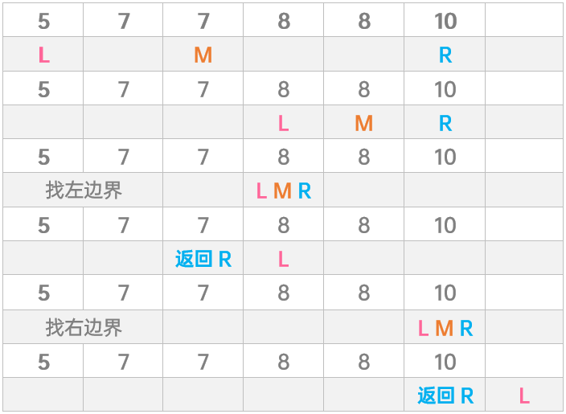

# **分治法/二分法**

## 寻找两个正序数组的中位数

### 解法一 - 暴力解法（Brute force）

```js
/**
 * @param {number[]} nums1
 * @param {number[]} nums2
 * @return {number}
 */
var findMedianSortedArrays = function(nums1, nums2) {
  // 归并排序
  const merged = []
  let i = 0
  let j = 0
  while(i < nums1.length && j < nums2.length) {
    if (nums1[i] < nums2[j]) {
      merged.push(nums1[i++])
    } else {
      merged.push(nums2[j++])
    }
  }
  while(i < nums1.length) {
    merged.push(nums1[i++])
  }
  while(j < nums2.length) {
    merged.push(nums2[j++])
  }

  const { length } = merged
  return length % 2 === 1
    ? merged[Math.floor(length / 2)]
    : (merged[length / 2] + merged[length / 2 - 1]) / 2
};
```

### 方法二：二分

二分思想确定分割点

我们回头看这个数组

```js
nums1 = [1, 3, 5, 7, 9]  
nums2 = [2, 4, 6, 8, 10]
```

在不口算的情况下，没有人会知道 `R1`、`R2`到底取在哪个位置是比较合理的，你只知道一件事——我需要让`nums1切割后左侧的元素个数+nums2切割后左侧元素的个数===两个数组长度和的一半`。
我们先用编码语言来表达一下这个关系：

```js
// slice1和slice2分别表示R1的索引和R2的索引
slice1 + slice2 === Math.floor((nums1.length + nums2.length)/2)
```

`nums1、nums2`的长度是已知的，这也就意味着只要求出 `slice1` 和 `slice2` 中的一个，另一个值就能求出来了。

因此我们的大方向先明确如下：

> 用二分法定位出其中一个数组的slice1，然后通过做减法求出另一个数组的slice2

“其中一个数组”到底以`nums1`为准还是以`nums2`为准？答案是以长度较短的数组为准，这样做可以减小二分计算的范围，从而提高我们算法的效率，所以我们代码开局就是要校验两个数组的长度大小关系：

```js
const findMedianSortedArrays = function(nums1, nums2) {  
    const len1 = nums1.length  
    const len2 = nums2.length    
    // 确保直接处理的数组（第一个数组）总是较短的数组
    if(len1 > len2) {
        return findMedianSortedArrays(nums2, nums1)
    }
    ...
}
```

从而确保较短的数组始终占据`nums1`的位置，后续我们就拿`nums1`开刀做二分。

这里我们假设 `nums1` 和 `nums2` 分别是以下两个数组：

```js
nums1 = [5, 6, 7] 
nums2 = [1, 2, 4, 12]
```

用二分法做题，首先需要明确二分的两个端点。在没有任何多余线索的情况下，我们只能把二分的端点定义为 `nums1` 的起点和终点:

```js
// 初始化第一个数组二分范围的左端点
let slice1L = 0  
// 初始化第一个数组二分范围的右端点
let slice1R = len1  
```

基于此去计算 `slice1` 的值：

```js
slice1 = Math.floor((slice1R - slice1L)/2) + slice1L  
```

然后通过做减法求出 `slice2`：

```js
slice2 = Math.floor(len/2) - slice1
```

第一次二分，两个数组分别被分割为如下形状：

```js
        L1   R1
nums1 = [5, |6, 7]   

            L2  R2
nums2 = [1, 2, |4, 12]
```

如何确认你的二分是否合理？标准只有一个——**分割后，需要确保左侧的元素都比右侧的元素小**，也就是说你的两个分割线要间接地把两个数组按照正序分为两半。这个标准用变量关系可以表示如下：

```js
L1 <= R1  
L1 <= R2  
L2 <= R1 
L2 <= R2  
```

由于数组本身是正序的，所以`L1 <= R1`、`L2 <= R2`是必然的，我们需要判断的是剩下两个不等关系：

若发现 `L1 > R2`，则说明`slice1`取大了，需要用二分法将`slice1`适当左移；若发现`L2 > R1`，则说明`slice1`取小了，需要用二分法将`slice1`适当右移：

```js
// 处理L1>R2的错误情况
 if(L1 > R2) {
    // 将slice1R左移，进而使slice1对应的值变小
    slice1R = slice1 - 1
} else if(L2 > R1) {
    // 反之将slice1L右移，进而使slice1对应的值变大
    slice1L = slice1 + 1
}
```

只有当以上两种偏差情况都不发生时，我们的分割线才算定位得恰到好处，此时就可以执行取中位数的逻辑了：

```js
// len表示两个数组的总长度
if(len % 2 === 0) {
    // 偶数长度对应逻辑（取平均值）
    const L = L1 > L2 ? L1 : L2  
    const R = R1 < R2 ? R1 : R2
    return  (L + R)/2
} else {
    // 奇数长度对应逻辑（取中间值）
    const median = (R1 < R2) ? R1 : R2  
    return median
}
```

我们把以上的整个分析用代码串起来，就有了这道题的答案：

```js
/**
 * @param {number[]} nums1
 * @param {number[]} nums2
 * @return {number}
 */
const findMedianSortedArrays = function(nums1, nums2) {  
    const len1 = nums1.length  
    const len2 = nums2.length    
    // 确保直接处理的数组（第一个数组）总是较短的数组
    if(len1 > len2) {
        return findMedianSortedArrays(nums2, nums1)
    }
    // 计算两个数组的总长度
    const len = len1 + len2 
    // 初始化第一个数组“下刀”的位置
    let slice1 = 0  
    // 初始化第二个数组“下刀”的位置
    let slice2 = 0  
    // 初始化第一个数组二分范围的左端点
    let slice1L = 0  
    // 初始化第一个数组二分范围的右端点
    let slice1R = len1  
    let L1, L2, R1, R2
    // 当slice1没有越界时
    while(slice1 <= len1) {
        // 以二分原则更新slice1
        slice1 = Math.floor((slice1R - slice1L)/2) + slice1L  
        // 用总长度的1/2减去slice1，确定slice2
        slice2 = Math.floor(len/2) - slice1 // 计算L1、L2、R1、R2
        const L1 = (slice1===0)? -Infinity : nums1[slice1-1]
        const L2 = (slice2===0)? -Infinity : nums2[slice2-1]  
        const R1 = (slice1===len1)? Infinity : nums1[slice1]  
        const R2 = (slice2===len2)? Infinity: nums2[slice2]
        
        // 处理L1>R2的错误情况
        if(L1 > R2) {
            // 将slice1R左移，进而使slice1对应的值变小
            slice1R = slice1 - 1
        } else if(L2 > R1) {
            // 反之将slice1L右移，进而使slice1对应的值变大
            slice1L = slice1 + 1
        } else {
            // 如果已经符合取中位数的条件（L1<R2&&L2<R1)，则直接取中位数
            if(len % 2 === 0) {
                const L = L1 > L2 ? L1 : L2  
                const R = R1 < R2 ? R1 : R2
                return  (L + R)/2
            } else {
                const median = (R1 < R2) ? R1 : R2  
                return median
            }
        }

    }
    return -1
};
```

## [23. 合并K个升序链表](https://leetcode-cn.com/problems/merge-k-sorted-lists/)

### 方法一：暴力解法

- `reduce`，将链表数组中的每一个值放入新`数组`
- `sort`，以链表的`val`作参考`冒泡排序`
- `reduceRight`，从右向左遍历，将数组连成`链表`

```js
var mergeKLists = function(lists) {
  return lists.reduce((p, n) => {
    while (n) {
      p.push(n), n = n.next
    }
    return p
  },[]).sort((a, b) => a.val - b.val).reduceRight((p, n) => (n.next = p, p = n, p), null)
}
```

### 方法二：分治合并


```js
/*
 * @lc app=leetcode id=23 lang=javascript
 *
 * [23] Merge k Sorted Lists
 *
 * https://leetcode.com/problems/merge-k-sorted-lists/description/
 *
 */
function mergeTwoLists(l1, l2) {
  const dummyHead = new ListNode();
  let current = dummyHead;
  // l1: 1 -> 3 -> 5
  // l2: 2 -> 4 -> 6
  while (l1 !== null && l2 !== null) {
    if (l1.val < l2.val) {
      current.next = l1; // 把小的添加到结果链表
      current = current.next; // 移动结果链表的指针
      l1 = l1.next; // 移动小的那个链表的指针
    } else {
      current.next = l2;
      current = current.next;
      l2 = l2.next;
    }
  }

  if (l1 === null) {
    current.next = l2;
  } else {
    current.next = l1;
  }
  return dummyHead.next;
}
/**
 * Definition for singly-linked list.
 * function ListNode(val) {
 *     this.val = val;
 *     this.next = null;
 * }
 */
/**
 * @param {ListNode[]} lists
 * @return {ListNode}
 */
var mergeKLists = function (lists) {
  // 图参考： https://zhuanlan.zhihu.com/p/61796021
  if (lists.length === 0) return null;
  if (lists.length === 1) return lists[0];
  if (lists.length === 2) {
    return mergeTwoLists(lists[0], lists[1]);
  }

  const mid = lists.length >> 1;
  const l1 = [];
  for (let i = 0; i < mid; i++) {
    l1[i] = lists[i];
  }

  const l2 = [];
  for (let i = mid, j = 0; i < lists.length; i++, j++) {
    l2[j] = lists[i];
  }

  return mergeTwoLists(mergeKLists(l1), mergeKLists(l2));
};
```

## [33. 搜索旋转排序数组](https://leetcode-cn.com/problems/search-in-rotated-sorted-array/)

### 方法一：二分

- target > nums[0]，target在左，反之在右。取序列中间值
- 中间值 = target返回m
- 右边界 = 中间值 - 1的情况：
  - target左，中间值右
  - target左，中间值左，中间值 > target
  - target右，中间值右，中间值 > target
- 左边界 = 中间值 + 1的情况：
  - target右，中间值左
  - target右，中间值右，中间值 < target
  - target左，中间值左，中间值 < target
- 以上包含target和中间值所有可能的位置关系，取上面或下面3个作为条件均可

```js
var search = function(nums, target, l = 0, r = nums.length - 1, m, inLeft = target > nums[0]) {
    if (nums[0] === target) return 0
    while (m = l + r >> 1, l <= r) {
        if (nums[m] === target) return m
        inLeft && (nums[m] < nums[0] || nums[m] > target) || !inLeft && nums[m] < nums[0] && nums[m] > target ? r = m - 1 : l = m + 1
    }
    return -1
}
```

### 方法二：二分

- 旋转数组中，解题关键在于确定target值在哪个有序数组的一边内
  - 在mid 右边，low = mid+1
  - 在mid 左边,high = mid


.jpg)

.jpg)

```js
/**
 * @param {number[]} nums
 * @param {number} target
 * @return {number}
 */
var search = function(nums, target) {
  // 时间复杂度：O(logn)
  // 空间复杂度：O(1)
  // [6,7,8,1,2,3,4,5]
  let start = 0;
  let end = nums.length - 1;

  while (start <= end) {
    const mid = start + ((end - start) >> 1);
    if (nums[mid] === target) return mid;

    // [start, mid]有序

    // ️⚠️注意这里的等号
    if (nums[mid] >= nums[start]) {
      //target 在 [start, mid] 之间

      // 其实target不可能等于nums[mid]， 但是为了对称，我还是加上了等号
      if (target >= nums[start] && target <= nums[mid]) {
        end = mid - 1;
      } else {
        //target 不在 [start, mid] 之间
        start = mid + 1;
      }
    } else {
      // [mid, end]有序

      // target 在 [mid, end] 之间
      if (target >= nums[mid] && target <= nums[end]) {
        start = mid + 1;
      } else {
        // target 不在 [mid, end] 之间
        end = mid - 1;
      }
    }
  }

  return -1;
};
```

优化：

```js
var search = function(nums, target) {
  var low = 0;
  var high = nums.length - 1;
  while(low < high){
    var mid = (low+high)>>1;
    if( (nums[0] > nums[mid]) ^ (target > nums[mid]) ^ (target < nums[0]) ) {
      low = mid+1;
    }
    else{
      high = mid;
    }
  }
  return low == high && nums[low] == target ? low : -1;
};
```

骚操作：

```js
var search = function(nums, target) {
  return nums.indexOf(target)
};
```

## [34. 在排序数组中查找元素的第一个和最后一个位置](https://leetcode-cn.com/problems/find-first-and-last-position-of-element-in-sorted-array/)

### 方法一：暴力

- `遍历`初见`target`赋值`开始位`和`结束位`。再见`target`只更新`结束位`直到当前数`>`目标值

```js
var searchRange = function(nums, target) {
    return nums.reduce((p, v, i) => v === target ? [p[0] === -1 ? i : p[0], i] : (v > target && (nums.length = 0), p), [-1, -1])
};

var searchRange = function(nums, target) {
  return nums.reduce((p, v, i) => {
    if(v === target) {
      return [p?.[0] === -1 ? i : p[0], i]
    }else {
      if(v > target ) {
        nums.length = 0
        return p
      }
    }
  }
  , [-1, -1])
};
```

### 方法二：哈希表

- 对象作哈希表`当前数`作`键名`。初见赋值。再见只更新`结束位`。终得所有数的`起止位置`

```js
var searchRange = function(nums, target) {
    return nums.reduce((h, v, i) => (h[v] ? h[v][1] = i : h[v] = [i, i], h), Object.create(null))[target] || [-1, -1]
};
```

### 方法三：二分查找 · 中心扩散

- 每轮取中间数。大于目标值，继续查找左边一半。小于目标值，继续查找右边一半
- 找不到，返回`-1`。找到，以其为中心`左右扩散`找`不等于目标值`且`不越界`的边界

```js
var searchRange = function(nums, target) {
    var i = binarySearch(nums, target)
    if (i === -1) return [-1, -1]
    else {
        var l = i, r = i + 1
        while(nums[l] === target && l >= 0) l--
        while(nums[r] === target && r < nums.length) r++
    }
    return [l + 1, r - 1]                                      
};
var binarySearch = (nums, target, l = 0, r = nums.length - 1, m = l + r >>> 1) => 
          l  >  r      ? -1 :
    nums[m] === target ?  m :
    nums[m]  >  target ? binarySearch(nums, target, l, m - 1)
                       : binarySearch(nums, target, m + 1, r)
```

### 方法四：二分查找 · 直达边界

- 区别在于当nums[m] === target时，上解法，直接返回值
- 本解法，寻左边界时，继续向左查找。寻右边界时，继续向右查找，如图
- l > r时返回右边界。这样左边界会到初见目标值左侧，右边界会到目标值最后出现位



```js
var searchRange = function(nums, target) {
    var l = binarySearch(nums, target, true), r = binarySearch(nums, target, false)
    return l === r ? [-1, -1] : [l + 1, r]                            
};
var binarySearch = (nums, target, isL, l = 0, r = nums.length - 1, m = l + r >>> 1) => 
    l  >  r ? r : (isL ? nums[m] >= target : nums[m] > target)
            ? binarySearch(nums, target, isL, l, m - 1)
            : binarySearch(nums, target, isL, m + 1, r)
```

好理解的写法：

```js
function searchRange (nums, target) {
  let low = 0
  let high = nums.length - 1
  while (low <= high) {
    let mid =(low + high) >> 1
    // 如果相等则直接将low = high = mid
    if (target === nums[mid]) {
      low = mid
      high = mid
      break
    }
    if (target < nums[mid]) {
      high = mid - 1
    } else if (target > nums[mid]) {
      low = mid + 1
    }
  }
  
  if (low > high) {
    return [-1, -1]
  } else {
    // 向两边扩散去查找边界
    while (nums[low - 1] === target) low--
    while (nums[high + 1] === target) high++
    return [low, high]
  }
};
```


### 方法五：骚操作

```js
var searchRange = function(nums, target) {
	return [nums.indexOf(target),nums.lastIndexOf(target)]
};
```

