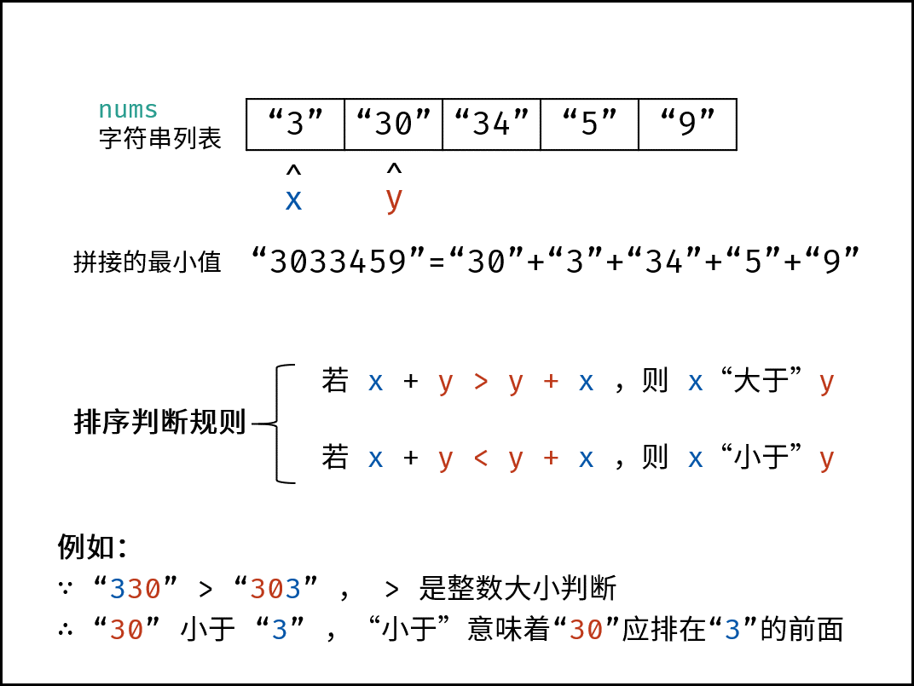

## [剑指 Offer 45. 把数组排成最小的数](https://leetcode-cn.com/problems/ba-shu-zu-pai-cheng-zui-xiao-de-shu-lcof/)

### 方法一：sort

首先先巩固下js中sort()方法的比较函数的知识
在mdn中对于sort()方法中的比较函数是这么解释的：

compareFunction 可选
用来指定按某种顺序进行排列的函数。如果省略，元素按照转换为的字符串的各个字符的Unicode位点进行排序。
如果指明了 compareFunction ，那么数组会按照调用该函数的返回值排序。即 a 和 b 是两个将要被比较的元素：
如果 compareFunction(a, b) 小于 0 ，那么 a 会被排列到 b 之前;
如果 compareFunction(a, b) 等于 0 ， a 和 b 的相对位置不变;
如果 compareFunction(a, b) 大于 0 ， b 会被排列到 a 之前。
compareFunction(a, b) 必须总是对相同的输入返回相同的比较结果，否则排序的结果将是不确定的。

显然我们这里的比较函数不能省略，比如3和30这两个数，通过比较编码来从小到大排序再组合会输出330，而最小的组合数为303，所以我们不能单纯地比较3和3的编码，而应该比较这两个数字的组合结果的编码。

众所周知，两个数a和b有唯二的组合数字ab或者ba。
再因为数组里的数值都是number，将其转换为字符再组合，最简单的方法就是a+""+b

所以我们的比较函数可以写为：

```js
const compareFunction=(a, b)=>{
    return ((a + "" + b) - (b + "" + a))
}
```


排序之后再将数组项拼成字符串即可。

```js
/**
 * @param {number[]} nums
 * @return {string}
 */
var minNumber = function(nums) {
    nums.sort((a,b)=>((a+""+b)-(b+""+a)))
    return nums.join("")
};
```

### 方法二：自定义排序

此题求拼接起来的最小数字，本质上是一个排序问题。设数组 numsnums 中任意两数字的字符串为 xx 和 yy ，则规定 排序判断规则 为：

若拼接字符串 x + y > y + x ，则 x “大于” y ；
反之，若 x + y < y + x ，则 x “小于” y ；

> x “小于” y 代表：排序完成后，数组中 x 应在 y 左边；“大于” 则反之。

根据以上规则，套用任何排序方法对 numsnums 执行排序即可。



```js
var minNumber = function(nums) {
  if (nums.length < 2) return nums.join('');
  return quickSort(nums, 0, nums.length - 1).join('');
}

function quickSort(nums, start, end) {
  const index = partition(nums, start, end);
  if (start < index - 1) quickSort(nums, start, index - 1);
  if (index < end) quickSort(nums, index, end);
  return nums;
}

function partition(nums, l, r) {
  const p = nums[l + r >> 1];
  while (l <= r) {
    while ('' + nums[l] + p < '' + p + nums[l]) l++;
    while ('' + nums[r] + p > '' + p + nums[r]) r--;
    if (l <= r) {
      [nums[l], nums[r]] = [nums[r], nums[l]];
      l++;
      r--;
    }
  }
  return l;
}
```

```js
/**
 * @param {number[]} nums
 * @return {string}
 */
var minNumber = function(nums) {
    sort(nums,0,nums.length-1);
    return nums.join('');
};

const sort = (arr,l,r) => {
    if(l >= r){
        return;
    }
    let p = partition(arr,l,r);
    sort(arr,l,p-1);
    sort(arr,p+1,r);
}

const partition = (arr,l,r) => {
    let i = l+1,
        j = r;
    while(true){
        while(i <= j && compare(arr[i] , arr[l]) == -1){
            i++
        }
        while(i <= j && compare(arr[j],arr[l]) == 1){
            j--
        }
        if(i >= j){
            break;
        }
        swap(arr,i,j);
        i++;
        j--;
    }
    swap(arr,l,j);
    return j;
}

const compare = (i,j) => {
    if(i == j)  return 0;
    let si = String(i);
    let sj = String(j);
    if(si + sj < sj + si)
        return -1;
    else if(si + sj > sj + si){
        return 1;
    }
    else{
        return 0
    }
}

const swap = (arr,i,j) => {
    let temp = arr[i];
    arr[i] = arr[j];
    arr[j] = temp;
}
```

