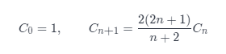
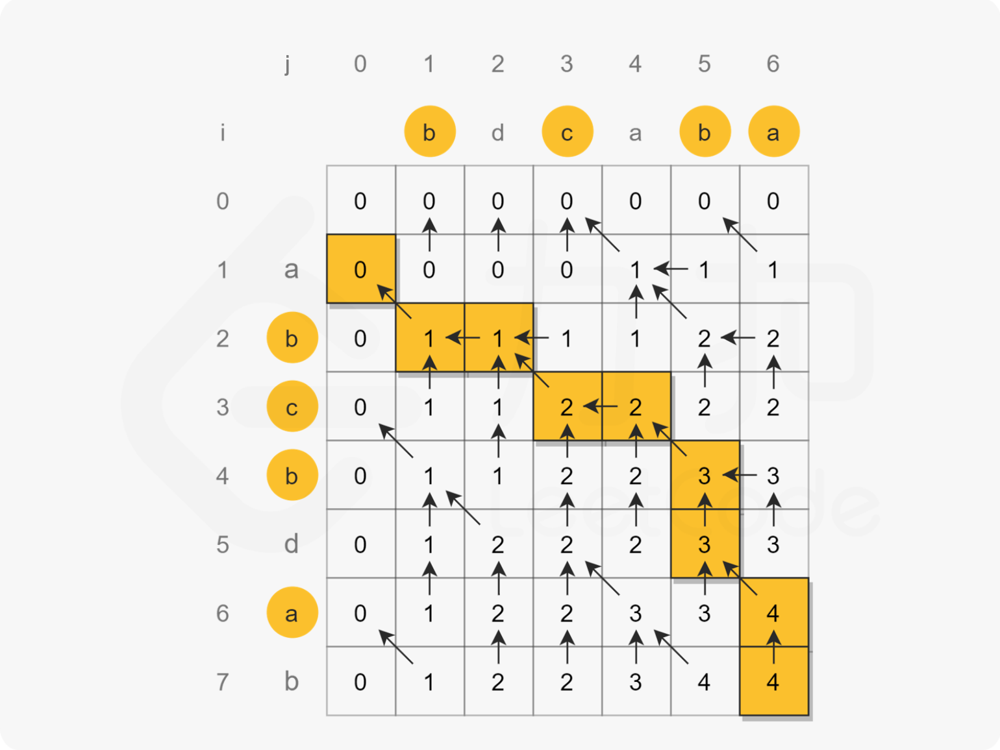

# 动态规划（dp）

## [5. 最长回文子串](https://leetcode-cn.com/problems/longest-palindromic-substring/)

### 方法一：动态规划

```js
/**
 * @param {string} s
 * @return {string}
 */
const longestPalindrome = function(s) {
    const dp = [];
    // 缓存字符串长度
    const len = s.length
    // 初始化状态二维数组
    for (let i = 0; i < len; i ++) {
        dp[i] = [];
    };
    
    // 初始化最长回文子串的两个端点值
    let st = 0, end=0
    // 初始化最长回文子串的初始值为1
    for(let i=0;i<len;i++) {
        dp[i][i] = 1
    }
    // 这里为了降低题目的复杂度，我们预先对悬念比较小的 s[i][i+1] 也做了处理
    for(let i=0;i<len-1;i++){
        if(s[i]===s[i+1]) {
            dp[i][i+1] = 1
            st = i 
            end = i+1
        }
    }
    
    // n 代表子串的长度，从3开始递增
    for(let n=3;n<=len;n++) {
        // 下面的两层循环，用来实现状态转移方程
        for(let i=0;i<=len-n;i++) {
            let j = i+n-1
            if(dp[i+1][j-1]) {
                if(s[i]===s[j]){
                    // 若定位到更长的回文子串，则更新目标子串端点的索引值
                    dp[i][j] = 1
                    st = i 
                    end = j
                }
            }
        }
    }
    // 最后依据端点值把子串截取出来即可
    return s.substring(st,end+1);
}

/**
 * @param {string} s
 * @return {string}
 */
var longestPalindrome = function(s) {
    let n = s.length;
    let res = '';
    let dp = Array.from(new Array(n),() => new Array(n).fill(0));
    for(let i = n-1;i >= 0;i--){
        for(let j = i;j < n;j++){
            dp[i][j] = s[i] == s[j] && (j - i < 2 || dp[i+1][j-1]);
            if(dp[i][j] && j - i +1 > res.length){
                res = s.substring(i,j+1);
            }
        }
    }
    return res;
};
```

### 方法二：中心扩散法

两种情况
一种是回文子串长度为奇数（如aba，中心是b）
另一种回文子串长度为偶数（如abba，中心是b，b）

循环遍历字符串 对取到的每个值 都假设他可能成为最后的中心进行判断


```js
/**
 * @param {string} s
 * @return {string}
 */
var longestPalindrome = function(s) {
        if (s.length<2){
            return s
        }
        let res = ''
        for (let i = 0; i < s.length; i++) {
            // 回文子串长度是奇数
            helper(i, i)
            // 回文子串长度是偶数
            helper(i, i + 1) 
        }

        function helper(m, n) {
            while (m >= 0 && n < s.length && s[m] == s[n]) {
                m--
                n++
            }
            // 注意此处m,n的值循环完后  是恰好不满足循环条件的时刻
            // 此时m到n的距离为n-m+1，但是mn两个边界不能取 所以应该取m+1到n-1的区间  长度是n-m-1 即 (n-1)-(m+1)+1
            if (n - m - 1 > res.length) {
                // slice也要取[m+1,n-1]这个区间 
                res = s.slice(m + 1, n)
            }
        }
        return res
}
```

### 方法三：brust forse

```js
function isPalindrome(str) {
    var len  = str.length
    var middle = parseInt(len/2)
    for(var i = 0;i<middle;i++){
        if(str[i]!=str[len-i-1]){
            return false
        }
    }
    return true
}
var ans = '';
var max = 0;
var len = s.length
for(var i = 0;i<len;i++){
    for(var r = i+1;r<=len;r++){
        var tmpStr = s.substring(i,r)
        if(isPalindrome(tmpStr) && tmpStr.length > max){
            ans = s.substring(i,r)
            max = tmpStr.length;
        }
    }
}
return ans;
```


## [300. 最长递增子序列](https://leetcode-cn.com/problems/longest-increasing-subsequence/)

#### 方法一：动态规划

这个也算是一种暴力解法（brute force）吧


```js
var lengthOfLIS = function (nums) {
  // let dp = [1]
  let dp = (new Array(len)).fill(1)
  // 从i=1开始,因为默认第一个值是1了
  for (let i = 1; i < nums.length; i++) {
    // dp[i] = 1
    for (let j = 0; j < i; j++) {
      nums[i] > nums[j] && (dp[i] = Math.max(dp[i], dp[j] + 1))
    }
  }
  return Math.max(...dp)
}
```

#### 方法二： 贪心 + 二分法

```js
var lengthOfLIS = function (nums) {
  let len = nums.length
  if (len <= 1) {
    return len
  }
  let res = [nums[0]]

  for (let i = 1; i < len; ++i) {
    if (nums[i] > res[res.length - 1]) {
      res.push(nums[i])
    } else {
      // 递增子序列里面找一个正好比他大的位置
      // 二分查找
      let left = 0,
        right = res.length - 1
      while (left < right) {
        let mid = (left + right) >> 1
        if (res[mid] < nums[i]) {
          left = mid + 1
        } else {
          right = mid
        }
      }
      res[left] = nums[i]
    }
  }
  return res.length
}
```

## [120. 三角形最小路径和](https://leetcode-cn.com/problems/triangle/)

```js
 
```


## [337. 打家劫舍 III](https://leetcode-cn.com/problems/house-robber-iii/)

### 方法一：动态规划

树形 DP 问题

```js
/**
 * Definition for a binary tree node.
 * function TreeNode(val, left, right) {
 *     this.val = (val===undefined ? 0 : val)
 *     this.left = (left===undefined ? null : left)
 *     this.right = (right===undefined ? null : right)
 * }
 */
var rob = function (root) {
  const f = new Map() // 抢当前节点的最大值
  const g = new Map() // 不抢当前节点的最大值

  const dfs = (node) => {
    if (node === null) return

    dfs(node.left)
    dfs(node.right)
    f.set(node, node.val + (g.get(node.left) || 0) + (g.get(node.right) || 0))
    g.set(
      node,
      Math.max(f.get(node.left) || 0, g.get(node.left) || 0) +
        Math.max(f.get(node.right) || 0, g.get(node.right) || 0)
    )
  }

  dfs(root)
  return Math.max(f.get(root) || 0, g.get(root) || 0)
}
```

PS: 看到这题的时候会觉得通过各行的层序遍历也能求解，但是[4,1,null,2,null,3]这个测试用例过不去。最大值是 7，隔行求解最大值是 6。

### 方法二：brute force

这个方法不好，会超时

```js
var rob = function (root) {
  if (root == null) return 0
  let money = root.val
  if (root.left !== null) {
    money += rob(root.left.left) + rob(root.left.right)
  }

  if (root.right !== null) {
    money += rob(root.right.left) + rob(root.right.right)
  }

  return Math.max(money, rob(root.left) + rob(root.right))
}
```

## [309. 最佳买卖股票时机含冷冻期](https://leetcode-cn.com/problems/best-time-to-buy-and-sell-stock-with-cooldown/)

### 方法一：递归的思路

- 每一天都有三种选择：1、卖出；2、买进；3、休息。（严格的说不准确，因为题目有限制）
- 一个选择是一个分支，形成一个「不完整」的「三叉树」，遍历它，求出所有路径对应的收益，比较出最大
- 用递归，遍历所有节点：时间复杂度 O(3^n)，空间复杂度：递归栈占用的空间：O(n)
- 可以向递归加入记忆化，降低时间复杂度

#### DP 状态的选择

- 可以用一个三维数组，i 表示天，j 表示是否持有股票，k 表示是否是冷冻期
- 也可以用一个二维数组，dp[i][j]：i 表示天，j 为 0，1，2：0 表示持股，1 表示不持股，2 表示处于冷冻天
- 也可以用三个一维数组，分别代表第 i 天，3 种选择：卖出、买进、休息，对应的最大收益。
- 也可以按手中是否持有股票，用两个一维数组，分别代表第 i 天，持有 / 没持有 的最大收益
  也就是说，在选择 DP 状态的定义时，可以尝试着降维。

##### 状态转移

- hold[i] : 在第 i 天的结束时，手中持有股票，此时的最大收益
  - 分为两种情况：今天休息或者买了股票
  - 可能是昨天持有了，今天休息，也可能是前天卖了，今天买的
  - hold[i] = Math.max(hold[i - 1], unhold[i - 2] - prices[i])
- unhold[i] : 第 i 天的结束时，手中没有股票，此时的最大收益
  - 分为两种情况：今天休息或者卖了股票
  - 可能是昨天也没持有，今天休息，也可能是昨天持有，今天卖了
  - unhold[i] = Math.max(unhold[i - 1], hold[i - 1] + prices[i])
- 目标是求 unhold[n-1] ( n：0 1 2 3 ... )

#### base case

- hold[0] = -prices[0] 第 0 天买股票，收益-prices[0]元
- hold[1] = Math.max(-prices[0], -prices[1]) 第 1 天持有着股票，可能是昨天买的，今天休息，也可能是昨天休息，今天买的
- unhold[0] = 0 第 0 天没有持有股票，就是休息，收益 0 元

### 代码

时间复杂度：两个 dp 数组发生状态转移，花费 O(2n) ，总的来说是 O(n)
为了方便理解，使用下面的这张图，作为参考


```JS
const maxProfit = (prices) => {
  const n = prices.length // n天
  if (n == 0) return 0
  let hold = new Array(n) // 第i天持有股票的最大收益
  let unhold = new Array(n) // 第i天不持有股票的最大收益
  hold[0] = -prices[0] // 第0天买了股票的收益
  unhold[0] = 0 // 第0天没有买股票的收益
  for (let i = 1; i < n; i++) {
    if (i == 1) {
      // base case
      hold[i] = Math.max(hold[i - 1], -prices[1])
    } else {
      hold[i] = Math.max(hold[i - 1], unhold[i - 2] - prices[i])
    }
    unhold[i] = Math.max(unhold[i - 1], hold[i - 1] + prices[i])
  }
  return unhold[n - 1]
}
```

```js
const maxProfit = (prices) => {
  if (prices == null || prices.length == 0) {
    return 0
  }

  let dp = new Array(prices.length).fill(null).map(() => [])
  dp[0][0] = 0
  dp[0][1] = -prices[0]

  for (let i = 1; i < prices.length; i++) {
    dp[i][0] = Math.max(dp[i - 1][0], dp[i - 1][1] + prices[i])

    dp[i][1] = Math.max(
      dp[i - 1][1],
      (i - 2 >= 0 ? dp[i - 2][0] : 0) - prices[i]
    )
  }

  return Math.max(dp[prices.length - 1][0], dp[prices.length - 1][1])
}
```

### 方法二：学习了解法：状态机

- 对于每一天有三种状态：
  - S0: 手中没持有，可以买
  - S1: 手中持有，可以卖
  - S2: 手中没持有，买不了


```JS
const maxProfit = (prices) => {
  let rest = 0
  let sold = 0
  let hold = -Infinity // 还没买入
  for (let price of prices) {
    let preSold = sold
    let preHold = hold
    hold = Math.max(preHold, rest - price)
    sold = preHold + price
    rest = Math.max(rest, preSold)
  }
  return Math.max(rest, sold)
}
```

## [62. 不同路径](https://leetcode-cn.com/problems/unique-paths/)

### 方法一：动态规划

- 动态方程：`dp[i][j = dp[i-1][j] + dp[i][j-1]`
- 对于第一行`dp[0][j]，或者第一列dp[i][0],由于是都是在边界，所以只能为1`


```js
var uniquePaths = function (m, n) {
  const f = new Array(m).fill(0).map(() => new Array(n).fill(0))
  for (let i = 0; i < m; i++) {
    f[i][0] = 1
  }
  for (let j = 0; j < n; j++) {
    f[0][j] = 1
  }
  for (let i = 1; i < m; i++) {
    for (let j = 1; j < n; j++) {
      f[i][j] = f[i - 1][j] + f[i][j - 1]
    }
  }
  return f[m - 1][n - 1]
}
```

优化空间复杂度方法

用个一维数组优化空间复杂度

公式：` f[j] = f[j] + f[j - 1]`，

可根据上图，推算出公式：到达当前格的方法数 = 当前格的上一格的数量 + 当前格的左一格的数量

```js
var uniquePaths = function (m, n) {
  let f = new Array(n).fill(1)

  for (let i = 1; i < m; i++) {
    for (let j = 1; j < n; j++) {
      f[j] = f[j] + f[j - 1]
    }
  }

  return f[f.length - 1]
}
```

### 方法二：组合数学

从左上角到右下角的过程中，我们需要移动 m+n-2 次，其中有 m-1 次向下移动，n-1 次向右移动。因此路径的总数，就等于从 m+n−2 次移动中选择 m−1 次向下移动的方案数，即组合数：


因此我们直接计算出这个组合数即可。计算的方法有很多种：

如果使用的语言有组合数计算的 API，我们可以调用 API 计算；

如果没有相应的 API，我们可以使用

 
进行计算。

- 时间复杂度：O(m)。由于我们交换行列的值并不会对答案产生影响，因此我们总可以通过交换 m 和 n 使得 m≤n，这样空间复杂度降低至 O(min(m, n))。
- 空间复杂度：O(1)。

```js
var uniquePaths = function (m, n) {
  let ans = 1
  for (let x = n, y = 1; y < m; ++x, ++y) {
    ans = Math.floor((ans * x) / y)
  }
  return ans
}
```

## [63. 不同路径 II](https://leetcode-cn.com/problems/unique-paths-ii/)

### 方法一：动态规划

动态规划方程：` dp[i][j] = dp[i - 1][j] + dp[i`][j - 1]

```js
const uniquePathsWithObstacles = (obstacleGrid) => {
  if (obstacleGrid[0][0] == 1) return 0 // 出发点就被障碍堵住
  const m = obstacleGrid.length // 列
  const n = obstacleGrid[0].length // 行
  // dp数组初始化
  const dp = new Array(m)
  for (let i = 0; i < m; i++) dp[i] = new Array(n)
  // base case
  dp[0][0] = 1 // 终点就是出发点
  for (let i = 1; i < m; i++) {
    // 第一列其余的case，初始化值，将第一列能到达的设置为1，不能到达的设置为0
    dp[i][0] = obstacleGrid[i][0] == 1 || dp[i - 1][0] == 0 ? 0 : 1
  }
  for (let i = 1; i < n; i++) {
    // 第一行其余的case，初始化值，将第一行能到达的设置为1，不能到达的设置为0
    dp[0][i] = obstacleGrid[0][i] == 1 || dp[0][i - 1] == 0 ? 0 : 1
  }
  // 迭代
  for (let i = 1; i < m; i++) {
    for (let j = 1; j < n; j++) {
      dp[i][j] = obstacleGrid[i][j] == 1 ? 0 : dp[i - 1][j] + dp[i][j - 1]
    }
  }
  return dp[m - 1][n - 1] // 到达(m-1,n-1)的路径数
}
```

空间复杂度优化：

```js

```

## [416. 分割等和子集](https://leetcode-cn.com/problems/partition-equal-subset-sum/)

### 方法一：动态规划

```js
/**
 * @param {number[]} nums
 * @return {boolean}
 */
var canPartition = function(nums) {
  const n = nums.length
  if (n < 2) {
    return false
  }
  let sum = 0,
    maxNum = 0
  for (const num of nums) {
    sum += num
    maxNum = maxNum > num ? maxNum : num
  }
  // 如果是奇数直接返回false
  if (sum & 1) {
    return false
  }
  const target = Math.floor(sum / 2)
  // 优化， 如果最大值大于了目标值，则返回false
  if (maxNum > target) {
    return false
  }
  // 目标值是 target 所以数组的长度是 target + 1
  // const dp = new Array(n).fill(0).map((v) => new Array(target + 1, false))
  const dp = Array.from({length: n}, () => new Array(target + 1), false)
  for (let i = 0; i < n; i++) {
    dp[i][0] = true
  }
  dp[0][nums[0]] = true

  for (let i = 1; i < n; i++) {
    const num = nums[i]
    for (let j = 1; j <= target; j++) {
      if (j >= num) {
        dp[i][j] = dp[i - 1][j] | dp[i - 1][j - num]
      } else {
        dp[i][j] = dp[i - 1][j]
      }
    }
  }
  return dp[n - 1][target]
}
```

动态规划优化方案：

```js
var canPartition = function(nums) {
  let sum = nums.reduce((acc, num) => acc + num, 0)
  if (sum % 2) {
    return false
  }	
  sum = sum / 2
  const dp = Array.from({ length: sum + 1 }).fill(false)
  dp[0] = true

  for (let i = 0; i < nums.length; i++) {
    // 倒序遍历
    for (let j = sum; j > 0; j--) {
      // 
      dp[j] = dp[j] || (j - nums[i] >= 0 && dp[j - nums[i]])
    }
  }

  return dp[sum]
}
```

### 方法二：dfs+记忆化


每次考察一个元素，用索引i描述，还有一个状态：当前累加的`curSum`。

递归函数：基于已选的元素（和为`curSum`），从i开始继续选，能否选出和为sum/2的子集。

每次递归，都有两个选择：

- 选`nums[i]`。基于选它，往下继续选（递归）：`dfs(curSum + nums[i], i + 1)`
- 不选`nums[i]`。基于不选它，往下继续选（递归）：`dfs(curSum, i + 1)`

递归的终止条件有三种情况：

- `curSum > target`，已经爆了，不用继续选数字了，终止递归，返回false。
- `curSum == target`，满足条件，不用继续选数字了，终止递归，返回true。
- 指针越界，考察完所有元素，能走到这步说明始终没有返回true，所以返回false。

```js
const canPartition = (nums) => {
  let sum = 0
  for (const n of nums) {
    // 求数组和
    sum += n
  }
  if (sum % 2 != 0) return false // 如果 sum 为奇数，直接返回 false
  const memo = new Map()
  const target = sum / 2 // 目标和

  const dfs = (curSum, i) => {
    // curSum是当前累加和，i是指针
    if (i == nums.length || curSum > target) {
      // 递归的出口
      return false
    }
    if (curSum == target) {
      // 递归的出口
      return true
    }
    const key = curSum + '&' + i // 描述一个问题的key
    if (memo.has(key)) {
      // 如果memo中有对应的缓存值，直接使用
      return memo.get(key)
    }
    const res = dfs(curSum + nums[i], i + 1) || dfs(curSum, i + 1)
    memo.set(key, res) // 计算的结果存入memo
    return res
  }

  return dfs(0, 0) // 递归的入口，当前和为0，指针为0
}
```

## [494. 目标和](https://leetcode-cn.com/problems/target-sum/)

### 方法一：递归 深度优先搜索

```js
var findTargetSumWays = function(nums, target) {
  let n = 0
  const loop = (idx, sum) => {
    if (nums.length > idx) {
      loop(idx + 1, sum + nums[idx])
      loop(idx + 1, sum - nums [idx])
    } else {
      sum === target && n++
    }
  }
  loop(0, 0)
  return n
}
```

### 方法二：动态规划

```js
var findTargetSumWays = function(nums, target) {
  let sum = 0
  for (let i = 0; i < nums.length; i++) {
    sum += nums[i]
  }

  // 绝对值范围超过了sum的绝对值范围则无法得到
  if (Math.abs(target) > Math.abs(sum)) return 0

  let len = nums.length
  // - 0 +
  let t = sum * 2 + 1
  let dp = Array.from({ length: len }, () => new Array(t).fill(0))
  // 初始化
  if (nums[0] == 0) {
    dp[0][sum] = 2
  } else {
    dp[0][sum + nums[0]] = 1
    dp[0][sum - nums[0]] = 1
  }

  for (let i = 1; i < len; i++) {
    for (let j = 0; j < t; j++) {
      // 边界
      let l = j - nums[i] >= 0 ? j - nums[i] : 0
      let r = j + nums[i] < t ? j + nums[i] : 0
      dp[i][j] = dp[i - 1][l] + dp[i - 1][r]
    }
  }
  return dp[len - 1][sum + target]
}
```

### 方法三：动态规则 01背包

```js
var findTargetSumWays = function(nums, target) {
  if (nums == null || nums.length == 0) return 0
  var sums = 0
  nums.forEach((num) => (sums += num))
  if (sums < target || (target + sums) % 2 == 1) return 0
  var p = (target + sums) >> 1
  var dp = new Array(p + 1).fill(0)
  dp[0] = 1
  nums.forEach((num) => {
    for (var i = p; i >= num; i--) {
      dp[i] += dp[i - num]
    }
  })
  return dp[p]
}
```

## [322. 零钱兑换](https://leetcode-cn.com/problems/coin-change/)

### 方法一：动态规划

- 假设给出的不同面额的硬币是[1, 2, 5]，目标是 120，问最少需要的硬币个数？

- 我们要分解子问题，分层级找最优子结构，看到这又要晕了哈，憋急~~ 下面马上举例。

- 这里我们使用「自顶向下」思想来考虑这个题目，然后用「自底向上」的方法来解题，
  体验算法的冰火两重天。

- dp[i]: 表示总金额为 i 的时候最优解法的硬币数

- 我们想一下：求总金额 120 有几种方法？下面这个思路关键了 !!!
  一共有 3 种方式，因为我们有 3 种不同面值的硬币。
  1.拿一枚面值为 1 的硬币 + 总金额为 119 的最优解法的硬币数量
    这里我们只需要假设总金额为 119 的最优解法的硬币数有人已经帮我们算好了，
    不需要纠结于此。(虽然一会也是我们自己算，哈哈)
    即：dp[119] + 1
  2.拿一枚面值为 2 的硬币 + 总金额为 118 的最优解法的硬币数
    这里我们只需要假设总金额为 118 的最优解法的硬币数有人已经帮我们算好了
    即：dp[118] + 1
  3.拿一枚面值为 5 的硬币 + 总金额为 115 的最优解法的硬币数
    这里我们只需要假设总金额为 115 的最优解法的硬币数有人已经帮我们算好了【
    即：dp[115] + 1
  - 所以，总金额为 120 的最优解法就是上面这三种解法中最优的一种，也就是硬币数最少
    的一种，我们下面试着用代码来表示一下：
  - dp[120] = Math.min(dp[119] + 1, dp[118] + 1, dp[115] + 1);
  - 推导出「状态转移方程」：
    dp[i] = Math.min(dp[i - coin] + 1, dp[i - coin] + 1, ...)
    其中 coin 有多少种可能，我们就需要比较多少次，那么我们到底需要比较多少次呢？
    当然是 coins 数组中有几种不同面值的硬币，就是多少次了~ 遍历 coins 数组，
    分别去对比即可
    
  - 上面方程中的 dp[119]，dp[118]，dp[115] 我们继续用这种思想去分解，
    这就是动态规划了，把这种思想，思考问题的方式理解了，这一类型的题目
    问题都不会太大。

```js
const coinChange = (coins, amount) => {
  let dp = new Array(amount + 1).fill(Infinity)
  dp[0] = 0
  // 分类讨论
  for (let coin of coins) {
    for (let i = coin; i <= amount; i++) {
      dp[i] = Math.min(dp[i], dp[i - coin] + 1)
    }
  }
  return dp[amount] === Infinity ? -1 : dp[amount]
}

const coinChange = function(coins, amount) {
    // 用于保存每个目标总额对应的最小硬币个数
    const f = []
    // 提前定义已知情况
    f[0] = 0
    // 遍历 [1, amount] 这个区间的硬币总额
    for(let i=1;i<=amount;i++) {
        // 求的是最小值，因此我们预设为无穷大，确保它一定会被更小的数更新
        f[i] = Infinity
        // 循环遍历每个可用硬币的面额
        for(let j=0;j<coins.length;j++) {
            // 若硬币面额小于目标总额，则问题成立
            if(i-coins[j]>=0) {
                // 状态转移方程
                f[i] = Math.min(f[i],f[i-coins[j]]+1)
            }
        }
    }
    // 若目标总额对应的解为无穷大，则意味着没有一个符合条件的硬币总数来更新它，本题无解，返回-1
    if(f[amount]===Infinity) {
        return -1
    }
    // 若有解，直接返回解的内容
    return f[amount]
};
```

## [518	零钱兑换 II](https://leetcode-cn.com/problems/coin-change-2/)

```js
/**
 * @param {number} amount
 * @param {number[]} coins
 * @return {number}
 */
var change = function(amount, coins) {
  if (amount === 0) return 1

  const dp = [1].concat(Array(amount).fill(0))

  for (let j = 0; j < coins.length; j++) {
    for (let i = 1; i < amount + 1; i++) {
      if (i - coins[j] >= 0) {
        dp[i] = dp[i] + dp[i - coins[j]]
      }
    }
  }

  return dp[dp.length - 1]
}
```


## [474. 一和零](https://leetcode-cn.com/problems/ones-and-zeroes/)

- 这是一道裸的“二维费用的01背包问题”
- 背包模型
  - 物品：数组元素
  - 体积：数组元素的长度
  - 价值：二维费用，消耗的0的个数，1的个数
- 然后就是套`01背包问题`的模板

### 方法一：动态规划，原始版本(未优化空间)

```js
/**
 * @param {string[]} strs
 * @param {number} m
 * @param {number} n
 * @return {number}
 */
var findMaxForm = function(strs, m, n) {
  let len = strs.length
  if (len === 0) return 0
  // 构造三维数组
  let dp = new Array(len + 1)
  for (let i = 0; i <= len; i++) {
    dp[i] = new Array(m + 1)
    for (let j = 0; j <= m; j++) {
      dp[i][j] = new Array(n + 1).fill(0)
    }
  }
    
  for (let i = 1; i <= len; i++) {
    // 计算出拼出该字符需要多少0和1；
    let { count0, count1 } = count01(strs[i - 1])
    for (let j = 0; j <= m; j++) {
      for (let k = 0; k <= n; k++) {
        // 0和1是否够，如果不够只能不拼这个字符串
        if (j < count0 || k < count1) {
          // 不拼这个字符串
          dp[i][j][k] = dp[i - 1][j][k]
        } else {
          // 否则就判断拼这个好还是不拼好
          dp[i][j][k] = Math.max(
            dp[i - 1][j][k],
            dp[i - 1][j - count0][k - count1] + 1
          )
        }
      }
    }
  }
  return dp[len][m][n]
}

function count01(str) {
  let count0 = 0,
    count1 = 0
  for (let i = 0; i < str.length; i++) {
    str[i] === '0' ? count0++ : count1++
  }
  return {
    count0,
    count1,
  }
}
```

### 方法二：动态规划，优化空间

```js
/**
 * @param {string[]} strs
 * @param {number} m
 * @param {number} n
 * @return {number}
 */
var findMaxForm = function(strs, m, n) {
  let len = strs.length
  if (len === 0) return 0
  // 构造二维数组
  let dp = new Array(m + 1)
  for (let i = 0; i <= m; i++) {
    dp[i] = new Array(n + 1).fill(0)
  }
  for (let i = 1; i <= len; i++) {
    // 计算出拼出该字符需要多少0和1；
    let { count0, count1 } = count01(strs[i - 1])
    // 之所以倒叙，是因为防止覆盖，之所以j >=count0是因为优化空间后，默认就有dp[i][j][k] = dp[i - 1][j][k];的功能，不熟悉的可以去看复习一下基础的背包问题的空间优化
    for (let j = m; j >= count0; j--) {
      for (let k = n; k >= count1; k--) {
        dp[j][k] = Math.max(dp[j][k], dp[j - count0][k - count1] + 1)
      }
    }
  }
  return dp[m][n]
}

function count01(str) {
  let count0 = 0,
    count1 = 0
  for (let i = 0; i < str.length; i++) {
    str[i] === '0' ? count0++ : count1++
  }
  return {
    count0,
    count1,
  }
}
```

和上面一样的思路

```js
/**
 * @param {string[]} strs
 * @param {number} m
 * @param {number} n
 * @return {number}
 */
var findMaxForm = function(strs, m, n) {
  /*
    二维费用的01背包问题：
    物品：数组元素
    体积：数组元素的长度，
    价值：二维费用，消耗的0的个数，1的个数
    */
  const map = {}
  for (let str of strs) {
    // 预处理每个物品的费用
    let ones = 0
    for (let ch of str) {
      if (ch === '1') ones++
    }
    map[str] = [str.length - ones, ones]
  }
  const N = strs.length
  const dp = new Array(m + 1)
  for (let i = 0; i < dp.length; i++) dp[i] = new Array(n + 1).fill(0)

  for (let i = 1; i <= N; i++) {
    const [v0, v1] = map[strs[i - 1]]
    for (let j = m; j >= v0; j--) {
      for (let k = n; k >= v1; k--) {
        dp[j][k] = Math.max(dp[j][k], dp[j - v0][k - v1] + 1)
      }
    }
  }
  return dp[m][n]
}
```

## 粉刷房子（应该是LeetCode256题）

> 题目描述: 假如有一排房子，共 n 个，每个房子可以被粉刷成红色、蓝色或者绿色这三种颜色中的一种，你需要粉刷所有的房子并且使其相邻的两个房子颜色不能相同。

当然，因为市场上不同颜色油漆的价格不同，所以房子粉刷成不同颜色的花费成本也是不同的。每个房子粉刷成不同颜色的花费是以一个 n x 3 的矩阵来表示的。
例如，costs[0][0] 表示第 0 号房子粉刷成红色的成本花费；costs[1][2] 表示第 1 号房子粉刷成绿色的花费，以此类推。请你计算出粉刷完所有房子最少的花费成本。

> 注意：

所有花费均为正整数。

> 示例：

输入: [[17,2,17],[16,16,5],[14,3,19]]
输出: 10
解释: 将 0 号房子粉刷成蓝色，1 号房子粉刷成绿色，2 号房子粉刷成蓝色。
最少花费: 2 + 5 + 3 = 10。

### 方法一：动态规划

```js
/**
 * @param {number[][]} costs
 * @return {number}
 */
const minCost = function(costs) {
    // 处理边界情况
    if(!costs || !costs.length) return 0 
    // 缓存房子的个数
    const len = costs.length  
    // 初始化状态数组（二维）
    const f = new Array(len)
    for(let i=0;i<len;i++) {
        f[i] = new Array(3)
    }
    // 初始化状态值
    f[0][0] = costs[0][0]
    f[0][1] = costs[0][1]
    f[0][2] = costs[0][2]   
    // 开始更新刷到每一个房子时的状态值
    for(let i=1;i<len;i++) {
      // 更新刷到当前房子时，给当前房子选用第0种油漆对应的最小总价
      f[i][0] = Math.min(f[i-1][1], f[i-1][2]) + costs[i][0]
      // 更新刷到当前房子时，给当前房子选用第1种油漆对应的最小总价
      f[i][1] = Math.min(f[i-1][2], f[i-1][0]) + costs[i][1]
      // 更新刷到当前房子时，给当前房子选用第2种油漆对应的最小总价
      f[i][2] = Math.min(f[i-1][1], f[i-1][0]) + costs[i][2]
    }
    // 返回刷到最后一个房子时，所有可能出现的总价中的最小值
    return Math.min(f[len-1][0], f[len-1][1], f[len-1][2])
};
```

### 方法二：滚动数组（降低空间复杂度）

```js
/**
 * @param {number[][]} costs
 * @return {number}
 */
const minCost = function(costs) {
    // 处理边界情况
    if(!costs || !costs.length) return 0 
    // 缓存房子的个数
    const len = costs.length
    // 开始更新状态
    for(let i=1;i<len;i++) {  
        // now表示粉刷到当前房子时对应的价格状态
        const now = costs[i]  
        // prev表示粉刷到上一个房子时的价格状态
        const prev = costs[i-1]  
        // 更新当前状态下，刷三种油漆对应的三种最优价格
        now[0] += Math.min(prev[1], prev[2])  
        now[1] += Math.min(prev[0], prev[2])  
        now[2] += Math.min(prev[1], prev[0])
    }
    // 返回粉刷到最后一个房子时，总价格的最小值
    return Math.min(costs[len-1][0], costs[len-1][1], costs[len-1][2])
};
```

## 

```js

```

## [343. 整数拆分](https://leetcode-cn.com/problems/integer-break/)

## [剑指 Offer 14- I. 剪绳子](https://leetcode-cn.com/problems/jian-sheng-zi-lcof/)

### 方法一：数学推论

[题解](https://leetcode-cn.com/problems/jian-sheng-zi-lcof/solution/mian-shi-ti-14-i-jian-sheng-zi-tan-xin-si-xiang-by/)

**推论一：** 将绳子 **以相等的长度等分为多段** ，得到的乘积最大。

**推论二：** 尽可能将绳子以长度 3 等分为多段时，乘积最大。

- 当 n≤3 时，按照规则应不切分，但由于题目要求必须剪成 m>1 段，因此必须剪出一段长度为 1 的绳子，即返回 n - 1。
- 当 n>3 时，求 n 除以 3 的 整数部分 a 和 余数部分 b （即n=3a+b ），并分为以下三种情况：
  - 当 b = 0 时，直接返回` 3^a3 `
  - 当 b = 1时，要将一个 1 + 3 转换为 2+2，因此返回 `3^{a-1}*4`
  - 当 b = 2 时，返回 `3^a*2`

```js
/**
 * @param {number} n
 * @return {number}
 */
var cuttingRope = function(n) {
  if (n <= 3) return n - 1
  let a = ~~(n / 3), b = n % 3
  if (b == 0) return Math.pow(3, a)
  if (b == 1) return Math.pow(3, a - 1) * 4
  return Math.pow(3, a) * 2
}
```


### 方法二：动态规划

- 我们想要求长度为n的绳子剪掉后的最大乘积，可以从前面比n小的绳子转移而来
- 用一个dp数组记录从0到n长度的绳子剪掉后的最大乘积，也就是dp[i]表示长度为i的绳子剪成m段后的最大乘积，初始化dp[2] = 1
- 我们先把绳子剪掉第一段（长度为j），如果只剪掉长度为1，对最后的乘积无任何增益，所以从长度为2开始剪
- 剪了第一段后，剩下(i - j)长度可以剪也可以不剪。如果不剪的话长度乘积即为j * (i - j)；如果剪的话长度乘积即为j * dp[i - j]。取两者最大值max(j * (i - j), j * dp[i - j])
- 第一段长度j可以取的区间为[2,i)，对所有j不同的情况取最大值，因此最终dp[i]的转移方程为
- dp[i] = max(dp[i], max(j * (i - j), j * dp[i - j]))
- 最后返回dp[n]即可

```js
const cuttingRope = n => {
    const dp = [null, null, 1];
    for (let i = 3; i <= n; i++) {
        for (let j = 1; j <= i - 1; j++) {
            dp[i] = Math.max(dp[i], (i - j) * j, dp[i - j] * j);
        }
    }
    return dp[n];
};

const cuttingRope = n => {
    let dp = new Array[n + 1]
    dp[2] = 1
    for(let i = 3; i < n + 1; i++){
        for(let j = 2; j < i; j++){
            dp[i] = Math.max(dp[i], Math.max(j * (i - j), j * dp[i - j]))
        }
    }
    return dp[n]
};
```


### 方法三：贪心算法

```js
const cuttingRope = n => {
  if(n < 4) return n - 1
  let res = 1
  while(n > 4) {
      res *= 3
      n -= 3
  }
  return res * n
};
```


## [剑指 Offer 14- II. 剪绳子 II](https://leetcode-cn.com/problems/jian-sheng-zi-ii-lcof/)

```js
/**
 * @param {number} n
 * @return {number}
 */
var cuttingRope = function(n) {
  let arr=[0,0,1,2,4];
  if(n<5) return arr[n];
  const max=1e9+7;
  let res=1;
  while(n>=5){
    res=res%max*3;
    n=n-3;
  }
  return res*n%max;
};
```

## [剑指 Offer 47. 礼物的最大价值](https://leetcode-cn.com/problems/li-wu-de-zui-da-jie-zhi-lcof/)

### 方法一：动态规划

`dp[i][j]= Math.max(dp[i-1][j],dp[i][j-1]) + grid[i`][j]

```js
var maxValue = function(grid) {
    // dp[i][j]= Math.max(dp[i-1][j],dp[i][j-1]) + grid[i][j]
    let m=grid.length;
    let n=grid[0].length
    let dp=Array.from(Array(m),()=>Array(n))
    for(let i=0;i<m;i++){
        for(let j=0;j<n;j++){
            if(i==0&&j==0){
                 dp[0][0] = grid[0][0]
            }else if(i==0){
                dp[i][j]=dp[i][j-1] + grid[i][j]
            }else if(j==0){
                 dp[i][j]=dp[i-1][j] + grid[i][j]
            }else{
                dp[i][j]= Math.max(dp[i-1][j],dp[i][j-1]) + grid[i][j]
            }
        }
    }
    return dp[m-1][n-1]
};
```

## [剑指 Offer 46. 把数字翻译成字符串](https://leetcode-cn.com/problems/ba-shu-zi-fan-yi-cheng-zi-fu-chuan-lcof/)

这题和爬楼梯类似

### 方法一： 递归

定义递归函数

- dfs 函数求：「当前指针位置到末尾的数字」的翻译方法数。
- 节点的状态用指针表示，dfs 入口传 0。
  - 如果 指针 和 指针+1 对应的两位数在[10,25]内，则可以直译，有两种选择：
    - 翻译 1 个数，指针走一步，递归调用 dfs，返回出剩余数字的翻译方法数。
    - 翻译 2 个数，指针走两步，递归调用 dfs，返回出剩余数字的翻译方法数。
    - 二者相加，就是当前数字串的翻译方法数。
  - 如果 指针 和 指针+1 对应的两位数不在[10, 25]内，则无法直译，只有一个选择：
    - 翻译 1 个数，指针走一步，递归调用 dfs，返回出剩余子串的翻译方法数。

```js
const translateNum = (num) => {
  const str = num.toString();

  const dfs = (str, pointer) => {            // 随着dfs向下，pointer右移
    if (pointer >= str.length - 1) return 1; // 指针抵达边界和超出边界都返回1

    const temp = Number(str[pointer] + str[pointer + 1]);   // 考察该2位数

    if (temp >= 10 && temp <= 25) {          
      return dfs(str, pointer + 1) + dfs(str, pointer + 2); // 2个分支的结果相加
    } else {                                
      return dfs(str, pointer + 1);          // 返回1个分支的结果
    }
  }

  return dfs(str, 0);
}

const translateNum = (num) => {
    if (num < 10) {
        return 1;
    }
    let n = num % 100;//取最后两位
    if (n >= 10 && n <= 25) {
        return translateNum(num / 10) + translateNum(num / 100);
    }
    return translateNum(num / 10);
}
```

### 方法二： 记忆化递归

先往 memo 存入两个已知的、处于底部的子树的结果。等 dfs 往下遇到它，就能直接从 memo 中拿出来用。递归的结果从下往上返回的过程中，子树的计算结果不断抄录到 memo 中。本来递归没有记忆计算结果，现在加入了记忆化。

```js
const translateNum = (num) => {
  const str = num.toString();
  const n = str.length;

  const memo = new Array(n);
  memo[n - 1] = 1;   // 指针临界时的子树的计算结果
  memo[n] = 1;       // 指针越界时的子树的计算结果

  const dfs = (str, pointer, memo) => {
    if (memo[pointer]) return memo[pointer]; // 之前存过，直接拿来用

    const temp = Number(str[pointer] + str[pointer + 1]);

    if (temp >= 10 && temp <= 25) {
      memo[pointer] = dfs(str, pointer + 1, memo) + dfs(str, pointer + 2, memo);
    } else {
      memo[pointer] = dfs(str, pointer + 1, memo);
    }

    return memo[pointer]; // 当前子树的计算结果向上返回
  };

  return dfs(str, 0, memo);
}
```

### 方法三： 动态规划

动态规划 和 递归 的区别：

- 前两个方法是递归，不断压栈再不断出栈。是自上而下解决问题，等待下面返回上来的结果。动态规划是自下而上解决问题，从已知的 case 出发，存储前面的状态，迭代出最后的结果。动态规划就是想办法不用递归，利用递推关系用“填表格”的方式顺序计算。每个 dp 项的值其实等于一个递归子调用的结果（递归子问题的解）。

```js
const translateNum = (num) => {
  const str = num.toString();
  const n = str.length;
  
  const dp = new Array(n + 1);
  dp[0] = 1;
  dp[1] = 1;

  for (let i = 2; i < n + 1; i++) {
    const temp = Number(str[i - 2] + str[i - 1]);
    if (temp >= 10 && temp <= 25) {
      dp[i] = dp[i - 1] + dp[i - 2];
    } else {
      dp[i] = dp[i - 1];
    }
  }
  
  return dp[n]; // 翻译前n个数的方法数，即翻译整个数字
}
```

降维

- 刚才的时间复杂度是O(n)，n 是状态转移的次数，空间复杂度是 O(n)。
- 你会发现，当前 dp 项只和它前面两项有关，无需用数组存储所有的 dp 项。用两个变量去存这两个状态值，在迭代中更新就好。空间复杂度可以优化到 O(1)。

````js
const translateNum = (num) => {
  const str = num.toString();
  const n = str.length;

  let prev = 1;
  let cur = 1;

  for (let i = 2; i < n + 1; i++) {
    const temp = Number(str[i - 2] + str[i - 1]);
    if (temp >= 10 && temp <= 25) {
      const t = cur;    // 缓存上个状态
      cur = prev + cur; // 当前状态 = 上上个状态 + 上个状态
      prev = t;         // 更新上上个状态
    } else {
      // cur = cur
      prev = cur;       // 这里容易忘了
    }
  } 
  
  return cur;
}
````

## [剑指 Offer 60. n个骰子的点数](https://leetcode-cn.com/problems/nge-tou-zi-de-dian-shu-lcof/)

### 方法一：动态规划


```js
/**
 * @param {number} n
 * @return {number[]}
 */
var twoSum = function(n) {
      if (n < 1) {
        return [];
      }
      const res = [0, 1, 1, 1, 1, 1, 1];
      for (let i = 1; i < n; i++) {
        for (let j = 6 * n; j > 0; j--) {
          res[j] = res
            .slice(Math.max(0, j - 6), j)
            .reduce((acc, cur) => acc + cur, 0);
        }
      }
      return res.slice(1).map(num => num / Math.pow(6, n)).filter(Boolean);
};

// 这个方法更容易看懂
var twoSum = function(n) {
  let dp = new Array(6).fill(1.0/6.0)
  for (let i = 2; i <= n; i++) {
    let tmp =  new Array(5 * i + 1).fill(0)
    for (let j = 0; j < dp.length; j++) {
      for (let k = 0; k < 6; k++) {
        tmp[j + k] += dp[j] / 6.0
      }
    }
    dp = tmp
  }
  return dp
};
```

```js
// 我们的思路是计算所有骰子点数出现的次数，然后除以总的可能数即可，总的可能性容易求出，为 6 ^ n，问题的关键在于求解每一个点数出现的次数
/**
 * @param {number} n
 * @return {number[]}
 */
var dicesProbability = function(n) {
    // 就是判断出来总共有多少个
    var num = n * 6; // 点数的最大取值
    var dp = [] // dp数组 由骰子n决定
    for(var i= 0; i<= n; i++){
        // dp[n][j]表示用n抛出的和为j出现的次数 所以num+1
        dp.push(new Array(num + 1).fill(0));
    }
    // dp[n][j]表示用n抛出的和为j出现的次数
    for(var i = 1; i <= 6; i++){
        dp[1][i] = 1; // 如果只有一个骰子,这些点数出现的次数都只有一次
    }
    // i表示骰子数目
    for(var i = 2; i <= n; i++){
       // 2,3,4,5,6...6*i
        for (var j = i; j <= 6 * i;j++){
            // k表示1-6的骰子数
            for (var k = 1; k <= 6; k++){
              // 抛出的点数大于当前的和为j的值
                if (k - j >= 0){
                    break;
                }
                dp[i][j] += dp[i-1][j-k];
            }
        }
    }
    console.log(dp)
    var all = Math.pow(6,n);
    var result = [];
    for (var i = n;i <= num; i++){
        result.push(dp[n][i] * 1.0 /all);
    }
    return result;
}
```


### 方法二：递归

```js
/**
 * @param {number} n
 * @return {number[]}
 */
var twoSum = function(n) {
      function diceCnt(n) {
        if (n === 1) {
            return [0, 1, 1, 1, 1, 1, 1];
        }

        cnts = diceCnt(n - 1);
        for (let i = 6 * n; i > 0; i--) {
            cnts[i] = cnts
            .slice(Math.max(i - 6, 0), i)
            .reduce((acc, cur) => acc + cur, 0);
        }

        return cnts;
        }
        return diceCnt(n)
            .map(num => num / Math.pow(6, n))
            .filter(Boolean)
};
```

### 方法三：记忆化递归

```js
/**
 * @param {number} n
 * @return {number[]}
 */
var twoSum = function (n) {
    /*
        3个骰子，最小点数(3*1)最大点数是3*6=18
        找到和为s =所有组合(6个骰子)
        所有组合范围是Math.pow(6,3) =216种组合
    */
    let total = Math.pow(6, n);
    let res = [];
    let maxSum = 6 * n;
    let memo = new Map();
    //范围是 [n,6n]=[3,18]
    for (let i = n; i <= maxSum; i++) {
        //计算 n个骰子和为i的所有组合
        let s = helper(i, n,memo);
        let rate = s / total;
        res.push(rate);
    }
    return res;
};
/**
 * @s 和
 * @n 骰子数量
 */
function helper(s, n,memo) {
    let key = `${s}_${n}`;
    if(memo.has(key)){
        return memo.get(key);
    }
    //3， 3
    /*
        和不能小于n，也不能大于6n
        3, [3, 3*6]
        3, 5
    */
    if (s < n || s > 6 * n) {
        return 0;
    }
    //如果只有1个骰子，只能有一种选择
    if (n == 1) {
        return 1;
    }
    let res = 0;
    for (let i = 1; i <= 6; i++) {
        // fn(3,6) = helper(n-1,n-i);
        /*
        */
        //下轮递归  和减去当前i, 骰子数-1
        res = res + helper(s - i, n - 1,memo);
    }
    memo.set(`${s}_${n}`,res);
    return res;
}
```

## [剑指 Offer 66. 构建乘积数组](https://leetcode-cn.com/problems/gou-jian-cheng-ji-shu-zu-lcof/)

本题的难点在于 不能使用除法 ，即需要 只用乘法 生成数组 B 。根据题目对 B[i] 的定义，可列表格，如下图所示。

根据表格的主对角线（全为 1 ），可将表格分为 上三角 和 下三角 两部分。分别迭代计算下三角和上三角两部分的乘积，即可 不使用除法 就获得结果。


```js
/**
 * @param {number[]} a
 * @return {number[]}
 */
var constructArr = function(a) {
    let len = a.length;
    if(len == 0) return [];
    let b = new Array(len)
    b[0] = 1;
    let tmp = 1;
    // 下三角
    for(let i = 1; i < len; i++) {
        b[i] = b[i - 1] * a[i - 1];
    }
    // 上三角
    for(let i = len - 2; i >= 0; i--) {
        tmp *= a[i + 1];
        b[i] *= tmp;
    }
    return b;
};
```

## [64. 最小路径和](https://leetcode-cn.com/problems/minimum-path-sum/)

从题目中可得知，到达 `grid[i][j]` 的最小路径和，取决于 `dp[i-1][j]`与`dp[i][j-1]`中的最小值。那么可以得出

- 边界：当 m 或 n 等于 1 时，路径只有一条，只需要将各个位置上的数字累加即可。

- 状态转移方程（m >1 && n > 1）： `dp[i][j] = Math.min(dp[i - 1][j], dp[i][j - 1]);`

最后，`dp[m - 1][n - 1]`代表着从起点到终点的最小路径和，即答案。

1. 当前数的最小和 = 当前数 + min(左边数最小和，上边数最小和)
2. 特例：第一列、第一行，需要单独处理

```js
/**
 * @param {number[][]} grid
 * @return {number}
 */
var minPathSum = function (grid) {
    const m = grid.length, n = grid[0].length;
    // 创建 dp 数组
    const f = new Array(m).fill(null).map(() => new Array(n).fill(0));

    // 矩阵 纵轴方向的路径和
    for (let i = 0; i < m; i++) {
        f[i][0] = i === 0 ? grid[i][0] : f[i - 1][0] + grid[i][0];
    };
    // 矩阵 横轴方向的路径和
    for (let j = 0; j < n; j++) {
        f[0][j] = j === 0 ? grid[0][j] : f[0][j - 1] + grid[0][j];
    }

    // 从 矩阵 grid[1][1] 开始，依次计算
    for (let i = 1; i < m; i++) {
        for (let j = 1; j < n; j++) {
            f[i][j] = Math.min(f[i][j - 1], f[i - 1][j]) + grid[i][j];
        }
    }

    return f[m - 1][n - 1];
};
```

```js
/**
 * @param {number[][]} grid
 * @return {number}
 */
var minPathSum = function (grid) {
  // let dp = new Array(grid.length).fill(0).map(()=>new Array(grid[0].length).fill(0))
  let dp = Array.from(new Array(grid.length), () => new Array(grid[0].length).fill(0))
  // dp[i][j] 表示从左下角走到i,j的最小路径和
  dp[0][0]=grid[0][0] // base case
  // 二维数组遍历肯定就是双层for循环了
  // 行 i
  for (let i = 0; i < grid.length; i++) {
    // 向下走
    // 向右走
    for (let j = 0; j < grid[0].length; j++) {
      if (i == 0 && j == 0) continue; // 第一步
      // 状态转移方程
      // 一直往下走
      else if (i == 0) dp[i][j] = dp[i][j - 1] + grid[i][j];
      // 一直往右走
      else if (j == 0) dp[i][j] = dp[i - 1][j] + grid[i][j];
      // 左和右都走可能走 比较值
      // ! 注意grid[i-1][j]和dp[i-1][j]的区别
      else dp[i][j] = Math.min(dp[i - 1][j], dp[i][j - 1]) + grid[i][j];
    }
  }
  return dp[dp.length - 1][dp[0].length - 1];
};
```

## [96. 不同的二叉搜索树](https://leetcode-cn.com/problems/unique-binary-search-trees/)

### 方法一：动态规划

给定一个有序序列`1⋯n`，为了构建出一棵二叉搜索树，我们可以遍历每个数字 ii，将该数字作为树根，将 `1⋯(i−1) `序列作为左子树，将` (i+1)⋯n `序列作为右子树。接着我们可以按照同样的方式递归构建左子树和右子树。

在上述构建的过程中，由于根的值不同，因此我们能保证每棵二叉搜索树是唯一的。

由此可见，原问题可以分解成规模较小的两个子问题，且子问题的解可以复用。因此，我们可以想到使用动态规划来求解本题。

```js
var numTrees = function(n) {
    const G = new Array(n + 1).fill(0);
    G[0] = 1;
    G[1] = 1;

    for (let i = 2; i <= n; ++i) {
        for (let j = 1; j <= i; ++j) {
            G[i] += G[j - 1] * G[i - j];
        }
    }
    return G[n];
};
```

### 方法二：数学

[卡塔兰数](https://baike.baidu.com/item/catalan/7605685?fr=aladdin) `C_n`



```js
var numTrees = function(n) {
    let C = 1;
    for (let i = 0; i < n; ++i) {
        C = C * 2 * (2 * i + 1) / (i + 2);
    }
    return C;
};
```

### 方法三：

```js
var numTrees = function(n) {
	switch(n){
        case 1: return 1;
        case 2: return 2;
        case 3: return 5;
        case 4: return 14;
        case 5: return 42;
        case 6: return 132;
        case 7: return 429;
        case 8: return 1430;
        case 9: return 4862;
        case 10: return 16796;
        case 11: return 58786;
        case 12: return 208012;
        case 13: return 742900;
        case 14: return 2674440;
        case 15: return 9694845;
        case 16: return 35357670;
        case 17: return 129644790;
        case 18: return 477638700;
        case 19: return 1767263190;
        default: return 0;
    }
};
```

## [152. 乘积最大子数组](https://leetcode-cn.com/problems/maximum-product-subarray/)

### 方法一：动态规划

- 遍历数组时计算当前最大值，不断更新
- 令imax为当前最大值，则当前最大值为 `imax = max(imax * nums[i], nums[i])`
- **由于存在负数，那么会导致最大的变最小的，最小的变最大的。因此还需要维护当前最小值imin**，`imin = min(imin * nums[i], nums[i])`
- 当负数出现时则imax与imin进行交换再进行下一步计算
- 时间复杂度：O(n)

```js
/**
 * @param {number[]} nums
 * @return {number}
 */
var maxProduct = function(nums) {
    let max = Number.MIN_SAFE_INTEGER, imax = 1, imin = 1
    for(let i=0; i < nums.length; i++){
        // 如果是负数，需要交换最小值和最大值
        if(nums[i] < 0) {
            let tmp = imax
            imax = imin
            imin = tmp
        }
        imax = Math.max(imax*nums[i], nums[i])
        imin = Math.min(imin*nums[i], nums[i])
        
        max = Math.max(max, imax)
    }
    return max
}
```

## [221. 最大正方形](https://leetcode-cn.com/problems/maximal-square/)

我们用 `dp(i,j)` 表示以`(i,j)` 为右下角，且只包含 11 的正方形的边长最大值。如果我们能计算出所有 `dp(i,j)` 的值，那么其中的最大值即为矩阵中只包含 1 的正方形的边长最大值，其平方即为最大正方形的面积。

那么如何计算 dp 中的每个元素值呢？对于每个位置 `(i,j)`，检查在矩阵中该位置的值：

- 如果该位置的值是 0，则 `dp(i,j)=0`，因为当前位置不可能在由 1 组成的正方形中；

- 如果该位置的值是 1，则 `dp(i,j) `的值由其上方、左方和左上方的三个相邻位置的 dp 值决定。具体而言，当前位置的元素值等于三个相邻位置的元素中的最小值加 1，状态转移方程如下：

`dp(i, j)=min(dp(i−1, j), dp(i−1, j−1), dp(i, j−1))+1`

此外，还需要考虑边界条件。如果 i 和 j 中至少有一个为 0，则以位置 (i,j) 为右下角的最大正方形的边长只能是 1，因此 `dp(i,j)=1`。

```js
// 原始矩阵如下
0 1 1 1 0
1 1 1 1 0
0 1 1 1 1
0 1 1 1 1
0 0 1 1 1

// dp 值
0 1 1 1 0
1 1 2 2 0
0 1 2 3 1
0 1 2 3 2
0 0 1 2 3
```


```js
/**
 * @param {character[][]} matrix
 * @return {number}
 */
var maximalSquare = function (matrix) {
  let maxSide = 0
  if (matrix == null || matrix.length == 0 || matrix[0].length == 0) {
    return maxSide
  }
  let rows = matrix.length, columns = matrix[0].length
  let dp = Array.from(Array(rows), () => Array(columns).fill(0))
  for (let i = 0; i < rows; i++) {
    for (let j = 0; j < columns; j++) {
      if (matrix[i][j] == '1') {
        if (i == 0 || j == 0) {
          dp[i][j] = 1
        } else {
          dp[i][j] = Math.min(Math.min(dp[i - 1][j], dp[i][j - 1]), dp[i - 1][j - 1]) + 1
        }
        maxSide = Math.max(maxSide, dp[i][j])
      }
    }
  }
  let maxSquare = maxSide * maxSide
  return maxSquare
}
```

## [1277. 统计全为 1 的正方形子矩阵](https://leetcode-cn.com/problems/count-square-submatrices-with-all-ones/)

```js
/**
 * @param {number[][]} matrix
 * @return {number}
 */
var countSquares = function(matrix) {
    let ans = 0
    if (matrix == null || matrix.length == 0 || matrix[0].length == 0) {
        return ans
    }
    let rows = matrix.length, columns = matrix[0].length
    let dp = Array.from(Array(rows), () => Array(columns).fill(0))
    for (let i = 0; i < rows; i++) {
        for (let j = 0; j < columns; j++) {
            if (matrix[i][j] == '1') {
                if (i == 0 || j == 0) {
                    dp[i][j] = 1
                } else {
                    dp[i][j] = Math.min(Math.min(dp[i - 1][j], dp[i][j - 1]), dp[i - 1][j - 1]) + 1
                }
                ans += dp[i][j]
            }
        }
    }
    return ans
}
```

## [1143. 最长公共子序列](https://leetcode-cn.com/problems/longest-common-subsequence/)（LCS）

### 方法一：DP（子序列）



```js
var longestCommonSubsequence = function (text1, text2) {
  const m = text1.length, n = text2.length
  const dp = new Array(m + 1).fill(0).map(() => new Array(n + 1).fill(0))
  for (let i = 1; i <= m; i++) {
    const c1 = text1[i - 1]
    for (let j = 1; j <= n; j++) {
      const c2 = text2[j - 1]
      if (c1 === c2) {
        dp[i][j] = dp[i - 1][j - 1] + 1
      } else {
        dp[i][j] = Math.max(dp[i - 1][j], dp[i][j - 1])
      }
    }
  }
  return dp[m][n]
}
```

## [583. 两个字符串的删除操作](https://leetcode-cn.com/problems/delete-operation-for-two-strings/)

### 方法一：转成LCS问题

```js
/**
 * @param {string} word1
 * @param {string} word2
 * @return {number}
 */
var minDistance = function (word1, word2) {
  let n = word1.length, m = word2.length
  let dp = new Array(n + 1).fill(0).map(() => new Array(m + 1).fill(0))
  for (let i = 1; i <= n; i++) {
    for (let j = 1; j <= m; j++) {
      if (word1[i - 1] === word2[j - 1]) {
        dp[i][j] = Math.max(dp[i][j], dp[i - 1][j - 1] + 1)
      } else {
        dp[i][j] = Math.max(dp[i - 1][j], dp[i][j - 1])
      }
    }
  }
  let max = dp[n][m]
  return n - max + m - max
}
```

### 方法二：序列DP

定义`f[i][j] `代表考虑 `s1` 的前 `i `个字符、考虑 `s2 `的前 `j` 个字符（最终字符串不一定包含 `s1[i]` 或 `s2[j]`）时形成相同字符串的最小删除次数。

同理，不失一般性的考虑`f[i][j] `该如何计算：

`s1[i]==s2[j]`：`f[i][j]=f[i−1][j−1]`，代表可以不用必然删掉 `s1[i]` 和 `s2[j]` 形成相同字符串；
`s1[i]!=s2[j]`：`f[i][j]=min(f[i−1][j]+1,f[i][j−1]+1)`，代表至少一个删除 `s1[i]` 和` s2[j] `中的其中一个。
`f[i][j] `为上述方案中的最小值，最终答案为` f[n][m]`。

```js
var minDistance = function (word1, word2) {
  let n = word1.length, m = word2.length
  let dp = new Array(n + 1).fill(0).map(() => new Array(m + 1).fill(0))
  for (let i = 0; i <= n; i++) f[i][0] = i
  for (let j = 0; j <= m; j++) f[0][j] = j
  for (let i = 1; i <= n; i++) {
    for (let j = 1; j <= m; j++) {
      if (word1[i - 1] === word2[j - 1]) {
        dp[i][j] = Math.min(dp[i][j], dp[i - 1][j - 1])
      } else {
        dp[i][j] = Math.min(dp[i - 1][j] + 1, dp[i][j - 1] + 1)
      }
    }
  }
  return dp[n][m]
}
```

## [279. 完全平方数](https://leetcode-cn.com/problems/perfect-squares/)

### 方法一：动态规划

- 首先初始化长度为 n+1 的数组 dp，每个位置都为 0
- 如果 n 为 0，则结果为 0
- 对数组进行遍历，下标为 i，每次都将当前数字先更新为最大的结果，即 dp[i]=i，比如 i=4，最坏结果为 4=1+1+1+1 即为 4 个数字
- 动态转移方程为：`dp[i] = MIN(dp[i], dp[i - j * j] + 1)`，i 表示当前数字，`j*j `表示平方数

```js
var numSquares = function (n) {
  let dp = new Array(n + 1).fill(0) // 默认初始化值都为0
  for (let i = 1; i <= n; i++) {
    dp[i] = i // 最坏的情况就是每次+1
    for (let j = 1; i - j * j >= 0; j++) {
      dp[i] = Math.min(dp[i], dp[i - j * j] + 1) // 动态转移方程
    }
  }
  return dp[n]
}
```

### 方法二：数学

[四平方定理](https://baike.baidu.com/item/%E5%9B%9B%E5%B9%B3%E6%96%B9%E5%92%8C%E5%AE%9A%E7%90%86)

四平方和定理证明了任意一个正整数都可以被表示为至多四个正整数的平方和。这给出了本题的答案的上界。

同时四平方和定理包含了一个更强的结论：当且仅当 n \=4^k × (8m+7)` 时，n可以被表示为至多三个正整数的平方和。因此，当 `n = 4^k × (8m+7)`时，n 只能被表示为四个正整数的平方和。此时我们可以直接返回 4。

当 n \\ =4 k×(8m+7)` 时，我们需要判断到底多少个完全平方数能够表示 n，我们知道答案只会是 1,2,3 中的一个：

- 答案为 1 时，则必有 n 为完全平方数，这很好判断；

- 答案为 2 时，则有 `n=a^2+b^2`，我们只需要枚举所有的  a(1 \leq a \leq \sqrt{n})，判断` n-a^2`是否为完全平方数即可；
  $$
  答案为 2 时，则有 `n=a^2+b^2`，我们只需要枚举所有的  a(1 \leq a \leq \sqrt{n})，判断` n-a^2`是否为完全平方数即可；
  $$

- 答案为 3 时，我们很难在一个优秀的时间复杂度内解决它，但我们只需要检查答案为 1 或 2 的两种情况，即可利用排除法确定答案。

```js
var numSquares = function(n) {
    if (isPerfectSquare(n)) {
        return 1;
    }
    if (checkAnswer4(n)) {
        return 4;
    }
    for (let i = 1; i * i <= n; i++) {
        let j = n - i * i;
        if (isPerfectSquare(j)) {
            return 2;
        }
    }
    return 3;
}

// 判断是否为完全平方数
const isPerfectSquare = (x) => {
    const y = Math.floor(Math.sqrt(x));
    return y * y == x;
}

// 判断是否能表示为 4^k*(8m+7)
const checkAnswer4 = (x) => {
    while (x % 4 == 0) {
        x /= 4;
    }
    return x % 8 == 7;
}
```

## [647. 回文子串](https://leetcode-cn.com/problems/palindromic-substrings/)

### 方法一：中心拓展（双指针法）

中心拓展，说白了，就是挨个遍历，只不过，中心可能是1个字符也可能是2个字符而已，

不可能出现3个字符作为中心的情况，因为3个字符作为中心的话，他就是回文了，等于1个字符作为中心的情况

```js
var countSubstrings = function(s) {
    const n = s.length;
    let ans = 0;
    for (let i = 0; i < 2 * n - 1; ++i) {
        let l = i / 2, r = i / 2 + i % 2;
        while (l >= 0 && r < n && s.charAt(l) == s.charAt(r)) {
            --l;
            ++r;
            ++ans;
        }
    }
    return ans;
};
```

```js
var countSubstrings = function(s) {
    const strLen = s.length
    let numOfPalindromicStr = 0

    for(let i = 0; i < 2 * strLen - 1; i++) {
        let left = Math.floor(i/2)
        let right = left + i % 2

        while(left >= 0 && right < strLen && s[left] === s[right]){
            numOfPalindromicStr++
            left--
            right++
        }
    }

    return numOfPalindromicStr
}
```

### 方法二：Manacher 算法

```js
var countSubstrings = function(s) {
    let n = s.length;
    let t = ['$', '#'];
    for (let i = 0; i < n; ++i) {
        t.push(s.charAt(i));
        t.push('#');
    }
    n = t.length;
    t.push('!');
    t = t.join('');

    const f = new Array(n);
    let iMax = 0, rMax = 0, ans = 0;
    for (let i = 1; i < n; ++i) {
        // 初始化 f[i]
        f[i] = i <= rMax ? Math.min(rMax - i + 1, f[2 * iMax - i]) : 1;
        // 中心拓展
        while (t.charAt(i + f[i]) == t.charAt(i - f[i])) {
            ++f[i];
        }
        // 动态维护 iMax 和 rMax
        if (i + f[i] - 1 > rMax) {
            iMax = i;
            rMax = i + f[i] - 1;
        }
        // 统计答案, 当前贡献为 (f[i] - 1) / 2 上取整
        ans += Math.floor(f[i] / 2);
    }

    return ans;
};
```

### 方法三：DP

当s[i]与s[j]不相等，那没啥好说的了，dp[i][j]一定是false。

当s[i]与s[j]相等时，这就复杂一些了，有如下三种情况

- 情况一：下标i 与 j相同，同一个字符例如a，当然是回文子串
- 情况二：下标i 与 j相差为1，例如aa，也是文子串
- 情况三：下标：i 与 j相差大于1的时候，例如cabac，此时s[i]与s[j]已经相同了，我们看i到j区间是不是回文子串就看aba是不是回文就可以了，那么aba的区间就是 i+1 与 j-1区间，这个区间是不是回文就看`dp[i + 1][j - 1]`是否为true。
  

```js
const countSubstrings = (s) => {
    const strLen = s.length;
    let numOfPalindromicStr = 0;
    let dp = Array.from(Array(strLen), () => Array(strLen).fill(false));

    for(let j = 0; j < strLen; j++) {
        for(let i = 0; i <= j; i++) {
            if(s[i] === s[j]) {
                if((j - i) < 2) {// 情况一 和 情况二
                    dp[i][j] = true;
                } else {// 情况三
                    dp[i][j] = dp[i+1][j-1];
                }
                numOfPalindromicStr += dp[i][j] ? 1 : 0;
            }
        }
    }

    return numOfPalindromicStr;
}
```

