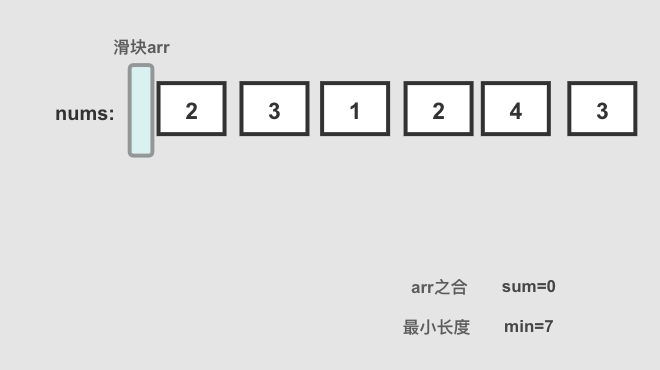

# **双指针遍历/滑动窗口**

## [3_无重复字符的最长子串](https://leetcode-cn.com/problems/longest-substring-without-repeating-characters/)

## [剑指 Offer 48. 最长不含重复字符的子字符串](https://leetcode-cn.com/problems/zui-chang-bu-han-zhong-fu-zi-fu-de-zi-zi-fu-chuan-lcof/)

### 解法一：维护数组，移动窗口

解题思路： 使用一个数组来维护滑动窗口

- 遍历字符串，判断字符是否在滑动窗口数组里

- 不在则 push 进数组

- 在则删除滑动窗口数组里相同字符及相同字符前的字符，然后将当前字符 push 进数组

- 然后将 max 更新为当前最长子串的长度

- 遍历完，返回 max 即可

画图帮助理解一下：


代码实现：

```js
var lengthOfLongestSubstring = function (s) {
  let arr = [],
    max = 0
  for (let i = 0; i < s.length; i++) {
    let index = arr.indexOf(s[i])
    if (index !== -1) {
      // 删除从开头到出现重复字母的位置字符串
      arr.splice(0, index + 1)
    }
    arr.push(s.charAt(i))
    // 	每次都要判断，找到最长的
    max = Math.max(arr.length, max)
  }
  return max
}
// 字符串是一个意思
var lengthOfLongestSubstring = function (s) {
  let len = 0,
    str = ''
  for (const item of s) {
    if (str.indexOf(item) > -1) {
      str = str.substr(str.indexOf(item) + 1) + item
    } else {
      str += item
    }
    len = len < str.length ? str.length : len
  }
  return len
}
```


时间复杂度：O(n<sup>2</sup>)， 其中 arr.indexOf() 时间复杂度为 O(n) ，arr.splice(0, index+1) 的时间复杂度也为 O(n)

空间复杂度：O(n)

### 解法二：维护下标

解题思路： 使用下标来维护滑动窗口

代码实现：

```js
var lengthOfLongestSubstring = function (s) {
  let index = 0,
    max = 0
  for (let i = 0, j = 0; j < s.length; j++) {
    index = s.substring(i, j).indexOf(s[j])
    if (index !== -1) {
      i = i + index + 1
    }
    max = Math.max(max, j - i + 1)
  }
  return max
}
```

时间复杂度：O(n<sup>2</sup>)

空间复杂度：O(n)

### 解法三：优化的Map

解题思路：

- 使用 map 来存储当前已经遍历过的字符，key 为字符，value 为下标

- 使用 i 来标记无重复子串开始下标，j 为当前遍历字符下标

- 遍历字符串，判断当前字符是否已经在 map 中存在，存在则更新无重复子串开始下标 i 为相同字符的下一位置，此时从 i 到 j 为最新的无重复子串，更新 max ，将当前字符与下标放入 map 中

- 最后，返回 max 即可

代码实现：

```js
var lengthOfLongestSubstring = function (s) {
  let map = new Map(),
    max = 0
  for (let i = 0, j = 0; j < s.length; j++) {
    if (map.has(s[j])) {
      // 更新子串起始位置i
      i = Math.max(map.get(s[j]) + 1, i)
    }
    // i是标记位，如果i没有动，说明子串没有重复，如果i动了，说明子串已经重复，所以将i移动到，新的起点，开始寻找它的下一个重复位置
    max = Math.max(max, j - i + 1)
  	// 记录or更新每个字符最后出现位置
    map.set(s[j], j)
  }
  return max
}
```


时间复杂度：O(n)

空间复杂度：O(n)

## [11. 盛最多水的容器](https://leetcode-cn.com/problems/container-with-most-water/)

### 解法一：暴力法。

长 * 宽 = 面积 

```js
var maxArea = function(height) {
  let vol = 0
  for(let i = 0;i<height.length;i++){
    for(let j = i+1;j<height.length;j++){
      let min = Math.min(height[i],height[j])
      let res = min * (j - i)
      vol = Math.max(vol, res)
    }
  }
  return vol
}
```

### 解法二：双指针

- 我们在数组中使用两个指针，一个放在开始，一个置于末尾。
- **在每一步中，我们将指向较短线段的指针向较长的线段那端移动；**（重点）
- 同时，我们记录下所有步骤里最大的面积: maxSquare。
- 时间复杂度 O(N)，双指针遍历一次底边宽度 N 。空间复杂度 O(1)，指针使用常数额外空间。

```js
/**
 * @param {number[]} height
 * @return {number}
 */
var maxArea = function (height) {
  let i = 0,
    j = height.length - 1
  let square,
    max = 0
  while (j - i >= 1) {
    if (height[i] > height[j]) {
      square = height[j] * (j - i)
      j--
    } else {
      square = height[i] * (j - i)
      i++
    }
    max = Math.max(square, max)
  }
  return max
}
```

## [15. 三数之和](https://leetcode-cn.com/problems/3sum/)

### 解法一：排序后，双指针

- 首先对数组进行排序，排序后固定一个数 nums[i]，再使用左右指针指向 nums[i]后面的两端，数字分别为 nums[L]和 nums[R]，计算三个数的和 sum判断是否满足为 0，满足则添加进结果集
- 如果 nums[i]大于 0，则三数之和必然无法等于 0，结束循环
- 如果 nums[i] == nums[i-1]，则说明该数字重复，会导致结果重复，所以应该跳过
- 当 sum == 0 时，nums[L] == nums[L+1] 则会导致结果重复，应该跳过，L++
- 当 sum == 0 时，nums[R] == nums[R-1] 则会导致结果重复，应该跳过，R--
- 时间复杂度：O(n^2)，n 为数组长度

```js
/**
 * @param {number[]} nums
 * @return {number[][]}
 */
var threeSum = function (nums) {
  let ans = []
  const len = nums.length
  if (nums == null || len < 3) return ans
  nums.sort((a, b) => a - b) // 排序
  for (let i = 0; i < len - 2; i++) {
    if (nums[i] > 0) break // 如果当前数字大于0，则三数之和一定大于0，所以结束循环
    if (i > 0 && nums[i] == nums[i - 1]) continue // 去重
    let L = i + 1
    let R = len - 1
    while (L < R) {
      const sum = nums[i] + nums[L] + nums[R]
      if (sum == 0) {
        ans.push([nums[i], nums[L], nums[R]])
        while (L < R && nums[L] == nums[L + 1]) L++ // 去重
        while (L < R && nums[R] == nums[R - 1]) R-- // 去重
        L++
        R--
      } else if (sum < 0) L++
      else if (sum > 0) R--
    }
  }
  return ans
}
```

## 解法二：暴力解

三层循环嵌套

## [18. 四数之和](https://leetcode-cn.com/problems/4sum/)

原理和三数之和类似，用双指针的方式，减少一次循环

```js
/**
 * @param {number[]} nums
 * @param {number} target
 * @return {number[][]}
 */
var fourSum = function(nums, target) {
    const len = nums.length;
    if(len < 4) return [];
    nums.sort((a, b) => a - b);
    const res = [];
    for(let i = 0; i < len - 3; i++) {
        // 去重i
        if(i > 0 && nums[i] === nums[i - 1]) continue;
        for(let j = i + 1; j < len - 2; j++) {
            // 去重j
            if(j > i + 1 && nums[j] === nums[j - 1]) continue;
            let l = j + 1, r = len - 1;
            while(l < r) {
                const sum = nums[i] + nums[j] + nums[l] + nums[r];
                if(sum < target) { l++; continue}
                if(sum > target) { r--; continue}
                res.push([nums[i], nums[j], nums[l], nums[r]]);
                while(l < r && nums[l] === nums[++l]);
                while(l < r && nums[r] === nums[--r]);
            }
        } 
    }
    return res;
};
```


## [16_最接近的三数之和](https://leetcode-cn.com/problems/3sum-closest/)

## 解法一：排序后，双指针

具体思路：

- 本题目因为要计算三个数，如果靠暴力枚举的话时间复杂度会到 O(n^3)，需要降低时间复杂度
- 首先进行数组排序，时间复杂度 O(nlogn)
- 在数组 nums 中，进行遍历，每遍历一个值利用其下标i，形成一个固定值 nums[i]
- 再使用前指针指向` start = i + 1` 处，后指针指向 `end = nums.length - 1` 处，也就是结尾处
- 根据 `sum = nums[i] + nums[start] + nums[end]` 的结果，判断 sum 与目标 target 的距离，如果更近则更新结果 ans
- 同时判断 sum 与 target 的大小关系，因为数组有序，如果 `sum > target` 则 `end--`，如果 `sum < target` 则 `start++`，如果 `sum == target` 则说明距离为 0 直接返回结果
- 整个遍历过程，固定值为 n 次，双指针为 n 次，时间复杂度为 O(n^2)

时间复杂度：*O*(*n**l**o**g**n*)+*O*(*n*2)=*O*(*n*2)

```js
var threeSumClosest = function (nums, target) {
  nums.sort((a, b) => a - b)
  let res = nums[0] + nums[1] + nums[2]
  let len = nums.length
  for (let i = 0; i < len; i++) {
    let left = i + 1,
      right = len - 1
    while (left < right) {
      let sum = nums[i] + nums[left] + nums[right]
      // 比较谁距离target更接近采用减法比较差值
      if (Math.abs(sum - target) < Math.abs(res - target)) {
        res = sum
      }
      if (sum < target) {
        left++
      } else if (sum > target) {
        right--
      } else {
        return res
      }
    }
  }
  return res
}
```

## [26. 删除排序数组中的重复项](https://leetcode-cn.com/problems/remove-duplicates-from-sorted-array/)

### 解法一：双指针

```js
/**
 * @param {number[]} nums
 * @return {number}
 */
var removeDuplicates = function (nums) {
  let left = 0,
    right = 1
  while (right < nums.length) {
    if (nums[left] !== nums[right]) {
      nums[++left] = nums[right]
    }
    right++
  }
  return left + 1
}
```


```js
/**
 * @param {number[]} nums
 * @return {number}
 */
var removeDuplicates = function (nums) {
  let count = 0
  for (let i = 0; i < nums.length; i++) {
    if (nums[i] != nums[i + 1]) {
      nums[count] = nums[i]
      count++
    }
  }
  return count
}
```

### 解法二：暴力法

```js
/**
 * @param {number[]} nums
 * @return {number}
 */
var removeDuplicates = function (nums) {
  for (let i = nums.length - 1; i >= 0; i--) {
    if (nums[i] == nums[i - 1]) {
      // 使用splice需要倒序
      nums.splice(i, 1)
    }
  }
  return nums.length
}
```

### 解法三：滑动窗口

```js
/**
 * @param {number[]} nums
 * @return {number}
 */
var removeDuplicates = function (nums) {
  let idx = 0,
    nowIdx,
    pass = 0 // 重复的个数
  while (idx + pass + 1 < nums.length) {
    nowIdx = idx + pass + 1
    if (nums[idx] === nums[nowIdx]) {
      pass++
    } else {
      // 根据题意，验证的时候只会验证前n个值是否不重复，所以将不重复的值，放到前n个就可以了
      idx++
      ;[nums[idx], nums[nowIdx]] = [nums[nowIdx], nums[idx]]
    }
  }
  return idx + 1
}
```

## [42. 接雨水](https://leetcode-cn.com/problems/trapping-rain-water/)

[解析](https://leetcode-cn.com/problems/trapping-rain-water/solution/42-jie-yu-shui-by-alexer-660/)

### 解法一：动态规划


- 找到数组中从下标 i 到最左端最高的条形块高度` leftMax`

- 找到数组中从下标 i 到最右端最高的条形块高度` rightMax`

- 扫描数组 `height `并更新答案：

  - 累加 `Math.min(leftMax[i], rightMax[i]) - height[i]` 到 volumn上

  复杂性分析

  时间复杂度：O(n)。

  存储最大高度数组，需要两次遍历，每次 O(n)。
  最终使用存储的数据更新volumn ，O(n)。
  空间复杂度：O(n) 额外空间。

```js
var trap = function (height) {
  let max = 0
  let volumn = 0
  const leftMax = []
  const rightMax = []

  for (let i = 0; i < height.length; i++) {
    // 遍历数组，查找当前 height[i] 的左边最高的值
    leftMax[i] = max = Math.max(height[i], max)
  }

  max = 0

  for (let i = height.length - 1; i >= 0; i--) {
    // 遍历数组，查找当前 height[i] 的右边最高的值
    rightMax[i] = max = Math.max(height[i], max)
  }

  for (let i = 0; i < height.length; i++) {
    volumn = volumn + Math.min(leftMax[i], rightMax[i]) - height[i]
  }

  return volumn
}
```

### 解法二：暴力破解


思路：

- 从左到右 遍历
- 设当列柱子为水洼洼底
- 同时更新，当前列左右两边洼滩的最大高度
- 以当前列为洼底的最大水洼面积为( Min(left_max,right_max) - height[i] ) * 1

时间复杂度：O(n^2)

空间复杂度：O(1)

```js
/**
 * @param {number[]} height
 * @return {number}
 */
var trap = function (height) {
  if (!height || height.length == 0) {
    return 0
  }
  let sum = 0
  // 两端列相当于只有洼底没有洼滩不能储水，也相当于平地
  // 因而下标不包含0、height.length - 2
  for (let i = 1; i < height.length - 2; i++) {
    let max_left = 0
    // 当前洼底左边最大的洼滩高度
    for (let j = i - 1; j >= 0; j--) {
      max_left = Math.max(max_left, height[j])
    }
    let max_right = 0
    // 当前洼底右边最大的洼滩高度
    for (let j = i + 1; j < height.length; j++) {
      max_right = Math.max(max_right, height[j])
    }
    // 求能够储水的最大高度
    let min = Math.min(max_left, max_right)
    if (min > height[i]) {
      sum += min - height[i]
    }
  }
  return sum
}
```

### 解法三：双指针（对撞指针）

对于凹槽来说，决定它高度的不是与它相邻的那个柱子，而是**左侧最高柱子和右侧最高柱子中，较矮的那个柱子**。

1. 维护一对`leftCur`（左指针）和`rightCur`（右指针，以对撞的形式从两边向中间遍历所有的柱子
2. 在遍历的过程中，维护一对 `leftMax` 和 `rightMax`，时刻记录当前两侧柱子高度的最大值。以便在遇到“凹槽”时，结合`leftCur`与`rightCur`各自指向的柱子高度，完成凹槽深度（也就是蓄水量）的计算。

```js
/**
 * @param {number[]} height
 * @return {number}
 */
const trap = function(height) {
    // 初始化左指针
    let leftCur = 0  
    // 初始化右指针
    let rightCur = height.length - 1  
    // 初始化最终结果
    let res = 0  
    // 初始化左侧最高的柱子
    let leftMax = 0    
    // 初始化右侧最高的柱子
    let rightMax = 0  
    
    // 对撞指针开始走路
    while(leftCur < rightCur) {
        // 缓存左指针所指的柱子的高度
        const left = height[leftCur]  
        // 缓存右指针所指的柱子的高度
        const right = height[rightCur]  
        // 以左右两边较矮的柱子为准，选定计算目标
        if(left < right) {
            // 更新leftMax
            leftMax = Math.max(left, leftMax)  
            // 累加蓄水量
            res += leftMax - left
            // 移动左指针
            leftCur++
        } else {
            // 更新rightMax
            rightMax = Math.max(right, rightMax)
            // 累加蓄水量
            res += rightMax - right  
            // 移动右指针
            rightCur-- 
        }
    }
    // 返回计算结果
    return res
};
```

### 方法四：单调栈

```js
var trap = function(height) {
    let ans = 0;
    const stack = [];
    const n = height.length;
    for (let i = 0; i < n; ++i) {
        while (stack.length && height[i] > height[stack[stack.length - 1]]) {
            const top = stack.pop();
            if (!stack.length) {
                break;
            }
            const left = stack[stack.length - 1];
            const currWidth = i - left - 1;
            const currHeight = Math.min(height[left], height[i]) - height[top];
            ans += currWidth * currHeight;
        }
        stack.push(i);
    }
    return ans;
}
```


## [121. 买卖股票的最佳时机](https://leetcode-cn.com/problems/best-time-to-buy-and-sell-stock/)

### 解法一：暴力解

```js
/**
 * @param {number[]} prices
 * @return {number}
 */
var maxProfit = function(prices) {
  let sockets = 0
  for(let i = 0;i<prices.length - 1;i++) {
    for(let j = i + 1;j<prices.length;j++) {
      if((prices[j] - prices[i])>sockets){
        sockets = prices[j] - prices[i] 
      }
    }
  }
  return sockets
}
```

### 解法二：贪心算法

利用贪心法求解的问题应具备如下2个特征。

1、贪心选择性质

一个问题的整体最优解可通过一系列局部的最优解的选择达到，并且每次的选择可以依赖以前作出的选择，但不依赖于后面要作出的选择。这就是贪心选择性质。对于一个具体问题，要确定它是否具有贪心选择性质，必须证明每一步所作的贪心选择最终导致问题的整体最优解。

2、最优子结构性质

当一个问题的最优解包含其子问题的最优解时，称此问题具有最优子结构性质。问题的最优子结构性质是该问题可用贪心法求解的关键所在。在实际应用中，至于什么问题具有什么样的贪心选择性质是不确定的，需要具体问题具体分析。

- 记录最小值和最大利润

- 循环迭代即可

```js
/**
 * @param {number[]} prices
 * @return {number}
 */
var maxProfit = function (prices) {
  let min = prices[0], //记录最小值
    max = 0 //记录最大利润
  prices.forEach((item) => {
    if (item < min) min = item
    if (item - min > max) max = item - min
  })
  return max
}
```

## [209. 长度最小的子数组](https://leetcode-cn.com/problems/minimum-size-subarray-sum/)

### 方法一：暴力解法

```js
/**
 * @param {number} s
 * @param {number[]} nums
 * @return {number}
 */
var minSubArrayLen = function(s, nums) {
  // if(nums.length == 0) return 0
  let len = Infinity
  for(let i = 0;i<nums.length;i++) {
    let sum = 0
    for(let j = i;j<nums.length;j++) {
      // 因为题目中说了是连续的子串，所以可以用这种暴力解法的方式去实现
      sum += nums[j]
      if(sum >= s) {
        len = Math.min(len, j - i + 1)
      }
    }
  }
  return len < Infinity ? len : 0
}
```

### 解法二：滑动窗口

这个和我用的暴力解法有点类似



```js
var minSubArrayLen = function (s, nums) {
  let left = 0 // 标识位，用来控制窗口的移动
  let sum = 0
  let min = Infinity //无穷大
  for (let right = 0; right < nums.length; right++) {
    sum += nums[right]
    while (sum >= s) {
      min = Math.min(min, right - left + 1)
      // 这里是减掉第一个，然后继续让循环继续。这个确实可以减少循环的次数
      sum -= nums[left++]
    }
  }
  return min < Infinity ? min : 0
}
```

### 解法三：双指针

依旧是滑动窗口，但更像是个优化

```js
/**
 * @param {number} s
 * @param {number[]} nums
 * @return {number}
 */
var minSubArrayLen = function (s, nums) {
  let left = 0
  let right = 0
  let sum = 0
  let min = Infinity //无穷大
  while (right < nums.length) {
    while (sum < s && right < nums.length) {
      sum += nums[right]
      right++
    }
    while (sum >= s && left < right) {
      min = Math.min(min, right - left)
      sum -= nums[left]
      left++
    }
  }
  return min < Infinity ? min : 0
}
```

## [剑指 Offer 52. 两个链表的第一个公共节点](https://leetcode-cn.com/problems/liang-ge-lian-biao-de-di-yi-ge-gong-gong-jie-dian-lcof/)

## [160. 相交链表](https://leetcode-cn.com/problems/intersection-of-two-linked-lists/)

### 方法一：集合

```js
var getIntersectionNode = function(headA, headB) {
    const visited = new Set();
    let temp = headA;
    while (temp !== null) {
        visited.add(temp);
        temp = temp.next;
    }
    temp = headB;
    while (temp !== null) {
        if (visited.has(temp)) {
            return temp;
        }
        temp = temp.next;
    }
    return null;
};
```


### 方法二：双指针

指针1：遍历完`headA`，再去遍历`headB`

指针2：遍历完`headB`，再去遍历`headA`

这样，两个指针走的路程就是一样的，必定会相遇。

很像莫比乌斯环

```js
var getIntersectionNode = function(headA, headB) {
    if (headA === null || headB === null) {
        return null;
    }
    let pA = headA, pB = headB;
    while (pA !== pB) {
        pA = pA === null ? headB : pA.next;
        pB = pB === null ? headA : pB.next;
    }
    return pA;
}
```

## 

## [剑指 Offer 21. 调整数组顺序使奇数位于偶数前面](https://leetcode-cn.com/problems/diao-zheng-shu-zu-shun-xu-shi-qi-shu-wei-yu-ou-shu-qian-mian-lcof/)

- 使用左右指针遍历数组
- 左指针寻找偶数，右指针寻找奇数
- 如果左指针没指向偶数，指针指向下一元素
- 如果右指针没指向奇数，指针指向下一元素
- 如果左指针指向偶数，右指针指向奇数，两个数进行互换

```js
/**
 * @param {number[]} nums
 * @return {number[]}
 */
var exchange = function(nums) {
    let numsLength = nums.length
    // 左指针
    let left = 0
    // 右指针
    let right = numsLength - 1
    let temp
    // 循环遍历
    while(left <= right){
        // 左指针寻找偶数，如果是奇数，指针进 1
        if(nums[left] % 2 === 1){
            left ++
            continue
        }
        // 右指针寻找奇数，如果是偶数，指针退 1
        if(nums[right] % 2 === 0){
            right --
            continue
        }
        // 如果左指针指着偶数，右指针指着奇数，对应的值互换
        // temp = nums[left]
        // nums[left] = nums[right]
        // nums[right] = temp
        [nums[left], nums[right]] = [nums[right], nums[left]]
        // 值互换后，同时移动左右指针
        right --
        left ++
    }
    return nums
}

// 数组问题基本要想到双指针
// 双指针解法可以优化空间和时间 原地
var exchange = function (nums) {
	let front = 0
	let after = 0
	for (let i = 0; i < nums.length; i++) {
		// 证明是偶数
		if (nums[after] % 2 === 0 && front < nums.length) {
			while (nums[front] % 2 === 0) {
				front++
			}
			if (front < nums.length) {
				// 交换
				let temp = nums[front]
				nums[front] = nums[after]
				nums[after] = temp
			}
		}
		after++
		front++
	}
	return nums
}
```

## [剑指 Offer 57. 和为s的两个数字](https://leetcode-cn.com/problems/he-wei-sde-liang-ge-shu-zi-lcof/)

```js
/**
 * @param {number[]} nums
 * @param {number} target
 * @return {number[]}
 */
var twoSum = function(nums, target) {
  let left = 0, right = nums.length - 1
  while(left <= right) {
    let value = nums[left] + nums[right]
    if(value > target) {
      right--
      continue
    }else if(value < target) {
      left++
      continue
    }else {
      return [nums[left], nums[right]]
    }
  }
}
```

## [剑指 Offer 57 - II. 和为s的连续正数序列](https://leetcode-cn.com/problems/he-wei-sde-lian-xu-zheng-shu-xu-lie-lcof/)

### 方法一：滑动窗口

```js
/**
 * @param {number} target
 * @return {number[][]}
 */
// 没有参照物数组 但是可以根据下标
// 滑动窗口（双指针）
var findContinuousSequence = function(target) {
    let l=1
    let r=2
    let sum = 3
    let res=[]
    // 滑动窗口框架
    while(l<r){
        if(sum===target){
            let ans =[]
            for(let k=l;k<=r;k++){
                ans.push(k)
            }
            res.push(ans)
            // 等于的情况 我们可以继续窗口往右搜索 同时缩小左边的
             sum=sum-l
             l++
        } else if(sum>target){
            // 大于的条件 缩小窗口 sum已经加过了
            sum=sum-l
            l++
        } else {
            // 小于的情况 滑动窗口继续扩大
            r++
            sum=sum+r
        }
    }
    return res
};
```

- 左右指针初试都指向1
- 如果左指针比目标值的1/2小，就不断寻找
- 每次寻找更新sum
- 如果sum比target小，右指针右移
- 如果sum比target大，左指针右移
- 如果相等，放入res

```js
const findContinuousSequence = target => {
    let [left, right] = [1, 1];
    let sum = 0;
    const res = [];
    while (left <= target >> 1) {
        sum = ((left + right) * (right - left + 1)) >> 1;
        if (sum < target) {
            right++;
        } else if (sum > target) {
            left++;
        } else {
            const res_item = [];
            for (let i = left; i <= right; i++) {
                res_item.push(i);
            }
            res.push(res_item);
            left++;
        }
    }
    return res;
};
```


## [剑指 Offer 58 - I. 翻转单词顺序](https://leetcode-cn.com/problems/fan-zhuan-dan-ci-shun-xu-lcof/)

```js
/**
 * @param {string} s
 * @return {string}
 */
var reverseWords = function(s) {
    // 1. 调用库函数 Array.prototype.reverse
    return s.trim().split(/\s+/).reverse().join(' ')
};
```

方法二：双指针

```js
var reverseWords = function(s) {
    // 2. 实现库函数方法
    const reverse = a => {
        // 两端指针实现 数组项翻转
        const swap = (a, i, j) => [a[i], a[j]] = [a[j], a[i]]
        let l = 0, r = a.length - 1

        while (l < r) swap(a, l++, r--)

        return a
    }

    return reverse(s.trim().split(/\s+/)).join(' ')
};

var reverseWords = function(s) {
  let arr = s.trim().replace(/\s+/g,' ').split(' ')
  let l=0;
  let r=arr.length-1
  // 双指针
  while(l<r){
    let temp=arr[l]
    arr[l] = arr[r]
    arr[r]=temp
    l++
    r--
  }
  console.log(arr)
  return arr.join(' ')
};
```


## [75. 颜色分类](https://leetcode-cn.com/problems/sort-colors/)

### 方法一：双指针

- 建立双指针，一个从头到尾，一个从尾到头。
- 从头到尾遍历数组，如果当前值(nums[i])一直为2则一直让尾指针从后往前和当前值交换：将2放到数组最后面。直到当前值不为2。
- 当前值为0的时候和头指针互换，将0放到数组最前面。

```js
/**
 * @param {number[]} nums
 * @return {void} Do not return anything, modify nums in-place instead.
 */
var sortColors = function(nums) {
    let p0 = 0;
    let p2 = nums.length-1;
    for(let i=0;i<=p2;i++){
        // 找到2 和尾指针互换
        while(nums[i] === 2 && i<p2){
            let temp = nums[i];
            nums[i] = nums[p2];
            nums[p2] = temp;
            p2--;
        }
        // 找到0和头指针互换，这里可以剪枝判断当p0 == i 的时候continue
        if(nums[i] === 0){
            let temp = nums[i];
            nums[i] = nums[p0];
            nums[p0] = temp;
            p0++; 
        }
    }
};
```

## [76. 最小覆盖子串](https://leetcode-cn.com/problems/minimum-window-substring/)

### 方法一：滑动窗口

- 将需要匹配的字符放入字典表，存储结构为需要匹配的字符，以及字符出现的次数：[字符，次数]
- 利用双指针维护一个滑动窗口，不断移动右指针
- 判断右指针的字符是否与字典表中的匹配
  - 是：将字典表中的次数 - 1，直到为 0（这里有个技巧：创建一个变量（needType）记录需要匹配的字符数量，初始长度为 Map 的 size,当对应的字符次数为 0 时，就减 1）
  - 否：继续移动右指针
- 当needType的值为 0 时，就证明在当前窗口所有字符都匹配成功了
  - 移动左指针，缩小滑动窗口的大小
  - 移动过程中判断左指针指向的值是否为字典中值，如果是就证明匹配的值少了一个，这是需要更新 Map 中的次数，以及needType的数量
  - 记录每次窗口中的字符，找到最小的返回

```js
/**
 * @param {string} s
 * @param {string} t
 * @return {string}
 */
var minWindow = function (s, t) {
  // 创建左指针
  let l = 0;
  // 创建右指针
  let r = 0;
  // 最后需要返回的最小长度子串
  let res = "";
  // 创建字典表
  const m = new Map();
  // 遍历需要匹配的字符
  for (let i = 0; i < t.length; i++) {
    const c = t[i];
    // 放入字典表
    m.set(c, m.has(c) ? m.get(c) + 1 : 1);
  }
  // 创建记录需要匹配的字符种类
  let needType = m.size;
  // 遍历字符串
  while (r < s.length) {
    // 获取当前字符
    const c = s[r];
    // 如果是需要匹配的字符
    if (m.has(c)) {
      // 更新字典表中的次数 - 1
      m.set(c, m.get(c) - 1);
      //  如果次数为0，证明这个字符种类在当前窗口已经集齐了，needType - 1
      if (m.get(c) === 0) needType -= 1;
    }
    // 当needType为0，证明所有需要匹配的字符都已经在当前滑动窗口中
    while (needType === 0) {
      const c2 = s[l];
      // 记录当前滑动窗口的字符
      let newRes = s.slice(l, r + 1);
      // 当新的窗口中的字符长度小于上次的字符长度时，更新结果
      // !res 是在结果值为空的时候需要更新一下第一次匹配的值
      if (!res || newRes.length < res.length) res = newRes;
      // 如果左指针移动过程中出现，字典中的值证明需要匹配的字符已经脱离了当前窗口
      if (m.has(c2)) {
        // 更新表中需要出现的次数
        m.set(c2, m.get(c2) + 1);
        // 更新needType
        if (m.get(c2) === 1) needType += 1;
      }
      // 移动左指针
      l++;
    }
    // 移动右指针
    r++;
  }
  // 返回结果值
  return res;
};
```

## [438. 找到字符串中所有字母异位词](https://leetcode-cn.com/problems/find-all-anagrams-in-a-string/)

题中要找异位词，那么就是找一个固定长度的字符串并且每个字符串数量跟p相同就可以。
使用一个对象记录所有需要配对的字符串，值为需要出现的次数，使用一个sum记录剩余需要配对的数量。
然后遍历s，在下标没超过p.length时只需要对对象里匹配到的字符串进行减少，当 大于或者等于0时就可以对sum进行-1，
当下标超过p.length时，对于左边超出去的字符串进行判断是否在obj里，，如果在那要对其进行增加，若大于0那么就要对sum += 1。
当遇到sum等于0的时候，将窗口最左边的元素 i - plen + 1推进答案数组里。

```js
/**
 * @param {string} s
 * @param {string} p
 * @return {number[]}
 */
var findAnagrams = function (s, p) {
    const plen = p.length;
    const obj = {};
    let sum = plen;
    let res = [];
    // 记录p字符串中每个字母出现的次数
    for (let i = 0; i < plen; i++) {
        const ps = p[i];
        obj[ps] = (obj[ps] || 0) + 1;
    }
    
    for (let i = 0; i < s.length; i++) {
        const ss = s[i];
        if (obj[ss] !== undefined) {
            obj[ss]--;
            if (obj[ss] >= 0) {
                sum--;
            }
        }
        if (i >= plen) {
            const leftStr = s[i - plen];
            if (obj[leftStr] !== undefined) {
                obj[leftStr]++;
                if (obj[leftStr] > 0) {
                    sum++;
                }
            }
        }
        if (sum === 0) res.push(i - plen + 1)
    }
    return res;
}
```

### 方法一：双指针 + 数组

```js
const CHAR_CODE_a = 'a'.charCodeAt(0)

/**
 * @param {string} s
 * @param {string} p
 * @return {number[]}
 */
var findAnagrams = function(s, p) {
  let n = s.length
  let m = p.length
  let res = []

  if(n < m) {
    return res
  }

  const count1 = new Array(26).fill(0)
  const count2 = new Array(26).fill(0)
  // 统计每个字母出现的次数
  for(let i = 0; i < m; i ++) {
    count1[s[i].charCodeAt(0) - CHAR_CODE_a]++
    count2[p[i].charCodeAt(0) - CHAR_CODE_a]++
  }
  // 对从0开始就相同的特殊处理	
  if(count1.toString() === count2.toString()) {
    res.push(0)
  }
  // 去匹配
  for(let i = m; i < n; i++) {
    // i - m的值 - 1
    count1[s[i - m].charCodeAt(0) - CHAR_CODE_a]--
    // i 位置增加 1  
    count1[s[i].charCodeAt(0) - CHAR_CODE_a]++

    if(count1.toString() === count2.toString()) {
      res.push(i - m + 1)
    }
  } 
  
  return res
};
```

## [567. 字符串的排列](https://leetcode-cn.com/problems/permutation-in-string/)

### 方法一：滑动窗口

```js
var checkInclusion = function(s1, s2) {
    const n = s1.length, m = s2.length;
    if (n > m) {
        return false;
    }
    const cnt1 = new Array(26).fill(0);
    const cnt2 = new Array(26).fill(0);
    for (let i = 0; i < n; ++i) {
        ++cnt1[s1[i].charCodeAt() - 'a'.charCodeAt()];
        ++cnt2[s2[i].charCodeAt() - 'a'.charCodeAt()];
    }
    if (cnt1.toString() === cnt2.toString()) {
        return true;
    }
    for (let i = n; i < m; ++i) {
        ++cnt2[s2[i].charCodeAt() - 'a'.charCodeAt()];
        --cnt2[s2[i - n].charCodeAt() - 'a'.charCodeAt()];
        if (cnt1.toString() === cnt2.toString()) {
            return true;
        }
    }
    return false;
};
```

### 方法二：双指针

思路其实和滑动窗口类似，节省了空间

```js
var checkInclusion = function(s1, s2) {
    const n = s1.length, m = s2.length;
    if (n > m) {
        return false;
    }
    const cnt = new Array(26).fill(0);
    for (let i = 0; i < n; ++i) {
        --cnt[s1[i].charCodeAt() - 'a'.charCodeAt()];
    }
    let left = 0;
    for (let right = 0; right < m; ++right) {
        const x = s2[right].charCodeAt() - 'a'.charCodeAt();
        ++cnt[x];
        while (cnt[x] > 0) {
            --cnt[s2[left].charCodeAt() - 'a'.charCodeAt()];
            ++left;
        }
        if (right - left + 1 === n) {
            return true;
        }
    }
    return false;
};
```

