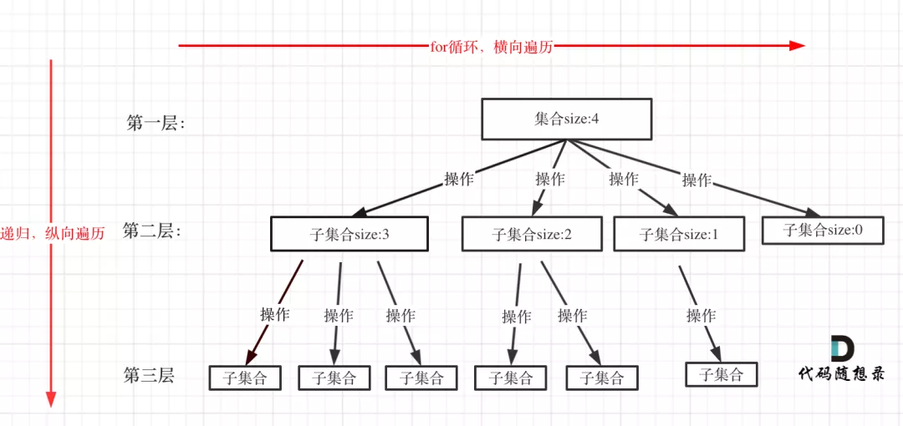
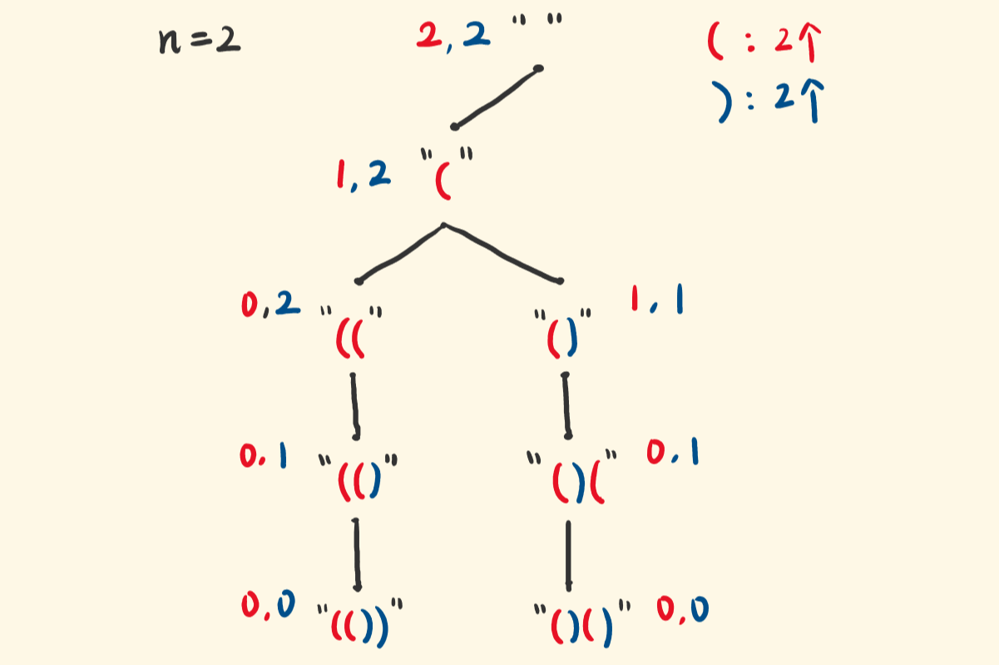

# **回溯法**

- 回溯是递归的副产品，只要有递归就会有回溯。
- 虽然回溯法很难，很不好理解，但是回溯法并不是什么高效的算法。因为回溯的本质是穷举，穷举所有可能，然后选出我们想要的答案
- 让回溯变得高效，需要配合剪枝



回溯法模板

```
function backtracking(参数) {
    if (终止条件) {
        存放结果;
        return;
    }

    for (选择：本层集合中元素（树中节点孩子的数量就是集合的大小）) {
        处理节点;
        backtracking(路径，选择列表); // 递归
        回溯，撤销处理结果
    }
}
```


## [10_正则表达式匹配](https://leetcode-cn.com/problems/regular-expression-matching/)

### 方法一：DP

[题解](https://leetcode-cn.com/problems/regular-expression-matching/solution/shou-hui-tu-jie-wo-tai-nan-liao-by-hyj8/)

```js
/**
 * @param {string} s
 * @param {string} p
 * @return {boolean}
 */
var isMatch = function(s, p) {
    if (s == null || p == null) return false
    const sLen = s.length, pLen = p.length

    let dp = Array.from(new Array(sLen + 1), () => new Array(pLen + 1).fill(false)) // 二维数组
    
	// base case
    dp[0][0] = true
    for (let j = 1; j < pLen + 1; j++) {
        if (p[j - 1] == "*") dp[0][j] = dp[0][j - 2]
    }
 	// 迭代
    for (let i = 1; i < sLen + 1; i++) {
        for (let j = 1; j < pLen + 1; j++) {
            if (s[i - 1] == p[j - 1] || p[j - 1] == ".") {
                dp[i][j] = dp[i - 1][j - 1]
            } else if (p[j - 1] == "*") {
                if (s[i - 1] == p[j - 2] || p[j - 2] == ".") {
                    dp[i][j] = dp[i][j - 2] || dp[i - 1][j - 2] || dp[i - 1][j]
                } else {
                    dp[i][j] = dp[i][j - 2]
                }
            }
        }
    }

    return dp[sLen][pLen] // 长sLen的s串 是否匹配 长pLen的p串
}
```

### 方法二：递归

```js
/**
 * @param {string} s
 * @param {string} p
 * @return {boolean}
 */
var isMatch = function(s, p) {
    if (p.length <= 0) {
    return !s.length
  }
  // 判断p模式字符串的第一个字符和s字符串的第一个字符是不是匹配
  let match = false
  if (s.length > 0 && (p[0] === s[0] || p[0] === '.')) {
    match = true
  }
  // p有模式的
  if (p.length > 1 && p[1] === '*') {
    // 第一种情况：s*匹配0个字符
    // 第二种情况：s*匹配1个字符，递归下去，用来表示s*匹配多个s
    return isMatch(s, p.slice(2)) || (match && isMatch(s.slice(1), p))
  } else {
    return match && isMatch(s.slice(1), p.slice(1))
  }
  return isMatch(s, p)
};
```


## [44. 通配符匹配](https://leetcode-cn.com/problems/wildcard-matching/)

### 方法一：DP

本题和第10题基本一样，且更容易。因为在本题中，模式 *p* 中的任意一个字符都是**独立**的，即不会和前后的字符互相关联，形成一个新的匹配模式。因此，本题的状态转移方程需要考虑的情况会少一些。

```js
/**
 * @param {string} s
 * @param {string} p
 * @return {boolean}
 */
var isMatch = function(s, p) {
    const m = s.length, n = p.length

    // 状态定义：dp[i][j] 表示 s 的前 i 个字符和 p 的前 j 个字符是否匹配
    const dp = new Array(m + 1).fill(false).map(() => new Array(n + 1).fill(false))

    // 状态初始化
    // 1. 空字符串和空字符串是匹配的
    dp[0][0] = true
    for (let i = 1; i <= n; i++) {
        // 3. 空字符串和 * 是匹配的
        if (dp[0][i - 1] && p[i - 1] == '*') {
            dp[0][i] = true
        }
    }

    // 状态转移
    for (let i = 1; i <= m; i++) {
        for (let j = 1; j <= n; j++) {
            if (s[i - 1] == p[j - 1] || p[j - 1] == '?') {
                dp[i][j] = dp[i - 1][j - 1]
            } else if (p[j - 1] == '*') {
                dp[i][j] = dp[i][j - 1] || dp[i - 1][j]
            }
        }
    }

    return dp[m][n]
}
```


## [22_括号生成](https://leetcode-cn.com/problems/generate-parentheses/)

#### 方法一：暴力法

#### 方法二：回溯法

就是不停选括号啊~，要么选左括号，要么选右括号。

并且，是有约束的：

- 只要(有剩，就可以选(。 (((((这么选，都还不能判定为非法。
- 当剩下的)比(多时，才可以选)，否则，)不能选，选了就非法了（见下图）。

描述节点的状态有：当前构建的字符串，和左右括号所剩的数量。





回溯，死抓三个要点

- 选择

  - 在这里，每次最多两个选择，选左括号，或右括号，“选择”会展开出一棵解的空间树。
  - 用 DFS 的方式遍历这棵树，找出所有的解，这个过程叫回溯。

- 约束条件

  - 即，什么情况下可以选左括号，什么情况下可以选右括号。

  - 利用约束做“剪枝”，即，去掉不会产生解的选项，即，剪去不会通往合法解的分支。
    比如()，现在左右括号各剩一个，再选)就成了())，这是错的选择，不能让它成为选项（不落入递归）：

    ```js
    if (right > left) { // 右括号剩的比较多，才能选右括号
        dfs(str + ')', left, right - 1);
    }
    ```

- 目标
  - 构建出一个用尽 n 对括号的合法括号串。
  - 意味着，当构建的长度达到 2*n，就可以结束递归（不用继续选了）。

```js
var generateParenthesis = function (n) {
  const res = [];

  const dfs = (lRemain, rRemain, str) => { // 左右括号所剩的数量，str是当前构建的字符串
    if (str.length == 2 * n) { // 字符串构建完成
      res.push(str);           // 加入解集
      return;                  // 结束当前递归分支
    }
    if (lRemain > 0) {         // 只要左括号有剩，就可以选它，然后继续做选择（递归）
      dfs(lRemain - 1, rRemain, str + "(");
    }
    if (lRemain < rRemain) {   // 右括号比左括号剩的多，才能选右括号
      dfs(lRemain, rRemain - 1, str + ")"); // 然后继续做选择（递归）
    }
  };

  dfs(n, n, ""); // 递归的入口，剩余数量都是n，初始字符串是空串
  return res;
};

```

#### 方法三：按括号序列的长度递归


#### 方法四：动态规划

简单来说，在求N个括号的排列组合时，把第N种情况（也就是N个括号排列组合）视为单独拿一个括号E出来，剩下的N-1个括号分为两部分，P个括号和Q个括号，P+Q=N-1，然后这两部分分别处于括号E内和括号E的右边，各自进行括号的排列组合。由于我们是一步步计算得到N个括号的情况的，所以小于等于N-1个括号的排列组合方式我们是已知的（用合适的数据结构存储，方便后续调用，且在存储时可利用特定数据结构实现题目某些要求，如排序，去重等），且P+Q=N-1，P和Q是小于等于N-1的，所以我们能直接得到P个和Q个括号的情况，进而得到N个括号的结果！

楼主的算法思想很巧妙，赞一个~这个算法主要的基点就是将排列组合的情况分为了括号内和括号外这两种情况，且仅存在两种情况！至于为什么，原因在于楼主的算法的前提是单独拿出来的括号E的左边在N个括号所有排列组合情况中都是处于最左边，所以不存在括号位于括号E的左边的情况。因此，N-1个括号（拿出了括号E）仅可能分布于括号E内和括号E外，分为两种子情况讨论！ 这种思想还可以应用于其他类似的题的求解中，即怎样合理高效的利用前面步骤的计算结果得出当前步骤结果，从而得出最终结果。感谢楼主分享~有收获的小伙伴别忘了点个赞哦~

```py
class Solution:
    def generateParenthesis(self, n: int) -> List[str]:
        if n == 0:
            return []
        total_l = []
        total_l.append([None])    # 0组括号时记为None
        total_l.append(["()"])    # 1组括号只有一种情况
        for i in range(2,n+1):    # 开始计算i组括号时的括号组合
            l = []        
            for j in range(i):    # 开始遍历 p q ，其中p+q=i-1 , j 作为索引
                now_list1 = total_l[j]    # p = j 时的括号组合情况
                now_list2 = total_l[i-1-j]    # q = (i-1) - j 时的括号组合情况
                for k1 in now_list1:  
                    for k2 in now_list2:
                        if k1 == None:
                            k1 = ""
                        if k2 == None:
                            k2 = ""
                        el = "(" + k1 + ")" + k2
                        l.append(el)    # 把所有可能的情况添加到 l 中
            total_l.append(l)    # l这个list就是i组括号的所有情况，添加到total_l中，继续求解i=i+1的情况
        return total_l[n]
```

## [46_全排列](https://leetcode-cn.com/problems/permutations/)

### 方法一：回溯

通用模板:

```java
void backtracking(参数) {
    if (终止条件) {
        存放结果;
        return;
    }
    for (选择 : 本层集合中的元素) {
        处理节点;
        backtracking(路径, 选择列表); // 递归
        撤销处理; // 回溯
    }
}
```

```js
/**
 * @param {number[]} nums
 * @return {number[][]}
 */
const permute = (nums) => {
  const res = []
  const used = {}

  const dfs = (path)=>{
    if(path.length === nums.length) {
      res.push([...path])
      return
    }

    for(const num of nums) {
      if(used[num]) continue
      path.push(num)
      used[num] = true
      dfs(path)
      path.pop()
      used[num] = false
    }
  }

  dfs([])
  return res
}
```

### 方法二： 递归

```js
/**
 * @param {number[]} nums
 * @return {number[][]}
 */
// 入参是一个数组
const permute = function(nums) {
  // 缓存数组的长度
  const len = nums.length
  // curr 变量用来记录当前的排列内容
  const curr = []
  // res 用来记录所有的排列顺序
  const res = []
  // visited 用来避免重复使用同一个数字
  const visited = {}
  // 定义 dfs 函数，入参是坑位的索引（从 0 计数）
  function dfs(nth) {
      // 若遍历到了不存在的坑位（第 len+1 个），则触碰递归边界返回
      if(nth === len) {
          // 此时前 len 个坑位已经填满，将对应的排列记录下来
          res.push(curr.slice())
          return 
      }
      // 检查手里剩下的数字有哪些
      for(let i=0;i<len;i++) {
          // 若 nums[i] 之前没被其它坑位用过，则可以理解为“这个数字剩下了”
          if(!visited[nums[i]]) {
              // 给 nums[i] 打个“已用过”的标
              visited[nums[i]] = 1
              // 将nums[i]推入当前排列
              curr.push(nums[i])
              // 基于这个排列继续往下一个坑走去
              dfs(nth+1) 
              // nums[i]让出当前坑位
              curr.pop()
              // 下掉“已用过”标识
              visited[nums[i]] = 0
          }
      }
  }
  // 从索引为 0 的坑位（也就是第一个坑位）开始 dfs
  dfs(0)
  return res
};
```


为什么加入解集时，要将数组内容拷贝到一个新的数组里，再加入解集？(`res.push(path.slice())`)

因为该 path 变量存的是地址引用，结束当前递归时，将它加入 res 后，该算法还要进入别的递归分支继续搜索，还要继续将这个 path 传给别的递归调用，它所指向的内存空间还要继续被操作，所以 res 中的 path 的内容会被改变，这就不对。
所以要弄一份当前的拷贝，放入 res，这样后续对 path 的操作，就不会影响已经放入 res 的内容。

```js
/**
 * @param {number[]} nums
 * @return {number[][]}
 */
const permute = (nums) => {
    const res = [];
    const used = {};

    function dfs(path) {
        if (path.length == nums.length) { // 个数选够了
            res.push(path.slice()); // 拷贝一份path，加入解集res
            return;                 // 结束当前递归分支
        }
        for (const num of nums) { // for枚举出每个可选的选项
            // if (path.includes(num)) continue; // 别这么写！查找是O(n)，增加时间复杂度
            if (used[num]) continue; // 使用过的，跳过
            path.push(num);         // 选择当前的数，加入path
            used[num] = true;       // 记录一下 使用了
            dfs(path);              // 基于选了当前的数，递归
            path.pop();             // 上一句的递归结束，回溯，将最后选的数pop出来
            used[num] = false;      // 撤销这个记录
        }
    }

    dfs([]); // 递归的入口，空path传进去
    return res;
};
```

### 方法三：双交换

```js
var permute = function(nums) {
  return nums.reduce(
    (result, num) => {
      return result.reduce((permutations, permutation) => {
        permutation.push(num)
        for (let i = permutation.length - 1; i; i--) {
          permutations.push([...permutation])
          permutation[i] = permutation[i - 1]
          permutation[i - 1] = num
        }
        permutations.push(permutation)
        return permutations
      }, [])
    },
    [[]]
  )
}
```

### 方法四：DP

```js
var permute = function(nums, n = 0) {
  if (n >= nums.length) return [[]]
  const res = []
  const prevs = permute(nums, n + 1) // permutations of elements after n
  for (let prev of prevs) {
    for (let i = 0; i <= prev.length; i++) {
      let p = prev.slice(0)
      p.splice(i, 0, nums[n]) // successively insert element n
      res.push(p)
    }
  }
  return res
}
```

### 方法五：

```js
var permute = function(nums) {
  let permutations = []

  let findPermutations = function(visited = new Set(), currPerm = []) {
    if (currPerm.length === nums.length) {
      permutations.push(currPerm)
      return
    }
    for (let i = 0; i < nums.length; i++) {
      if (!visited.has(i)) {
        findPermutations(new Set([...visited, i]), [...currPerm, nums[i]])
      }
    }
  }

  findPermutations()

  return permutations
}
```


## [79. 单词搜索](https://leetcode-cn.com/problems/word-search/)

## [剑指 Offer 12. 矩阵中的路径](https://leetcode-cn.com/problems/ju-zhen-zhong-de-lu-jing-lcof/)

### 方法一：DFS + 回溯

1、首先，dfs的关键部分在于找到一个相同字符后，如何判断后续字符是否相同，
最容易想到的就是对 `board[i][j]` 周围四个字符进行判断，
因此，这就明确了 dfs 的输入至少要有 i j 这两个 index，
由于还需要定位 word 中的字符，输入再加一个 k ，指向 word 中的目标字符；

2、对四周字符进行判断：
`dfs(i-1,j,k+1)` // 上
`dfs(i+1,j,k+1)` // 下
`dfs(i,j-1,k+1) `// 左
`dfs(i,j+1,k+1)` // 右

k+1 是比对 word 中的下一个字符；

3、明确核心部分之后，要确定终止条件：
3.1、当 k 已经达到 word 的长度，即代表已经完成比对 return true；
3.2、当 i 或 j 已经超出正常范围，说明触碰到边界了，return false；
3.3、当前字符与比对字符不同，return false （这个条件并没有直接列出，原因往后看）；
4、在确定终止条件之后，如何开始 我们可以选择通过两层 for 循环嵌套，找到与 word[0] 相同的字符，并从该位置开始 dfs。我没有选择这样做，因为觉得这个完全可以放在 dfs 内：
4.1、如果要将遍历放在 dfs 内，那就必须要做 ++i ++j 的操作移动指针，在第3步中，如果我们将3.3的终止条件列出，并直接 return false，dfs 内就不好进行遍历了，所以直接在 `board[i][j]` === word[k] 时对四周字符查找，不相同则进入下一步；
4.2、当 `board[i][j] `！== word[k] 或 相等但后续没法拼成完整 word 时，如果此时 k > 0，说明不是在找首字符，直接 return false，如果是在找首字符，那么推指针：

```js
if (++j === n) { // 遍历到右端 该换行了
	if (++i === m) return false // 已经到右下角了，遍历结束也没能找到符合要求的
	j = 0
}
```


以上代码在推指针的同时，也判断了是否超边界；
4.3、当推完指针，且此时的 i j 都合法，进行下一个 dfs；
5、在完成以上功能后，题目中有一个小细节 “同一个单元格内的字母不允许被重复使用”，此时，我们要避免向四周字符 dfs 时使用到重复的字符，可以使用 set 保存已使用字符的坐标（用 i*10+j 双位保存），这样有点累赘，时间和空间都耗费了，所以取个巧：
题目只说不允许重复使用，如果我们把它变成一个绝对不会在 word 里出现的字符，不就等同于把它去除了吗？这个去除不能是永久的，因为一旦这条路走不通的时候，我们要恢复之，当重新开始匹配的时候是可以再用的，所以，在向四周查找比对之前，将 board[i][j] 保存后再换成一个非字母的字符：
let save =` board[i][j]` // 记录值
`board[i][j] = '/' `// 选择一个必不会出现在 word 中的字符
当然，如果此次比对不成功，即第2条中的四个方向的 dfs 均 return false 时，恢复 `board[i][j]`：
`board[i][j] = save`
注意这里的save不是同一个参数，每层都有一个，
所以如果层很深，其实还是会耗费空间的，但相比 set 已经很优化了，至少时间少了很多；
6、最后，只用优雅的 return dfs(0,0,0) 就得到结果了。


```js
/**
 * @param {character[][]} board
 * @param {string} word
 * @return {boolean}
 */
var exist = function(board, word) {
  // 二维数组跟树不同 做DFS的时候 有不同的起点
  for(let i=0;i<board.length;i++){
      // 因为是矩阵 board[0]
    for(let j=0;j<board[0].length;j++){
      if(dfs(board,word,i,j,0)){
        return true
      }
    }
  }
  return false
};
 // DFS 最后一步拿到结果 回溯的时候 上层（栈底）才能拿到值
function dfs(board,word,i,j,k){
    // 递归的base case，边界条件
    if(i<0||j<0||i>=board.length||j>=board[0].length||board[i][j]!==word[k]){
        return false
    }
    if(k===word.length-1){
        console.log('k',k)
        return true
    }
    board[i][j] ='' // 标记下已经查找过的，因为四周的字母做dfs的时候，会用到这个单词，所以要先设为''
    // !上下左右 每次进去 k+1==>表示 走了多少步
    let res =dfs(board,word,i-1,j,k+1)||dfs(board,word,i+1,j,k+1)||dfs(board,word,i,j-1,k+1)||dfs(board,word,i,j+1,k+1)
    // 撤销
    board[i][j]=word[k]
    return res
 }
```

```js
/**
 * @param {character[][]} board
 * @param {string} word
 * @return {boolean}
 */
var exist = function(board, word) {
    var row = board.length;
    var col = board[0].length;

    var dfs = function(i,j,board,word,index){
        // 注意条件
        if(i < 0 || i >= row || j < 0 || j > col || board[i][j] !== word[index]) return false; // 判断不符合条件
        if(index === word.length - 1) return true;  // word遍历完了
        var tmp = board[i][j];  // 记录到board的值
        board[i][j] = '-'      // 锁上，因为后续的递归是4个方向上的，无法保证上一个方向的值
        var res =  dfs(i - 1,j,board,word,index + 1) || dfs(i + 1,j,board,word,index + 1) || dfs(i,j - 1,board,word,index + 1) || dfs(i,j + 1,board,word,index + 1);
        board[i][j] = tmp;   // 恢复现场
        return res;
    }

    // 遍历整个board，找到初始位置点
    for(var i = 0;i < row; i++){
        for(var j = 0; j < col; j++){
            // 0 用来记录遍历word到第几个位置
            if(dfs(i,j,board,word,0)) return true;
        }
    }
    // 没找到
    return false
}
```

```js
var exist = function(board, word) {
    if(board.length === 1&& board[0].length===1 &&board[0][0] === word){
        return true
    }
    //记录是否走过
    let arr=Array.from(Array(board.length),()=>Array(board[0].length).fill(false))
    let isSuccess=false;
    //四个方向延伸
    let dir=[[0,1],[1,0],[-1,0],[0,-1]]

    const toBack=(x,y,step)=>{

        if(step>word ||  board[x][y] !== word[step] || isSuccess){
            return false
        }
        if(step === word.length-1){
            isSuccess=true;
            return false
        }
        for(let i=0;i<dir.length;i++){
            let x1=dir[i][0] + x
            let y1=dir[i][1] + y
            if(x1<board.length&&x1>=0&&y1<board[x].length&&y1>=0&&!arr[x1][y1]){
                //试探性延伸 如果可以延伸 就记录下来 如果不行就回到这一步
                arr[x1][y1]=true
                toBack(x1,y1,step+1)
                 arr[x1][y1]=false
            }
        }
    }
    for(let i=0;i<board.length;i++){
        for(let j=0;j<board[i].length;j++){
            arr[i][j]=true;
            toBack(i,j,0);
            arr[i][j]=false;
        }
    }
    return isSuccess;
};
```


```js
/**
 * @param {character[][]} board
 * @param {string} word
 * @return {boolean}
 */
var exist = function(board, word) {
  let m = board.length, n = board[0].length, l = word.length
  if (m * n < l) return false // 字库长度小于单词长度 必不可能成功
  const dfs = (i,j,k) => {
    if (k === l) return true // 已经找到完整的 word
    if (i < 0 || i >= m || j < 0 || j >= n) return false // 超过边界
    if (board[i][j] === word[k]) { // 字符相同
      let save = board[i][j] // 记录值
      board[i][j] = '/' // 选择一个必不会出现在 word 中的字符
      if (dfs(i-1,j,k+1) ||
          dfs(i+1,j,k+1) ||
          dfs(i,j-1,k+1) ||
          dfs(i,j+1,k+1)) { // 向四个方向找下一位
        return true // 找到了符合要求的
      } else { // 四个方向都没有与下一个字符相同的
        board[i][j] = save // 该字符不符合要求，不是要找的下一位，恢复字符
      }
    }
    if (k > 0) {
      return false
    } else {
      if (++j === n) { // 遍历到右端 该换行了
        if (++i === m) return false // 已经到右下角了，遍历结束也没能找到符合要求的
        j = 0
      }
      return dfs(i,j,k) // 继续遍历
    }
  }

  return dfs(0,0,0)
};
```

## [剑指 Offer 38. 字符串的排列](https://leetcode-cn.com/problems/zi-fu-chuan-de-pai-lie-lcof/)

## [47. 全排列 II](https://leetcode-cn.com/problems/permutations-ii/)

### 方法一：递归

```js
const permutation = s => {
    if (s.length === 0) return [''];
    // 递归出口
    if (s.length === 1) return [s];
    const res = [];
    const len = s.length;
    for (let i = 0; i < len; i++) {
        // 取出一个字符为char
        const char = s[i];
        // newStr=去掉char后剩下的字符
        // a -> bc  b -> c  c -> b
        // b -> ac  a -> b  c -> a
        // c -> ab  a -> b  b -> a
        let newStr = s.slice(0, i) + s.slice(i + 1);
        // 递归产生newStr的全排列
        const next = permutation(newStr);
        // 将char与newStr的全排列拼接，放入res
        next.forEach(item => {
            res.push(char + item);
        });
    }
    // 去重
    return [...new Set(res)];
};
```

### 方法二：回溯

```js
/**
 * @param {string} s
 * @return {string[]}
 */
var permutation = function(s) {
    const rec = [], vis = [];
    const n = s.length;
    const arr = Array.from(s).sort();
    const perm = [];

    const backtrack = (arr, i) => {
        if (i === n) {
            rec.push(perm.toString())
            return
        }
        for (let j = 0; j < n; j++) {
            if (vis[j] || (j > 0 && !vis[j - 1] && arr[j - 1] === arr[j])) {
                continue
            }
            vis[j] = true
            perm.push(arr[j])
            backtrack(arr, i + 1)
            perm.pop()
            vis[j] = false
        }
    }

    backtrack(arr, 0)
    const size = rec.length
    const recArr = new Array(size).fill(0)
    for (let i = 0; i < size; i++) {
        recArr[i] = rec[i].split(',').join('')
    }
    return recArr
}
```

```js
// LeetCode 47
var permuteUnique = function(nums) {
    const ans = [];
    const vis = new Array(nums.length).fill(false);
    const backtrack = (idx, perm) => {
        if (idx === nums.length) {
            ans.push(perm.slice());
            return;
        }
        for (let i = 0; i < nums.length; ++i) {
            if (vis[i] || (i > 0 && nums[i] === nums[i - 1] && !vis[i - 1])) {
                continue;
            }
            perm.push(nums[i]);
            vis[i] = true;
            backtrack(idx + 1, perm);
            vis[i] = false;
            perm.pop();
        }
    }
    nums.sort((x, y) => x - y);
    backtrack(0, []);
    return ans;
};
```


## [剑指 Offer 13. 机器人的运动范围](https://leetcode-cn.com/problems/ji-qi-ren-de-yun-dong-fan-wei-lcof/)

### 方法一：bfs

这其实就是暴力解法

```js
/**
 * @param {number} m
 * @param {number} n
 * @param {number} k
 * @return {number}
 */
var movingCount = function(m, n, k) {
    // 位数和
    function getSum(num) {
        let answer = 0
        while(num) {
            answer += num % 10
            num = Math.floor(num / 10)
        }
        return answer
    } 
    // 方向数组，但是这题其实只需要计算向下和向右两个方向
    const directionAry = [
        [-1, 0], // 上
        [0, 1], // 右
        [1, 0], // 下
        [0, -1] // 左
    ]

    // 已经走过的坐标
    let set = new Set(['0,0'])

    // 将遍历的坐标队列，题意要求从[0,0]开始走
    let queue = [[0, 0]]

    // 遍历队列中的坐标
    while(queue.length) {
        // 移除队首坐标
        let [x, y] = queue.shift()

        // 遍历方向
        for(let i = 0; i < 4; i++) {
            let offsetX = x + directionAry[i][0]
            let offsetY = y + directionAry[i][1]

            // 临界值判断
            if(offsetX < 0 || offsetX >= m || offsetY < 0 || offsetY >= n || getSum(offsetX) + getSum(offsetY) > k || set.has(`${offsetX},${offsetY}`)) {
                continue
            }

            // 走过的格子就不再纳入统计
            set.add(`${offsetX},${offsetY}`)

            // 将该坐标加入队列（因为这个坐标的四周没有走过，需要纳入下次的遍历）
            queue.push([offsetX, offsetY])
        }
    }

    // 走过坐标的个数就是可以到达的格子数
    return set.size
};
```

### 方法二：DFS

```js
/**
 * @param {number} m
 * @param {number} n
 * @param {number} k
 * @return {number}
 */
var movingCount = function(m, n, k) {
    function getsum(x){
        let sum = 0;
        while(x){
            sum += x%10;
            x = Math.floor(x/10);
        }
        return sum;
    }

    const directedArr = [
        [1,0],  //down
        [0,1]   //right
    ];
    var s = new Set(['0,0']);
    dfs(0,0,k);

    function dfs(x,y,k){
            for(let i=0;i<2;i++){
                let offsetX = x + directedArr[i][0];
                let offsetY = y + directedArr[i][1];
                if(offsetX<0 || offsetY<0 || offsetX>m-1 || offsetY>n-1 || getsum(offsetY)+ getsum(offsetX)>k || s.has(`${offsetX},${offsetY}`)) {
                    continue
                }
                s.add(`${offsetX},${offsetY}`)
                dfs(offsetX,offsetY,k)
        }
    }
    return s.size
}

// 另一种写法
/**
 * @param {number} m
 * @param {number} n
 * @param {number} k
 * @return {number}
 */
var movingCount = function(m, n, k) {
  let total = 0
  let obj = {}
  function runing(i,j){
    //边界直接返回
    if(i < 0 || j < 0 || i >= m || j >= n) return
    let sum = (i + '' + j).split('').reduce((a,b) => +a + +b)
    let axis = JSON.stringify([i,j])
    if(sum <= k && !obj[axis]){  // 当该点还没走过 和 满足 不大于k 时 继续执行
      total++
      obj[axis] = true  // 标识该点已经走过, 下次不进
      // 当前的继续 上下左右 走
      runing(i + 1, j)
      runing(i, j + 1)
      runing(i - 1, j)
      runing(i, j - 1)
    }
  }
  runing(0,0)
  return total
};
```

## [77. 组合](https://leetcode-cn.com/problems/combinations/)

## [39. 组合总和](https://leetcode-cn.com/problems/combination-sum/)


```js
var combinationSum = function(candidates, target) {
    const ans = [];
    const dfs = (target, combine, idx) => {
        if (idx === candidates.length) {
            return;
        }
        if (target === 0) {
            ans.push(combine);
            return;
        }
        // 直接跳过
        dfs(target, combine, idx + 1);
        // 选择当前数
        if (target - candidates[idx] >= 0) {
            dfs(target - candidates[idx], [...combine, candidates[idx]], idx);
        }
    }

    dfs(target, [], 0);
    return ans;
};
```

剪枝

```js
const combinationSum = (candidates, target) => {
  const res = [];
  const dfs = (start, temp, sum) => { // start是当前选择的起点索引 temp是当前的集合 sum是当前求和
    if (sum >= target) {
      if (sum == target) {
        res.push(temp.slice()); // temp的拷贝 加入解集
      }
      return;   // 结束当前递归
    }
    for (let i = start; i < candidates.length; i++) { // 枚举当前可选的数，从start开始
      temp.push(candidates[i]);          // 选这个数
      dfs(i, temp, sum + candidates[i]); // 基于此继续选择，传i，下一次就不会选到i左边的数
      temp.pop();   // 撤销选择，回到选择candidates[i]之前的状态，继续尝试选同层右边的数
    }
  };
  dfs(0, [], 0); // 最开始可选的数是从第0项开始的，传入一个空集合，sum也为0
  return res;
};


var combinationSum = function(candidates, target) {
    const res = [], path = [];
    candidates.sort(); // 排序

    function backtracking(j, sum) {
        if (sum > target) return;
        if (sum === target) {
            res.push(Array.from(path));
            return;
        }
        for(let i = j; i < candidates.length; i++ ) {
            const n = candidates[i];
            if(n > target - sum) continue;
            path.push(n);
            sum += n;
            backtracking(i, sum);
            path.pop();
            sum -= n;
        }
    }
    
    backtracking(0, 0);
    return res;
};
```

## [131. 分割回文串](https://leetcode-cn.com/problems/palindrome-partitioning/)


## [17. 电话号码的字母组合](leetcode.cn/problems/letter-combinations-of-a-phone-number/)

方案一：回溯

需要弄明白的问题
1. 如何处理重复的字母
2. 如何处理空字符串
3. 输入1 * #按键等等异常情况


```js
/**
 * @param {string} digits
 * @return {string[]}
 */
var letterCombinations = function (digits) {
    // 定义一个对象，用于存储每个数字对应的字母列表
    const map = {
        '2': ['a', 'b', 'c'],
        '3': ['d', 'e', 'f'],
        '4': ['g', 'h', 'i'],
        '5': ['j', 'k', 'l'],
        '6': ['m', 'n', 'o'],
        '7': ['p', 'q', 'r','s'],
        '8': ['t', 'u', 'v'],
        '9': ['w', 'x', 'y', 'z']
    };
    // 如果输入的数字字符串为空或者为 undefined，直接返回空数组
    if (!digits || digits === "") {
        return [];
    }
    // 用于存储最终结果的数组，即所有可能的字母组合
    let res = [];
    // 定义深度优先搜索（DFS）函数
    function dfs(digits, startIndex, path) {
        // 如果当前路径（path）的长度等于输入数字字符串（digits）的长度，
        // 说明已经找到了一个完整的字母组合，将其转换为字符串并添加到结果数组（res）中
        if (path.length === digits.length) {
            res.push(path.join(""));
            return;
        }
        // 从 startIndex 开始遍历输入的数字字符串（digits）
        for (let i = startIndex; i < digits.length; i++) {
            // 获取当前位置的数字
            let cur = digits[i];
            // 根据当前数字，从 map 对象中获取对应的字母列表
            let letters = map[cur];
            // 遍历当前数字对应的字母列表
            for (let c of letters) {
                // 将当前字母添加到路径（path）中
                path.push(c);
                // 递归调用 DFS 函数，处理下一个数字，同时更新起始索引（i + 1）
                dfs(digits, i + 1, path);
                // 回溯，将刚刚添加的字母从路径（path）中移除，尝试其他可能的组合
                path.pop();
            }
        }
    }
    // 初始化一个空数组，用于存储构建字母组合的路径
    let path = [];
    // 调用 DFS 函数，从数字字符串的第一个位置开始搜索
    dfs(digits, 0, path);
    // 返回最终的结果数组，包含所有可能的字母组合
    return res;
};
```