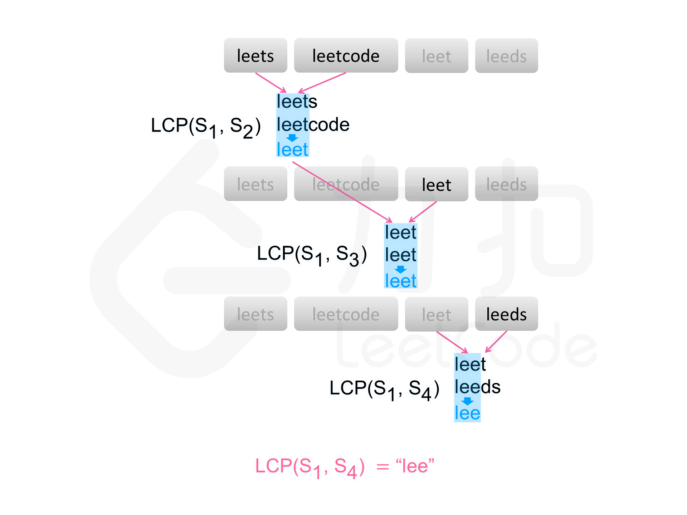

# 字符串操作

## [680. 验证回文字符串 Ⅱ](https://leetcode-cn.com/problems/valid-palindrome-ii/)

### 方法一：双指针

```js
/**
 * @param {string} s
 * @return {boolean}
 */
const validPalindrome = function(s) {
  // 缓存字符串的长度
  const len = s.length

  // i、j分别为左右指针
  let i = 0,
    j = len - 1

  // 当左右指针均满足对称时，一起向中间前进
  while (i < j && s[i] === s[j]) {
    i++
    j--
  }

  // 尝试判断跳过左指针元素后字符串是否回文
  if (isPalindrome(i + 1, j)) {
    return true
  }
  // 尝试判断跳过右指针元素后字符串是否回文
  if (isPalindrome(i, j - 1)) {
    return true
  }

  // 工具方法，用于判断字符串是否回文
  function isPalindrome(st, ed) {
    while (st < ed) {
      if (s[st] !== s[ed]) {
        return false
      }
      st++
      ed--
    }
    return true
  }

  // 默认返回 false
  return false
}
```


## [6. Z字形变换](https://leetcode-cn.com/problems/zigzag-conversion/)

### 解法一：

思路：

- 整体的思路是遍历字符串，遍历过程中将每行都看成新的字符串构成字符串数组，最后再将该数组拼接起来即可
- 如果 numRows=1 则说明当前字符串即为结果，直接返回
- 否则整个字符串需要经历，向下向右，向下向右，这样的反复循环过程，设定 down 变量表示是否向下，loc变量表示当前字符串数组的下标
- 如果 down 为 true，则 loc+=1，字符串数组下标向后移动，将当前字符加入当前字符串中
- 如果 down 为 false，则表示向右，则 loc-=1，字符串数组下标向前移动，将当前字符加入当前字符串中
- 时间复杂度：O(n)，n为字符串s的长度

```js
/**
 * @param {string} s
 * @param {number} numRows
 * @return {string}
 */
var convert = function (s, numRows) {
  if (numRows == 1) return s

  const len = Math.min(s.length, numRows)
  const rows = []
  for (let i = 0; i < len; i++) rows[i] = ''
  let loc = 0
  let down = false

  for (const c of s) {
    rows[loc] += c
    if (loc == 0 || loc == numRows - 1) down = !down
    loc += down ? 1 : -1
  }

  let ans = ''
  for (const row of rows) {
    ans += row
  }
  return ans
}
```

### 解法二：

#### 解题思路


- 以 V 字型为一个循环, 循环周期为 n = (2 * numRows - 2) （2倍行数 - 头尾2个）。
- 对于字符串索引值 i，计算 x = i % n 确定在循环周期中的位置。
- 行号 y = min(x, n - x)。

以 numRows = 4 为例，则 n = 6， 规律如下：

| rows |                                |                              |                             |                               |
| ---- | ------------------------------ | ---------------------------- | --------------------------- | ----------------------------- |
| 0    | x = 0 % 6 = 0 ✔️<br/>6 - x = 6  |                              |                             | x = 6 % 6 = 0 ✔️<br/>6 - x = 6 |
| 1    | x = 1 % 6 =1 ✔️<br/>6 - x = 5   |                              | x =5 % 6 = 5<br/>6 - x =1 ✔️ | x = 7 % 6 =1 ✔️<br/>6 - x = 5  |
| 2    | x = 2 % 6 = 2 ✔️<br/> 6 - x = 4 | x =4 % 6 = 4<br/>6 - x = 2 ✔️ |                             | x = 8 % 6 = 2 ✔️<br/>6 - x = 4 |
| 3    | x =3 % 6 = 3 ✔️<br/>6 - x = 3   |                              |                             |                               |


根据规律可拼接出每一行的的字符串，最后合并所有行即可。

```js
/**
 * @param {string} s
 * @param {number} numRows
 * @return {string}
 */
var convert = function (s, numRows) {
  if (numRows === 1) return s
  const rows = new Array(numRows).fill('')
  // 用空字符串填充数组，默认是undefined.也为后续字符串相连做准备。
  const n = 2 * numRows - 2 //循环周期
  for (let i = 0; i < s.length; i++) {
    const x = i % n
    rows[Math.min(x, n - x)] += s[i] //V字形走位规律， 按行拼接
     /*核心是这句，总共有numRows个数组元素。
       字符s.length个，numRows个元素按照v字形走位规律，循环周期是n
       一次循环数组元素依次可接收最多n个字符，一直循环到字符串耗尽为止。*/
  }
  return rows.join('')
}
```

### 解法三：转换成数组 长度为numRows

```js
/**
 * @param {string} s
 * @param {number} numRows
 * @return {string}
 */
var convert = function (s, numRows) {
  //每一个元素都是一个字符串
  let arr = []
  let str = ''
  let loop = 0 //循环次数
  //普通列  一列肯定有numRows个数
  //特殊列  一列肯定只有一个数(PS:如果numRows <= 2 没有特殊列)
  let normal = 0 //普通 值：0 ~ (numRows - 1)  从上往下（递减）
  let special = 0 //特殊 值：1 ~ (numRows - 2) 从下往上（递增）

  while (loop < s.length) {
    if (special < 1) {
      //当special值不符合 1 ~ (numRows - 2) 时,为普通列赋值
      !arr[normal] && (arr[normal] = '') //初始化
      arr[normal] += s[loop]
      if (normal < numRows - 1) {
        normal++
      } else {
        // 普通列满列 重置special、normal
        special = numRows - 2
        normal = 0
      }
    } else {
      // 特殊列 special递减
      arr[special] += s[loop]
      special--
    }
    loop++
  }
  loop = 0
  while (loop < arr.length) {
    str += arr[loop]
    loop++
  }
  return str
}
```

### 解法四：

```js
/**
 * @param {string} s
 * @param {number} numRows
 * @return {string}
 */
var convert = function (s, numRows) {
  if (numRows === 0) return ''
  if (numRows === 1) return s
  var isDown = false
  var nowRow = 0
  var array = new Array(numRows).fill('')
  array.forEach.call(s, (val) => {
    array[nowRow] += val
    if (nowRow === numRows - 1) {
      isDown = false
    } else if (nowRow === 0) {
      isDown = true
    }
    nowRow += isDown ? 1 : -1
  })
  return array.join('')
}
```


## [14. 最长公共前缀](https://leetcode-cn.com/problems/longest-common-prefix/)

### 方法一：暴力破解

横向扫描法


```js
/**
 * @param {string[]} strs
 * @return {string}
 */
var longestCommonPrefix = function(strs) {
  if(strs.length == 0)   return ""
  let str = strs[0], s = ''

  for(let i = 1;i<strs.length;i++) {
    let j = 0
    for(;j<str.length && j<strs[i].length;j++){
      if(str[j] != strs[i][j]){
        break
      }
    }
    str = str.substr(0, j);
    if(str === "") return str
  }
  return str
}

// 自己写的
var longestCommonPrefix = function(strs) {
  if (strs.length == 0) return ''
  let str = strs[0]
  
  // 从1开始遍历
  for(let i = 1,len = strs.length;i<len;i++) {
    // 只需要遍历str的长度，
    for(let j = 0;j< str.length;j++){
      // 当字母不同的时候，截取字符串
      if(str[j] != strs[i][j]){
        str = str.substring(0, j)
      }
    }
  }
  return str
}
```

纵向扫描法


```js
/**
 * @param {string[]} strs
 * @return {string}
 */
var longestCommonPrefix = function (strs) {
  if (strs.length == 0) return ''
  let length = strs[0].length
  let count = strs.length
  for (let i = 0; i < length; i++) {
    let c = strs[0][i]
    for (let j = 0; j < count; j++) {
      if (i == strs[j].length || strs[j][i] != c) {
        return strs[0].substring(0, i)
      }
    }
  }
  return strs[0]
}
```

### 方法二：仅需最大、最小字符串的最长公共前缀

获取数组中的最大值及最小值字符串，最小字符串与最大字符串的最长公共前缀也为其他字符串的公共前缀，即为字符串数组的最长公共前缀

例如 abc 、 abcd 、ab 、ac ，最小 ab 与最大 ac 的最长公共前缀一定也是 abc 、 abcd 的公共前缀，这个比较是比较**ascii码**


```js
/**
 * @param {string[]} strs
 * @return {string}
 */
var longestCommonPrefix = function (strs) {
  if (strs === null || strs.length === 0) return ''
  if (strs.length === 1) return strs[0]
  let min = 0,
    max = 0
  for (let i = 1; i < strs.length; i++) {
    if (strs[min] > strs[i]) min = i
    if (strs[max] < strs[i]) max = i
  }
  for (let j = 0; j < strs[min].length; j++) {
    if (strs[min].charAt(j) !== strs[max].charAt(j)) {
      return strs[min].substring(0, j)
    }
  }
  return strs[min]
}
```

### 方法三：分治策略 归并思想


分治，顾名思义，就是分而治之，将一个复杂的问题，分成两个或多个相似的子问题，在把子问题分成更小的子问题，直到更小的子问题可以简单求解，求解子问题，则原问题的解则为子问题解的合并。

这道题就是一个典型的分治策略问题：

- 问题：求多个字符串的最长公共前缀 
- 分解成多个相似的子问题：求两个字符串的最长公共前缀
- 子问题可以简单求解：两个字符串的最长公共前缀求解很简单
- 原问题的解为子问题解的合并：多个字符串的最长公共前缀为两两字符串的最长公共前缀的最长公共前缀，我们可以归并比较两最长公共前缀字符串的最长公共前缀，知道最后归并比较成一个，则为字符串数组的最长公共前缀：LCP(S1, S2, ..., Sn) = LCP(LCP(S1, Sk), LCP(Sk+1, Sn))

**时间复杂度：O(s)，s 是所有字符串中字符数量的总和**

**空间复杂度：O(m\*logn)，n是数组的长度，m为字符串数组中最长字符的长度**


```js
/**
 * @param {string[]} strs
 * @return {string}
 */
var longestCommonPrefix = function (strs) {
  if (strs === null || strs.length === 0) return ''
  return lCPrefixRec(strs)
}

// 若分裂后的两个数组长度不为 1，则继续分裂
// 直到分裂后的数组长度都为 1，
// 然后比较获取最长公共前缀
function lCPrefixRec(arr) {
  let length = arr.length
  if (length === 1) {
    return arr[0]
  }
  let mid = Math.floor(length / 2),
    left = arr.slice(0, mid),
    right = arr.slice(mid, length)
  return lCPrefixTwo(lCPrefixRec(left), lCPrefixRec(right))
}

// 求 str1 与 str2 的最长公共前缀
function lCPrefixTwo(str1, str2) {
  let j = 0
  for (; j < str1.length && j < str2.length; j++) {
    if (str1.charAt(j) !== str2.charAt(j)) {
      break
    }
  }
  return str1.substring(0, j)
}
```

### 方法四：Trie 树（字典树）

Trie 树，也称为字典树或前缀树，顾名思义，它是用来处理字符串匹配问题的数据结构，以及用来解决集合中查找固定前缀字符串的数据结构。

解题思路： 构建一个 Trie 树，字符串数组的最长公共序列就为从根节点开始遍历树，直到：

- 遍历节点存在超过一个子节点的节点

- 或遍历节点为一个字符串的结束字符

为止，走过的字符为字符串数组的最长公共前缀

时间复杂度：O(s+m)，s 是所有字符串中字符数量的总和，m为字符串数组中最长字符的长度，构建 Trie 树需要 O(s) ，最长公共前缀查询操作的复杂度为 O(m)

空间复杂度：O(s)，用于构建 Trie 树


```js
/**
 * @param {string[]} strs
 * @return {string}
 */
var longestCommonPrefix = function (strs) {
  if (strs === null || strs.length === 0) return ''
  // 初始化 Trie 树
  let trie = new Trie()
  // 构建 Trie 树
  for (let i = 0; i < strs.length; i++) {
    if (!trie.insert(strs[i])) return ''
  }
  // 返回最长公共前缀
  return trie.searchLongestPrefix()
}
// Trie 树
var Trie = function () {
  this.root = new TrieNode()
}
var TrieNode = function () {
  // next 放入当前节点的子节点
  this.next = {}
  // 当前是否是结束节点
  this.isEnd = false
}

Trie.prototype.insert = function (word) {
  if (!word) return false
  let node = this.root
  for (let i = 0; i < word.length; i++) {
    if (!node.next[word[i]]) {
      node.next[word[i]] = new TrieNode()
    }
    node = node.next[word[i]]
  }
  node.isEnd = true
  return true
}

Trie.prototype.searchLongestPrefix = function () {
  let node = this.root
  let prevs = ''
  while (node.next) {
    let keys = Object.keys(node.next)
    if (keys.length !== 1) break
    if (node.next[keys[0]].isEnd) {
      prevs += keys[0]
      break
    }
    prevs += keys[0]
    node = node.next[keys[0]]
  }
  return prevs
}
```

## [剑指 Offer 05. 替换空格](https://leetcode-cn.com/problems/ti-huan-kong-ge-lcof/)

### 方法一：原生API

- `repleace/replaceAll`
- `encodeURIComponent`
- `split/join`
- 或者循环一遍，暴力解法

方法二：

```js
var replaceSpace = function(s) {
    s = s.split("")
    let oldLen = s.length
    let spaceCount = 0
    for (let i = 0; i < oldLen; i++) {
        if (s[i] === ' ') spaceCount++
    }
    s.length += spaceCount * 2 // 需要修改的字符传的长度
    for (let i = oldLen - 1, j = s.length - 1; i >= 0; i--, j--) {
        if (s[i] !== ' ') s[j] = s[i] // 给新字符串赋值
        else {
            s[j - 2] = '%'
            s[j - 1] = '2'
            s[j] = '0'
            j -= 2
        }
    }
    return s.join('')
};
```

## [剑指 Offer 58 - II. 左旋转字符串](https://leetcode-cn.com/problems/zuo-xuan-zhuan-zi-fu-chuan-lcof/)

### 方法一：库函数

```js
/**
 * @param {string} s
 * @param {number} n
 * @return {string}
 */
var reverseLeftWords = function(s, n) {   
	let len = n%s.length
    return s.slice(len) + s.slice(0, len)
}
```

方法二：分治

```js
/**
 * @param {string} s
 * @param {number} n
 * @return {string}
 */
var reverseLeftWords = function (s, n) {
  let result = [];
  for (let i = n; i < s.length + n; i++) {
    result[i - n] = s[i % s.length];
  }
  return result.join('');
};
```

## [剑指 Offer 53 - II. 0～n-1中缺失的数字](https://leetcode-cn.com/problems/que-shi-de-shu-zi-lcof/)

### 方法一：暴力解法

```js
/**
 * @param {number[]} nums
 * @return {number}
 */
var missingNumber = function(nums) {
    nums.push('x')//防止缺失的是最后一个
    for(let i = 0 ; i < nums.length ; i++){
        if(nums[i]!== i)
        return i
    }
};
```

### 方法二：二分

排序数组中的搜索问题，首先想到 二分法解决。

```js
/**
 * @param {number[]} nums
 * @return {number}
 */
var missingNumber = function(nums) {
    /* 
        题目条件：有序 & 数字唯一 
        排序数组中的搜索问题，首先想到 二分法(有序 & 有界) 解决
        双指针遍历 第一次差值大于1 
        第一个 nums[i] !== i 返回 i 即为所有
        [0, 1, 3]
        l   r           m               nums[m]    nums[m] === m    
        0   2       (0 + 2) >> 1 = 1      1           true            l = m + 1 => 更新左边界 l = 2
        2   2       (2 + 2) >> 1 = 2      3           false           r = m - 1 => 更新右边界 r = 1
        此时 l === r 退出while循环 返回左边界值l = 2 即为我们所求
    */  
    
    let l = 0, r = nums.length - 1, m

    while (l <= r) {
        m = (l + r) >> 1
        nums[m] === m 
        ? l = m + 1
        : r = m - 1
    }

    return l
    
};

```


## [剑指 Offer 67. 把字符串转换成整数](https://leetcode-cn.com/problems/ba-zi-fu-chuan-zhuan-huan-cheng-zheng-shu-lcof/)

### 方法一：正则表达式

```js
/**
 * @param {string} str
 * @return {number}
 */
var strToInt = function (str) {
  // ^：匹配输入字符串的开始位置，除非在方括号表达式中使用，当该符号在方括号表达式中使用时，表示不接受该方括号表达式中的字符集合。要匹配 ^ 字符本身，请使用 \^。
  // \s：匹配任何空白字符，包括空格、制表符、换页符等等。等价于 [ \f\n\r\t\v]。注意 Unicode 正则表达式会匹配全角空格符。
  // *：匹配前面的子表达式零次或多次。要匹配 * 字符，请使用 \*。
  // [+-]：一个字符集合。匹配方括号中的"+""-"，正负号
  // \d：等同[0-9]，匹配字符串中的一个数字
  // +：匹配前面一个表达式 1 次或者多次
  let matchStr = str.trim().match(/^[+-]?\d+/)
  // match成功返回的是一个数组：
  // matchStr = [ '-432', index: 0, input: '-432r 534 fdsr 34', groups: undefined ]
  // 失败则返回：matchStr null
  if (!matchStr) return 0
  if (matchStr >= Math.pow(2, 31)) {
    return Math.pow(2, 31) - 1
  } else if (matchStr <= Math.pow(-2, 31)) {
    return Math.pow(-2, 31)
  } else {
    return matchStr[0]-
  }
}
```

```js
/**
 * @param {string} str
 * @return {number}
 */
var strToInt = function(str) {
    /* 
        解法一 步步为营
        1、过滤前方空格
        2、确定正负号
        3、计算值部分
        4、得到值 且判断是否越界
    */
    if (!str.length) return 0

    let i = 0, sign = 1, total = 0, num // i 当前索引 sign 正负号 total 数字部分
    const l = str.length, min = - (2 ** 31) , max = (2 ** 31) - 1

    // 1、剩余前方空格
    while (str.charAt(i) === ' ' && i < l) i++

    // 2、确定正负号
    if (str.charAt(i) === '+' || str.charAt(i) === '-') sign = str.charAt(i++) === '+' ? 1 : -1

    // 3、计算数字部分 
    while (i < l) {
        // 遇到字符不在[0-9] 则推出循环
        if (str.charCodeAt(i) < 48 || str.charCodeAt(i) > 57) break

        // 更新total 巧用 - '0' 隐式转换 [0-9]字符
        total = 10 * total + (str.charAt(i++) - '0')
    }

    num = sign * total

    return num <= min ? min : num >= max ? max : num
};
```

不符合题意使用了`parseInt`

```js
var strToInt = function(str) {
  str = str.trim();
  let res = parseInt(str);
  if(isNaN(res)) return 0;
  let minValue = Math.pow(-2, 31);
  let maxValue = Math.pow(2, 31) -1
  if(res < minValue) return minValue
  if(res > maxValue) return maxValue; 
  return res
};
```

## [28. 实现 strStr()](https://leetcode-cn.com/problems/implement-strstr/)

### 方法一：brute force

```js
/**
 * @param {string} haystack
 * @param {string} needle
 * @return {number}
 */
var strStr = function(haystack, needle) {
  const n = haystack.length, m = needle.length
  // 注意这里是 i + m
  for (let i = 0; i + m <= n; i++) {
    let flag = true
    for(let j = 0; j < m; j++) {
      if(haystack[i + j] !== needle[j]) {
        flag = false
        break
      }
    }
    if(flag) {
      return i 
    }
  }
  return -1
}
```

### 方法二：Knuth-Morris-Pratt 算法

直观的解法的是：枚举原串 ss 中的每个字符作为「发起点」，每次从原串的「发起点」和匹配串的「首位」开始尝试匹配：

- 匹配成功：返回本次匹配的原串「发起点」。
- 匹配失败：枚举原串的下一个「发起点」，重新尝试匹配。

```js
var strStr = function(haystack, needle) {
    const n = haystack.length, m = needle.length;
    if (m === 0) {
        return 0;
    }
    const pi = new Array(m).fill(0);
    for (let i = 1, j = 0; i < m; i++) {
        while (j > 0 && needle[i] !== needle[j]) {
            j = pi[j - 1];
        }
        if (needle[i] == needle[j]) {
            j++;
        }
        pi[i] = j;
    }
    for (let i = 0, j = 0; i < n; i++) {
        while (j > 0 && haystack[i] != needle[j]) {
            j = pi[j - 1];
        }
        if (haystack[i] == needle[j]) {
            j++;
        }
        if (j === m) {
            return i - m + 1;
        }
    }
    return -1;
};
```

