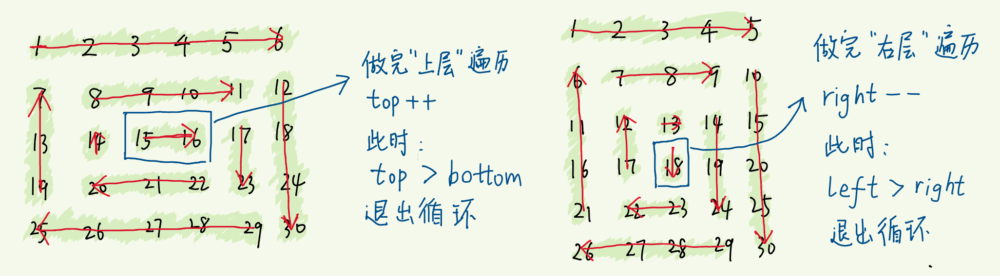
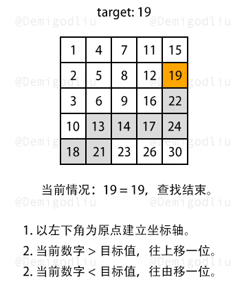
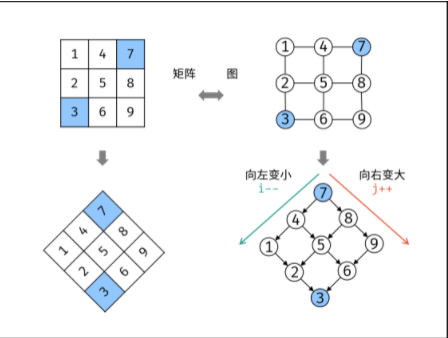
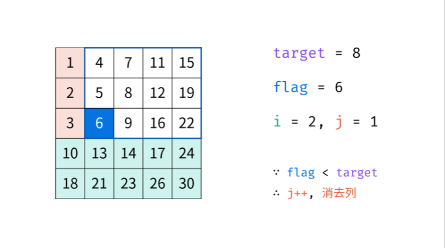

# **数组操作**

## [15. 三数之和](https://leetcode-cn.com/problems/3sum/)

### 方法一：双指针

```js
/**
 * @param {number[]} nums
 * @return {number[][]}
 */
const threeSum = function(nums) {
  // 用于存放结果数组
  let res = []
  // 给 nums 排序
  nums = nums.sort((a, b) => {
    return a - b
  })
  // 缓存数组长度
  const len = nums.length
  // 注意我们遍历到倒数第三个数就足够了，因为左右指针会遍历后面两个数
  for (let i = 0; i < len - 2; i++) {
    if (nums[i] > 0) break
    // 左指针 left
    let left = i + 1
    // 右指针k
    let right = len - 1
    // 如果遇到重复的数字，则跳过
    if (i > 0 && nums[i] === nums[i - 1]) {
      continue
    }
    while (left < right) {
      // 三数之和小于0，左指针前进
      if (nums[i] + nums[left] + nums[right] < 0) {
        left++
        // 处理左指针元素重复的情况
        while (left < right && nums[left] === nums[left - 1]) {
          left++
        }
      } else if (nums[i] + nums[left] + nums[right] > 0) {
        // 三数之和大于0，右指针后退
        right--

        // 处理右指针元素重复的情况
        while (left < right && nums[right] === nums[right + 1]) {
          right--
        }
      } else {
        // 得到目标数字组合，推入结果数组
        res.push([nums[i], nums[left], nums[right]])

        // 左右指针一起前进
        left++
        right--

        // 若左指针元素重复，跳过
        while (left < right && nums[left] === nums[left - 1]) {
          left++
        }

        // 若右指针元素重复，跳过
        while (left < right && nums[right] === nums[right + 1]) {
          right--
        }
      }
    }
  }

  // 返回结果数组
  return res
}
```

## [54_螺旋矩阵](https://leetcode-cn.com/problems/spiral-matrix/)

## [剑指 Offer 29. 顺时针打印矩阵](https://leetcode-cn.com/problems/shun-shi-zhen-da-yin-ju-zhen-lcof/)

### 解法一：

- 在画图分析后，判断出路线都是有固定方向的 先→再↓再←再↑再→.....一直循环到没数字

- 因此定义4个方向边界 当触及边界时即按固定方向转向 且其对应的边界值向内收缩1

- 若没触及边界 即按自身方向继续行走 改变坐标值直到触边界/数字全部遍历过

  

  #### 举例

  在其方向为右 且未触碰边界值时 列向右走（j++）
  当触碰时转向

  ```js
  if(turn=='r'){
    j++
    if(j==boundr){
      boundu++
      turn='d'
    }
  }
  ```

  

```js
var spiralOrder = function (matrix) {
  var res = []
  var i = 0
  var j = 0
  var n = matrix.length - 1
  if (n < 0) return []
  var m = matrix[0].length - 1
  var turn = m == 0 ? 'd' : 'r'
  var boundl = 0
  var boundr = m
  var boundu = 0
  var boundd = n

  for (var a = 0; a < (m + 1) * (n + 1); a++) {
    res.push(matrix[i][j])
    if (turn == 'r') {
      j++
      if (j == boundr) {
        boundu++
        turn = 'd'
      }
    } else if (turn == 'd') {
      i++
      if (i == boundd) {
        boundr--
        turn = 'l'
      }
    } else if (turn == 'l') {
      j--
      if (j == boundl) {
        boundd--
        turn = 'u'
      }
    } else if (turn == 'u') {
      i--
      if (i == boundu) {
        boundl++
        turn = 'r'
      }
    }
  }
  return res
}
```

### 解法二：


#### 这么遍历的特点

- 如果一条边从头遍历到底，则下一条边遍历的起点随之变化
- 选择不遍历到底，可以减小横向、竖向遍历之间的影响
- 一轮迭代结束时，4条边的范围，同时收窄 1
- 循环做的工作更清晰：遍历一个“圈” & 范围收缩至内圈

#### 思路概括

- 一层层向里处理，按顺时针依次遍历：上、右、下、左层
- 不再形成“环”了，就会剩下一行或一列，然后单独判断

#### 4 个边界

- 上边界 top : 0
- 下边界 bottom : matrix.length - 1
- 左边界 left : 0
- 右边界 right : matrix[0].length - 1

#### 矩阵不一定是方阵

- top < bottom && left < right 是循环的条件
- 无法构成“环”了，就退出循环，分 3 种情况：
  - top == bottom && left < right —— 剩一行
  - top < bottom && left == right —— 剩一列
  - top == bottom && left == right —— 剩一项（也是一行/列）

#### 处理剩下的单行或单列

- 因为是按顺时针推入结果数组的，所以
- 剩下的一行，从左至右 依次推入结果数组
- 剩下的一列，从上至下 依次推入结果数组

#### 代码

- 每个元素访问一次，时间复杂度 O(m*n)，m、n 分别是矩阵的行数和列数
- 空间复杂度 O(m*n)

```js
var spiralOrder = function (matrix) {
  if (matrix.length === 0) return []
  const res = []
  let top = 0,
    bottom = matrix.length - 1,
    left = 0,
    right = matrix[0].length - 1
  while (top < bottom && left < right) {
    for (let i = left; i < right; i++) res.push(matrix[top][i]) // 上层
    for (let i = top; i < bottom; i++) res.push(matrix[i][right]) // 右层
    for (let i = right; i > left; i--) res.push(matrix[bottom][i]) // 下层
    for (let i = bottom; i > top; i--) res.push(matrix[i][left]) // 左层
    right--
    top++
    bottom--
    left++ // 四个边界同时收缩，进入内层
  }
  if (top === bottom)
    // 剩下一行，从左到右依次添加
    for (let i = left; i <= right; i++) res.push(matrix[top][i])
  else if (left === right)
    // 剩下一列，从上到下依次添加
    for (let i = top; i <= bottom; i++) res.push(matrix[i][left])
  return res
}
```

### 解法三：



#### 换一种遍历的策略：遍历到底

- 循环的条件是 top <= bottom && left <= right
- 每遍历一条边，下一条边遍历的起点被“挤占”——要更新相应的边界
- 可能出现 循环途中，循环的条件不再满足
- 即出现 top > bottom || left > right ，其中一对边界彼此交错了
- 说明此时所有项都遍历完了，如果没有 break ，就会重复遍历

#### 解决办法

- 每遍历完一条边，更新完相应的边界后，都加一条 `if (top > bottom || left > right) break`
- 但你发现，遍历完成要么发生在遍历完“上边”，要么发生在遍历完“右边”
- 所以只需在这两步操作之后，加 `if (top > bottom || left > right) break `即可

#### 代码

```js
var spiralOrder = function (matrix) {
  if (matrix.length == 0) return []
  const res = []
  let top = 0,
    bottom = matrix.length - 1,
    left = 0,
    right = matrix[0].length - 1
  while (top <= bottom && left <= right) {
    for (let i = left; i <= right; i++) res.push(matrix[top][i])
    top++
    for (let i = top; i <= bottom; i++) res.push(matrix[i][right])
    right--
    if (top > bottom || left > right) break
    for (let i = right; i >= left; i--) res.push(matrix[bottom][i])
    bottom--
    for (let i = bottom; i >= top; i--) res.push(matrix[i][left])
    left++
  }
  return res
}
```

#### 换一种循环的条件，也是可以的

- 遍历完所有项时，res 数组构建完毕。我们可以用 res 数组的长度 等于 矩阵的项的个数，作为循环的出口
- 不等于就继续遍历，等于就 break

```js
var spiralOrder = function (matrix) {
  if (matrix.length == 0) return []
  const res = []
  let top = 0,
    bottom = matrix.length - 1,
    left = 0,
    right = matrix[0].length - 1
  const size = matrix.length * matrix[0].length
  while (res.length !== size) {
    // 仍未遍历结束
    for (let i = left; i <= right; i++) res.push(matrix[top][i])
    top++
    for (let i = top; i <= bottom; i++) res.push(matrix[i][right])
    right--
    if (res.length === size) break // 遍历结束
    for (let i = right; i >= left; i--) res.push(matrix[bottom][i])
    bottom--
    for (let i = bottom; i >= top; i--) res.push(matrix[i][left])
    left++
  }
  return res
}
```

## [59. 螺旋矩阵 II](https://leetcode-cn.com/problems/spiral-matrix-ii/)

### 方法一：模拟

```js
var generateMatrix = function(n) {
    const maxNum = n * n;
    let curNum = 1;
    const matrix = new Array(n).fill(0).map(() => new Array(n).fill(0));
    let row = 0, column = 0;
    const directions = [[0, 1], [1, 0], [0, -1], [-1, 0]]; // 右下左上
    let directionIndex = 0;
    while (curNum <= maxNum) {
        matrix[row][column] = curNum;
        curNum++;
        const nextRow = row + directions[directionIndex][0], nextColumn = column + directions[directionIndex][1];
        if (nextRow < 0 || nextRow >= n || nextColumn < 0 || nextColumn >= n || matrix[nextRow][nextColumn] !== 0) {
            directionIndex = (directionIndex + 1) % 4; // 顺时针旋转至下一个方向
        }
        row = row + directions[directionIndex][0];
        column = column + directions[directionIndex][1];
    }
    return matrix;
};
```

### 方法二：按层模拟

```js
var generateMatrix = function(n) {
    let num = 1;
    const matrix = new Array(n).fill(0).map(() => new Array(n).fill(0));
    let left = 0, right = n - 1, top = 0, bottom = n - 1;
    while (left <= right && top <= bottom) {
        // 从左到右
        for (let column = left; column <= right; column++) {
            matrix[top][column] = num;
            num++;
        }
        // 从上到下
        for (let row = top + 1; row <= bottom; row++) {
            matrix[row][right] = num;
            num++;
        }
        if (left < right && top < bottom) {
            // 从右到左
            for (let column = right - 1; column > left; column--) {
                matrix[bottom][column] = num;
                num++;
            }
            // 从下到上
            for (let row = bottom; row > top; row--) {
                matrix[row][left] = num;
                num++;
            }
        }
        left++;
        right--;
        top++;
        bottom--;
    }
    return matrix;
};


/**
 * @param {number} n
 * @return {number[][]}
 */
// 按照螺旋矩阵遍历 
var generateMatrix = function(n) {
    const arr =new Array(n).fill(0).map(()=>new Array(n).fill(0)) // 生成一个n*n的二维数组
    let top=0
    let left=0
    let right=n-1
    let bottom=n-1
    let count=1
    while(count<=n*n){
      // 从左到右
      for(let i=left;i<=right;i++){
        // arr[0][1] arr[0][2]
        arr[top][i]=count
        count++
      }
      // 从左到右 向下缩减边界
      if(++top>bottom){
        break
      }
      // 从上到下
      for(let i=top;i<=bottom;i++){
        // arr[1][3] arr[2][3]
        arr[i][right]=count
        count++
      }

      // 从上到下 向左缩减边界
      if(--right<left){
        break
      }
      // 从右到左
      for(let i=right;i>=left;i--){
        arr[bottom][i]=count
        count++
      }
      // 从右到左 向上缩小边界
      if(--bottom<top){
        break
      }
      // 从下到上
      for(let i=bottom;i>=top;i--){
        arr[i][left]=count
        count++
      }
      //  从下到上 向右缩小边界
      if(++left>right){
        break;
      }
    }
    return arr
};
```


## [73_矩阵置零](https://leetcode-cn.com/problems/set-matrix-zeroes/)

#### 解法一：

##### 定义对象存储行列情况

- 遍历二维数组 当遍历到0则将其下标在两个对象中存储为false 例如`{1:false}`

```js
for (var i = 0; i < matrix.length; i++) {
  for (var j = 0; j < matrix[0].length; j++) {
    if (matrix[i][j] == 0) {
      rows[i] = false
      column[j] = false
    }
  }
}
```

##### 改值

此时我们已有行列信息了，只需将触发条件的地方变为0

- 当循环到上方第row行出现false时 则置为0
- 当循环到上方第column列出现false时 则置为0

```js
for (var i = 0; i < matrix.length; i++) {
  for (var j = 0; j < matrix[0].length; j++) {
    if (rows[i] == false || column[j] == false) matrix[i][j] = 0
  }
}
```

##### 最终代码

```js
var setZeroes = function (matrix) {
  var rows = {}
  var column = {}
  for (var i = 0; i < matrix.length; i++)
    for (var j = 0; j < matrix[0].length; j++) {
      if (matrix[i][j] == 0) {
        rows[i] = false
        column[j] = false
      }
    }
  for (var i = 0; i < matrix.length; i++)
    for (var j = 0; j < matrix[0].length; j++) {
      if (rows[i] == false || column[j] == false) matrix[i][j] = 0
    }
}
```


#### 解法二：原地算法版

##### 解题思路

- 利用了js的特性，-0和0的不相等
- 将0所在行列中非0元素置为-0
- 可以设置标记位用于优化置零次数，但要引入两个变量。

```js
/**
 * @param {number[][]} matrix
 * @return {void} Do not return anything, modify matrix in-place instead.
 */
var setZeroes = function (matrix) {
  for (let i = 0; i < matrix.length; i++) {
    for (let j = 0; j < matrix[i].length; j++) {
      if (Object.is(matrix[i][j], 0)) {
        for (let k = 0; k < matrix.length; k++) {
          if (k !== i && Object.is(matrix[k][j], 0)) continue
          else matrix[k][j] = -0
        }
        for (let k = 0; k < matrix[i].length; k++) {
          if (k !== j && Object.is(matrix[i][k], 0)) continue
          else matrix[i][k] = -0
        }
      }
    }
  }
  return matrix
}
```

### 解法三：m+n空间复杂度

```js
var setZeroes = function (matrix) {
  let rowSet = new Set()
  let colSet = new Set()
  let rowLen = matrix.length
  let colLen = matrix[0].length
  for (let i = 0; i < rowLen; i++) {
    for (let j = 0; j < colLen; j++) {
      if (matrix[i][j] == 0) {
        rowSet.add(i)
        colSet.add(j)
      }
    }
  }
  for (let i = 0; i < rowLen; i++) {
    for (let j = 0; j < colLen; j++) {
      if (rowSet.has(i) || colSet.has(j)) {
        matrix[i][j] = 0
      }
    }
  }
  return matrix
}
```

### 解法四：常数空间复杂度

```js
var setZeroes = function (matrix) {
  let rowLen = matrix.length
  let colLen = matrix[0].length
  for (let i = 0; i < rowLen; i++) {
    for (let j = 0; j < colLen; j++) {
      if (matrix[i][j] == 0) {
        for (let rowI = 0; rowI < rowLen; rowI++) {
          if (matrix[rowI][j] != 0) {
            matrix[rowI][j] = true
          }
        }
        for (let colI = 0; colI < colLen; colI++) {
          if (matrix[i][colI] != 0) {
            matrix[i][colI] = true
          }
        }
      }
    }
  }
  for (let i = 0; i < rowLen; i++) {
    for (let j = 0; j < colLen; j++) {
      if (typeof matrix[i][j] == 'boolean') {
        matrix[i][j] = 0
      }
    }
  }
  return matrix
}
```

### 解法五：巧设-0

```js
var setZeroes = function (matrix) {
  let rowLen = matrix.length
  let colLen = matrix[0].length
  for (let i = 0; i < rowLen; i++) {
    for (let j = 0; j < colLen; j++) {
      if (matrix[i][j] == 0 && 1 / matrix[i][j] > 0) {
        for (let rowI = 0; rowI < rowLen; rowI++) {
          if (matrix[rowI][j] != 0) {
            matrix[rowI][j] = -0
          }
        }
        for (let colI = 0; colI < colLen; colI++) {
          if (matrix[i][colI] != 0) {
            matrix[i][colI] = -0
          }
        }
      }
    }
  }
  return matrix
}
```


## [945_使数组唯一的最小增量](https://leetcode-cn.com/problems/minimum-increment-to-make-array-unique/)

### 方法一：将数值映射到地址，碰撞则右移，右移次数即move次数

```js
/**
 * @param {number[]} A
 * @return {number}
 */
var minIncrementForUnique = function (A) {
  let count = 0
  let hash = []
  for (let num of A) {
    while (hash[num]) {
      count++
      num++
    }
    hash[num] = true
  }
  return count
}
```

### 方法二：

这题先排下序就很好做了，升序排序。

然后遍历数组，如果当前遍历的数小于或等于前一个数，说明要move

计算当前数和前一个数的差值再加1，就实现了当前数比前一个数多1。

我开始想到的是当找到小于或等于的情况下while循环当前数+1直到大于，这样执行用时2236ms。。。所以就思考既然是有序的那么直接加差值不就好了吗，，

```js
/**
 * @param {number[]} A
 * @return {number}
 */
var minIncrementForUnique = function (A) {
  let move = 0
  A = A.sort((a, b) => a - b)
  for (let i = 1; i < A.length; i++) {
    if (A[i] <= A[i - 1]) {
      let n = A[i - 1] + 1 - A[i]
      A[i] += n
      move += n
    }
  }
  return move
}
```


## [剑指 Offer 04. 二维数组中的查找](https://leetcode-cn.com/problems/er-wei-shu-zu-zhong-de-cha-zhao-lcof/)

### 方法一：brute force

暴力方法，两层循环O(mn)

```js
/**
 * @param {number[][]} matrix
 * @param {number} target
 * @return {boolean}
 */
var findNumberIn2DArray = function(matrix, target) {
    if(matrix.length === 0) return false
    const n = matrix.length
    const m = matrix[0].length
    let res = false

    const getRes = (row) => {
        for(let i = 0; i < m; i++) {
            if(matrix[row][i] === target) {
                res = true
            } 
        }
    }

    for(let i = 0; i < n; i++) {
        if(matrix[i][0] <= target && matrix[i][m -1] >= target) {
            getRes(i)
            if(res) {
                break
            }
        }
    }

    return res
};
```

### 方法二：坐标轴

根据题意已知，二维数组从左往右递增，从上往下递增，所以得出以下结论：

- 某列的某个数字，该数之上的数字，都比其小；
- 某行的某个数字，该数右侧的数字，都比其大；

所以，解题流程如下所示：

- 以二维数组左下角为原点，建立直角坐标轴。
- 若当前数字大于了查找数，查找往上移一位。
- 若当前数字小于了查找数，查找往右移一位。



```js
var findNumberIn2DArray = function(matrix, target) {
    if(!matrix.length) return false;
    let x = matrix.length - 1, y = 0;
    while(x >= 0 && y < matrix[0].length){
        if(matrix[x][y] === target){
            return true;
        }else if(matrix[x][y] > target){
            x--;
        }else{
            y++;
        }
    }
    return false;
}
```

### 方法三：**标志数** 

思路其实和上面的坐标轴法类似

如下图所示，我们将矩阵逆时针旋转 45° ，并将其转化为图形式，发现其类似于 二叉搜索树 ，即对于每个元素，其左分支元素更小、右分支元素更大。因此，通过从 “根节点” 开始搜索，遇到比 target 大的元素就向左，反之向右，即可找到目标值 target 。





```js
var findNumberIn2DArray = function(matrix, target) {    
	let i = matrix.length - 1, j = 0
    while (i >= 0 && j < matrix[0].length){
        if (matrix[i][j] > target){
            i -= 1
        } else if (matrix[i][j] < target){
            j += 1
        }
        else return true
    }
    return false
}
```

## [剑指 Offer 53 - I. 在排序数组中查找数字 I](https://leetcode-cn.com/problems/zai-pai-xu-shu-zu-zhong-cha-zhao-shu-zi-lcof/)

### 方法一：二分

```js
const search = (nums, target) => {
    // 定义上下限、找到的标志flag
    let [low, high, flag] = [0, nums.length - 1, null];

    while (low <= high) {
        const mid = (low + high) >> 1;
        const midNum = nums[mid];
        if (midNum > target) {
            high = mid - 1;
        } else if (midNum < target) {
            low = mid + 1;
        } else {
            // 如果找到了，将mid赋值给flag，存的是索引
            flag = mid;
            // 找到一个，直接退出循环
            break;
        }
    }
    // while结束后，判断是否找到，没找到直接返回0
    if (flag === null) return 0;

    // 从flag开始，向两边扩散
    low = high = flag;
    while (nums[low - 1] === target) low--;
    while (nums[high + 1] === target) high++;

    // 返回计数
    return high - low + 1;
}
```

### 方法二：暴力解法

```js
var search = function(nums, target) {
    let count = 0
    for(let i = 0; i < nums.length; i++) {
        if(nums[i] === target) count++
    }
    return count
}
```

## [153. 寻找旋转排序数组中的最小值](https://leetcode-cn.com/problems/find-minimum-in-rotated-sorted-array/)

### 方法一：二分法

```js
var findMin = function(nums) {
    let left = 0, right = nums.length - 1;
    while(left < right){
        let middle = left + ~~((right - left) / 2);
        if(nums[middle] > nums[right]) left = middle + 1;
        else if(nums[middle] < nums[right]) right = middle;
        else right--;
    }
    return nums[left];
};
```

### 方法二：暴力

```js
function findMin(nums) {
    for(let i = 0; i < nums.length; i++){
        if(nums[i] < nums[0]){
            return nums[i];
        }
    }
    return nums[0];
}
```

## [448. 找到所有数组中消失的数字](https://leetcode-cn.com/problems/find-all-numbers-disappeared-in-an-array/)

```js
/**
 * @param {number[]} nums
 * @return {number[]}
 */
var findDisappearedNumbers = function(nums) {
    // nums = [4,3,2,7,8,2,3,1]
    const n = nums.length
    for (const num of nums) {
        // 这个就是这个解法的精髓
        const x = (num - 1) % n
        // += 是用原来位置上的值 去加上 n 的值
        nums[x] += n
    }
    console.log(nums) // [12, 19, 18, 15, 8,  2, 11,  9]
    const ret = []
    for (const [i, num] of nums.entries()) {
        if (num <= n) {
            ret.push(i + 1)
        }
    }
    return ret
}
```

## [414. 第三大的数](https://leetcode-cn.com/problems/third-maximum-number/)

### 方法一：遍历

```js
var thirdMax = function(nums) {
    nums.sort((a, b) => a - b);
    nums.reverse();
    for (let i = 1, diff = 1; i < nums.length; ++i) {
        if (nums[i] !== nums[i - 1] && ++diff === 3) { // 此时 nums[i] 就是第三大的数
            return nums[i];
        }
    }
    return nums[0];
}
```

### 方法二：一次遍历

我们可以遍历数组，并用三个变量 a、b 和 c 来维护数组中的最大值、次大值和第三大值，以模拟方法二中的插入和删除操作。为方便编程实现，我们将其均初始化为小于数组最小值的元素，视作「无穷小」，比如 -2^{63} 等。

遍历数组，对于数组中的元素 num：

- 若 num>a，我们将 c 替换为 b，b 替换为 a，a 替换为 num，这模拟了将 num 插入有序集合，并删除有序集合中的最小值的过程；
- 若 a>num>b，类似地，我们将 c 替换为 b，b 替换为 num，a 保持不变；
- 若 b>num>c，类似地，我们将 c 替换为 num，aa 和 bb 保持不变；
- 其余情况不做处理。

遍历结束后，若 c 仍然为 -2^{63} ，则说明数组中不存在三个或三个以上的不同元素，即第三大的数不存在，返回 a，否则返回 c。

```js
var thirdMax = function(nums) {
    let a = -Number.MAX_VALUE, b = -Number.MAX_VALUE, c = -Number.MAX_VALUE;
    for (const num of nums) {
        if (num > a) {
            c = b;
            b = a;
            a = num;
        } else if (a > num && num > b) {
            c = b;
            b = num;
        } else if (b > num && num > c) {
            c = num;
        }
    }
    return c === -Number.MAX_VALUE ? a : c;
};
```

另一种不依赖元素范围的做法是，将 a、b 和 c 初始化为空指针或空对象，视作「无穷小」，并在比较大小前先判断是否为空指针或空对象。遍历结束后，若 c 为空，则说明第三大的数不存在，返回 a，否则返回 c。

```js
var thirdMax = function(nums) {
    let a = null, b = null, c = null;
    for (const num of nums) {
        if (a === null || num > a) {
            c = b;
            b = a;
            a = num;
        } else if (a > num && (b === null || num > b)) {
            c = b;
            b = num;
        } else if (b !== null && b > num && (c === null || num > c)) {
            c = num;
        }
    }
    return c === null ? a : c;
};
```

## [560. 和为 K 的子数组](https://leetcode-cn.com/problems/subarray-sum-equals-k/)

### 方法一：暴力解法（会超时）

```js
/**
 * @param {number[]} nums
 * @param {number} k
 * @return {number}
 */
var subarraySum = function(nums, k) {
    let count = 0;
    for (let start = 0; start < nums.length; ++start) {
        let sum = 0;
        for (let end = start; end >= 0; --end) {
            sum += nums[end];
            if (sum == k) {
                count++;
            }
        }
    }
    return count;
};
```

### 方法二：前缀和

- 构建前缀和数组，以快速计算区间和；
- 注意在计算区间和的时候，下标有偏移。

```java
public class Solution {
    public int subarraySum(int[] nums, int k) {
        int len = nums.length;
        // 计算前缀和数组
        int[] preSum = new int[len + 1];
        preSum[0] = 0;
        for (int i = 0; i < len; i++) {
            preSum[i + 1] = preSum[i] + nums[i];
        }

        int count = 0;
        for (int left = 0; left < len; left++) {
            for (int right = left; right < len; right++) {
                // 区间和 [left..right]，注意下标偏移
                if (preSum[right + 1] - preSum[left] == k) {
                    count++;
                }
            }
        }
        return count;
    }
}
```

```js
var subarraySum = function(nums, k) {
    const mp = new Map()
    mp.set(0, 1)
    let count = 0, pre = 0
    for (const x of nums) {
        pre += x
        if (mp.has(pre - k)) {
            count += mp.get(pre - k)
        }
        if (mp.has(pre)) {
            mp.set(pre, mp.get(pre) + 1)
        } else {
            mp.set(pre, 1)
        }
    }
    return count
}
```

