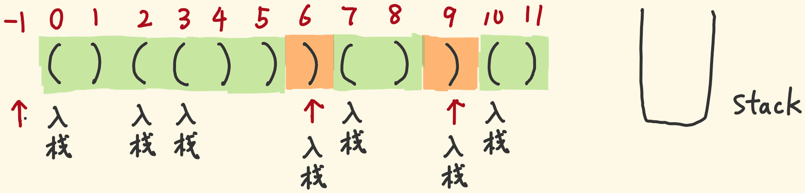

# 栈相关

## [20_有效的括号](https://leetcode-cn.com/problems/valid-parentheses/)

### 方法一：栈

```js
const isValid = (s) => {
  const stack = []

  for (let i = 0; i < s.length; i++) {
    const c = s[i]
    if (c == '{' || c == '[' || c == '(') {
      stack.push(c)
    } else {
      if (stack.length == 0) {
        return false
      }
      const top = stack[stack.length - 1];
      if (top == '(' && c == ')' || top == '[' && c == ']' || top == '{' && c == '}') {
        stack.pop()
      } else {
        return false
      }
    }
  }
  return !arr.length
}
```

```js
// 用一个 map 来维护左括号和右括号的对应关系
const leftToRight = {
  "(": ")",
  "[": "]",
  "{": "}"
}

/**
 * @param {string} s
 * @return {boolean}
 */
const isValid = function(s) {
  // 结合题意，空字符串无条件判断为 true
  if (!s) {
    return true
  }
  // 初始化 stack 数组
  const stack = []
  // 缓存字符串长度
  const len = s.length
  // 遍历字符串
  for (let i = 0; i < len; i++) {
    // 缓存单个字符
    const ch = s[i]
    // 判断是否是左括号，这里我为了实现加速，没有用数组的 includes 方法，直接手写判断逻辑
    if (ch === "(" || ch === "{" || ch === "[") stack.push(leftToRight[ch])
    // 若不是左括号，则必须是和栈顶的左括号相配对的右括号
    else {
      // 若栈不为空，且栈顶的左括号没有和当前字符匹配上，那么判为无效
      if (!stack.length || stack.pop() !== ch) {
        return false
      }
    }
  }
  // 若所有的括号都能配对成功，那么最后栈应该是空的
  return !stack.length
}
```


## [32_最长有效括号](https://leetcode-cn.com/problems/longest-valid-parentheses/)

### 方法一：栈

- 在栈中预置索引 -1 作为一个“参照物”，并改变计算方式：当前索引 - 出栈后新的栈顶索引。

  

- 当遍历到索引 5 的右括号，此时栈顶的索引为 2，出栈，栈顶变为 -1，有效长度为 5 - (-1) = 6。如果照之前那样，5 找不到 -1 减。
- 当遍历到索引 6 的右括号，它不是需要入栈的左括号，又匹配不到左括号，怎么处理？
- 它后面可能也出现一段有效长度，它要成为 -1 那样的“参照物”。它之前出现的有效长度已经计算过了，栈中的 -1 的使命已经完成了，要被替代。
- 所以我们照常让 -1 出栈。不同的是，此时栈空了，让索引 6 入栈当“参照物”。

```js
const longestValidParentheses = (s) => {
  let maxLen = 0;
  const stack = [];
  stack.push(-1);
  for (let i = 0; i < s.length; i++) {
    const c = s[i];
    if (c == '(') {       // 左括号的索引，入栈
      stack.push(i);
    } else {              // 遍历到右括号
      stack.pop();        // 栈顶的左括号被匹配，出栈
      if (stack.length) { // 栈未空
        const curMaxLen = i - stack[stack.length - 1]; // 计算有效连续长度
        maxLen = Math.max(maxLen, curMaxLen);          // 挑战最大值
      } else {            // 栈空了
        stack.push(i);    // 入栈充当参照
      }
    }
  }
  return maxLen;
};
```


### 方法二：动态规划

#### 把dp[i]定义对

- 我们试着拆分成子问题，目光盯着子问题与大问题之间的联系

- “提供” 这词比较爱用：前一个问题的解可以“提供”给后一个问题多大的有效长度。后一个问题的最优解，要想纳入前面“提供”的有效长度，则前面子串的末尾必须是有效子串的一部分

- 因此子问题的最优解dp[i]定义为：以s[i]为结尾的子串中，形成的最长有效子串的长度，且这个有效子串是以s[i]为结尾。


#### 紧盯子问题与大问题之间的“联结点”

- 我们单看「子串」的末位s[i]，它要么是'('，要么是')'：
  1. s[i]是'('，以它为结尾的子串肯定不是有效括号子串——dp[i] = 0
  2.   s[i]是')'，我们考察前一个子问题的末尾——s[i-1]
    1. s[i-1]是'('，s[i-1]和s[i]结成一对，我们考察s[i-2]
          1. s[i-2]不存在，则这一对孤零零，有效长度为 2——dp[i] = 2
              2. 存在，考虑它们俩的前面提供的有效长度 dp[i] = dp[i-2] + 2
    2. s[i-1]是')'，即'))'形式，这就来到子问题了，以s[i-1]为结尾形成的最长有效长度为dp[i-1]，跨过这个长度（里面细节不用管，总之它最大能提供dp[i-1]长度），来看s[i-dp[i-1]-1]这个字符
          1. s[i-dp[i-1]-1]不存在或为')'，s[i]找不到匹配，直接gg，dp[i] = 0
              2. s[i-dp[i-1]-1]是'('，与s[i]匹配，有效长度有 2 保底，加上跨过的dp[i-1]，再加上前方的dp[i-dp[i-1]-2]…等等…s[i-dp[i-1]-2]要存在才行
        1. s[i-dp[i-1]-2]存在，dp[i] = dp[i-1] + dp[i-dp[i-1]-2] + 2
        2. s[i-dp[i-1]-2]不存在，dp[i] = dp[i-1] + 2
- base case ：dp[0] = 0 一个括号形成不了有效子串

```js
const longestValidParentheses = (s) => {
  let maxLen = 0;
  const len = s.length;
  const dp = new Array(len).fill(0);
  for (let i = 1; i < len; i++) {
    if (s[i] == ')') {
      if (s[i - 1] == '(') {
        if (i - 2 >= 0) {
          dp[i] = dp[i - 2] + 2;
        } else {
          dp[i] = 2;
        }
      } else if (s[i - dp[i - 1] - 1] == '(') {
        if (i - dp[i - 1] - 2 >= 0) {
          dp[i] = dp[i - 1] + 2 + dp[i - dp[i - 1] - 2];
        } else {
          dp[i] = dp[i - 1] + 2;
        }
      }
    }
    maxLen = Math.max(maxLen, dp[i]);
  }
  return maxLen;
};
```


## [155_最小栈](https://leetcode-cn.com/problems/min-stack/)

## [剑指 Offer 30. 包含min函数的栈](https://leetcode-cn.com/problems/bao-han-minhan-shu-de-zhan-lcof/)

### 方法一：二维数组

```js
var MinStack = function () {
  this.q = []
}
MinStack.prototype.push = function (x) {
  this.q.unshift([x, Math.min(this.q[0] ? this.q[0][1] : Infinity, x)])
}
MinStack.prototype.pop = function () {
  this.q.shift()
}
MinStack.prototype.top = function () {
  return this.q[0][0]
}
MinStack.prototype.getMin = function () {
  return this.q[0][1]
}
```

### 方法二：辅助栈

```js
/**
 * initialize your data structure here.
 */
var MinStack = function() {
  this.stack = []
  this.minStack = [Infinity]
};

/** 
 * @param {number} x
 * @return {void}
 */
MinStack.prototype.push = function(x) {
  this.stack.push(x)
  this.minStack.push(Math.min(this.minStack[this.minStack.length - 1], x))
};

/**
 * @return {void}
 */
MinStack.prototype.pop = function() {
  this.stack.pop()
  this.minStack.pop()
};

/**
 * @return {number}
 */
MinStack.prototype.top = function() {
  return this.stack[this.stack.length - 1]
};

/**
 * @return {number}
 */
MinStack.prototype.getMin = function() {
  return this.minStack[this.minStack.length - 1]
};
```

## [224. 基本计算器](https://leetcode-cn.com/problems/basic-calculator/)

### 方法一：`eval` 或 `new Function`

```js
var calculate = function(s) {
  return eval(s)
};

var calculate = function(s) {
    var Fn = Function;
    return new Fn('return ' + s)()
};
```

### 方法二：栈+递归

- 反转字符串转为`数组`。`pop`即`从左到右`遍历字符串
- `空格`忽视。`(`开始递归。`非数字`，`+/-`入栈，`*/除`与栈头运算入栈。`)`结束递归
- `数字`累加。返回`栈`的累加和

```js
var calculate = function(s) {
    var q = [], n = '', f = '+', a = typeof s === 'string' ? Array.from(s).reverse() : s
    while(a.length || n) {
        var p = a.pop()
        if (p === ' ') continue
        if (p === '(')  {
            n = calculate(a)
        } else if (/\D/.test(p)) {
            switch (f) {
                case '+':
                    q.push(n)
                break;
                case '-':
                    q.push(-n)
                break;
                case '*':
                    q.push(q.pop() * n)
                break;
                case '/':
                    q.push(q.pop() / n | 0)
            }
            if (p === ')') break
            f = p, n = ''
        } else n += p
    }
    return q.reduce((p, v) => p + (v | 0), 0)
};
```

### 方法三：栈

空格 -> 直接跳过

减号 -> 更新运算符号为 -1
加号 -> 更新运算符号为 1
「
  符号存为 1(+) 和 -1(-) 的好处是计算起来比较清晰
  如果是加：5 + 3 * 1  => 即为 5 + 3 的效果
  如果是减：5 + 3 * -1 => 即为 5 - 3 的效果
  优化了 if...else 语句，否则，if (sign === '+')  if (sign === '-')
」

左括号 -> 将当前的 sum 和 符号保存到 stack 中，为了后面遇到右括号时的计算，
后面计算的结果和栈里的值做运算的时候，只需要让后面运算的值 * 刚刚保存的符号 + sum

右括号 -> 执行 curr = curr * stack.pop(){ 这是上面刚刚保存的符号 } + 
stack.pop(){ 这是上面刚刚保存的运算结果 }

数字 -> 利用一个临时变量 temp 存储所有连续的数字，直到数字不再连续，
用前面的总运算结果 sum 和 temp 进行运算即可

```js
var calculate = function(s) {
  let sum = 0,
      stack = [],
      sign = 1,
      i = 0,
      n = s.length;
  
  while (i < n) {
    let c = s.charAt(i);
    if (c === ' ') {
      i++;
    }
    else if (c === '-') {
      sign = -1;
      i++;
    }
    else if (c === '+') {
      sign = 1;
      i++;
    }
    else if (c === '(') {
      stack.push( sum, sign );
      sum = 0;
      sign = 1;
      i++;
    }
    else if (c === ')') {
      sum = sum * stack.pop() + stack.pop();
      i++;
    }
    else {
      let temp = c;
      i++;
      while (i < n && isNumber( s.charAt(i) )) {
        temp += s.charAt(i);
        i++;
      }
      sum += Number( temp ) * sign;
    }
  }
  
  console.log( stack );
  
  return sum;
};

function isNumber(n) {
  n = Number( n );
  return typeof n === 'number' && !isNaN( n );
}
```

### 方法四：双栈

建立两个栈（st_num和st_signs），来存储遇到括号前的符号sign（初始值为1,代表正，-1代表负），和括号外面已经算过的结果ans（初始值值为0），从栈顶到栈底依次是从内层到外层的结果。
扫描字符串，遇到空格直接跳过，遇到正负号则更新正负号，遇到左括号，将当前的结果和符号存入对应的栈中，遇到右括号，更新运算结果。
为什么要这样做？
假设没有括号的情况下，我们可以直接在当前得到的结果上累加。但是有括号就不同了，我们要先把之前算过的结果存起来，然后再单独算计算括号里面的结果，直到遇到反括号，将当前括号内的结果（当前括号内的结果是要包括括号前的符号的）和上一层的结果（上次的ans）加起来，上一层的结果即为st_num的栈顶元素。


```js
var calculate = function (s) {
    let ans = 0;
    let num_stack = [];
    let op_stack = [];
    let sign = 1;//正负号,运算符号
    for (let i = 0; i < s.length; i++) {
        if (s[i] == ' ') continue;
        if (s[i] == '+' || s[i] == '-') sign = s[i] == '+' ? 1 : -1;
        else if (s[i] >= '0' && s[i] <= '9') {//数字
            let num = parseInt(s[i]);
            while (i < s.length - 1 && s[i + 1] >= '0' && s[i + 1] <= '9') {//将这个数字找完
                num = num * 10 + parseInt(s[++i]);
            }
            ans += sign * num;
        } else if (s[i] == '(') {//左括号，暂存结果
            // 计算括号内的值
            num_stack.push(ans);
            op_stack.push(sign);
            ans = 0;
            sign = 1;
        } else {
            ans = num_stack.pop() + ans * op_stack.pop();//右括号更新结果
        }
    }
    return ans;
};
```

## [227. 基本计算器 II](https://leetcode-cn.com/problems/basic-calculator-ii/)

我们可以用一个栈，保存这些（进行乘除运算后的）整数的值。对于加减号后的数字，将其直接压入栈中；对于乘除号后的数字，可以直接与栈顶元素计算，并替换栈顶元素为计算后的结果。

- 加号：将数字压入栈；
- 减号：将数字的相反数压入栈；
- 乘除号：计算数字与栈顶元素，并将栈顶元素替换为计算结果。

```js
var calculate = function(s) {
    s = s.trim()
    const stack = new Array()
    let preSign = '+'
    let num = 0
    const n = s.length
    for (let i = 0; i < n; ++i) {
        if (!isNaN(Number(s[i])) && s[i] !== ' ') {
            // * 10 是因为会出现 42, 100这样的数字
            num = num * 10 + s[i].charCodeAt() - '0'.charCodeAt()
        }
        if (isNaN(Number(s[i])) || i === n - 1) {
            switch (preSign) {
                case '+':
                    stack.push(num)
                    break;
                case '-':
                    stack.push(-num)
                    break;
                case '*':
                    stack.push(stack.pop() * num)
                    break;
                default:
                    stack.push(stack.pop() / num | 0)
            }   
            preSign = s[i]
            num = 0
        }
    }
    let ans = 0
    while (stack.length) {
        ans += stack.pop()
    }
    return ans
}
```


## [316_去除重复字母](https://leetcode-cn.com/problems/remove-duplicate-letters/)

```js
/**
 * @think 利用栈和贪心算法的思想
 *        1. 维护一个栈stack，对字符串进行正序遍历
 *        2. 对每个字符char，首先判断stack中是否存在，
 *          2.1 若stack栈顶值比char大且后续还存在此值，则将栈顶弹出；
 *            2.1.1 使用indexOf(xx, i)取代 lastIndexOf(xx)减少遍历次数会更快
 *        3. 入栈每个char
 *        4. 打印栈底到栈顶即为结果
 * @time O(nlogn) 
 * @space 0(1) 只需借用一个栈
 * @param {string} s
 * @return {string}
 */
var removeDuplicateLetters = function (s) {
  var stack = []
  for (var i = 0; i < s.length; i++) {
    var char = s[i]
    if (stack.indexOf(char) > -1) continue
    // 使用indexOf(xx, i)取代 lastIndexOf(xx)减少遍历次数会更快
    while (stack.length > 0 && stack[stack.length - 1] > char && s.indexOf(stack[stack.length - 1], i) > i) {
      stack.pop()
    }
    stack.push(char)
  }
  return stack.join('')
}
```

## [739. 每日温度](https://leetcode-cn.com/problems/daily-temperatures/)

## 方法一：单调栈 解法

```js
/**
 * @param {number[]} T
 * @return {number[]}
 */
// 入参是温度数组
const dailyTemperatures = function(T) {
    const len = T.length // 缓存数组的长度 
    const stack = [] // 初始化一个栈   
    const res = (new Array(len)).fill(0) //  初始化结果数组，注意数组定长，占位为0
    for(let i=0;i<len;i++) {
      // 若栈不为0，且存在打破递减趋势的温度值
      while(stack.length && T[i] > T[stack[stack.length-1]]) {
        // 将栈顶温度值对应的索引出栈
        const top = stack.pop()  
        // 计算 当前栈顶温度值与第一个高于它的温度值 的索引差值
        res[top] = i - top 
      }
      // 注意栈里存的不是温度值，而是索引值，这是为了后面方便计算
      stack.push(i)
    }
    // 返回结果数组
    return res 
}
```

另外一种写法：遍历顺序和单调栈反着来
- 如果当前元素比栈顶大，则让小项逐个出栈，直到当前元素比栈顶小，停止出栈
- 此时的栈顶元素就是当前项右边的第一个比自己大的元素索引，计算距离
- 当前项入栈

```js
/**
 * @param {number[]} temperatures
 * @return {number[]}
 */
var dailyTemperatures = function(temperatures) {
    const n = temperatures.length
    const stack = []
    const res = new Array(n).fill(0)
    for (let i = n - 1; i >= 0; --i) {
        const t = temperatures[i]
        while (stack.length && t >= temperatures[stack[stack.length - 1]]) {
            stack.pop()
        }
        if (stack.length) {
            res[i] = stack[stack.length - 1] - i
        }
        stack.push(i)
    }
    return res
};
```

### 方法二：brute  force

```js
const dailyTemperatures = (T) => {
  const res = new Array(T.length).fill(0)
  for (let i = 0; i < T.length; i++) {
    for (let j = i + 1; j < T.length; j++) {
      if (T[j] > T[i]) {
        res[i] = j - i
        break
      }
    }
  }
  return res
}
```

## [239. 滑动窗口最大值](https://leetcode-cn.com/problems/sliding-window-maximum/)

## [剑指 Offer 59 - I. 滑动窗口的最大值](https://leetcode-cn.com/problems/hua-dong-chuang-kou-de-zui-da-zhi-lcof/)

### 方法一：双指针+遍历法（brute force） 

```js
/**
 * @param {number[]} nums
 * @param {number} k
 * @return {number[]}
 */
const maxSlidingWindow = function (nums, k) {
  // 缓存数组的长度
  const len = nums.length;
  // 定义结果数组
  const res = [];
  // 初始化左指针
  let left = 0;
  // 初始化右指针
  let right = k - 1;
  // 当数组没有被遍历完时，执行循环体内的逻辑
  while (right < len) {
    // 计算当前窗口内的最大值
    const max = calMax(nums, left, right);
    // 将最大值推入结果数组
   	if(max) res.push(max);
    // 左指针前进一步
    left++;
    // 右指针前进一步
    right++;
  }
  // 返回结果数组
  return res;
};

// 这个函数用来计算最大值
function calMax(arr, left, right) {
  // 处理数组为空的边界情况
  if (!arr || !arr.length) {
    return;
  }
  // 初始化 maxNum 的值为窗口内第一个元素
  let maxNum = arr[left];
  // 遍历窗口内所有元素，更新 maxNum 的值
  for (let i = left; i <= right; i++) {
    if (arr[i] > maxNum) {
      maxNum = arr[i];
    }
  }
  // 返回最大值
  return maxNum;
}
```

### 方法二：分块

- 指针j → 统计每块内从块开头到j最大值
- 指针i ← 统计每块内从块结尾到i最大值
- 滑动区间[i, i + k - 1]最大值 = 某块结尾到i最大值 与 某块开头到i + k - 1最大值 取大

```js
var maxSlidingWindow = function(nums, k) {
    let n = nums.length, p = new Int16Array(n), s = new Int16Array(n), r = new Int16Array(n - k + 1), i = n, j = -1
    while (i--) {
        p[++j] = j % k ? Math.max(p[j - 1], nums[j]) : nums[j]
        s[i]   = i % k ? Math.max(s[i + 1], nums[i]) : nums[i]
    }
    while (i++ < n - k) r[i] = Math.max(s[i], p[i + k - 1])
    return r
}
```

### 方法三： 双端队列

```js
/**
 * @param {number[]} nums
 * @param {number} k
 * @return {number[]}
 */
const maxSlidingWindow = function (nums, k) {
  // 缓存数组的长度
  const len = nums.length
  // 初始化结果数组
  const res = []
  // 初始化双端队列
  const deque = []
  // 开始遍历数组
  for (let i = 0; i < len; i++) {
    // 当队尾元素小于当前元素时
    while (deque.length && nums[deque[deque.length - 1]] < nums[i]) {
      // 将队尾元素（索引）不断出队，直至队尾元素大于等于当前元素
      deque.pop()
    }
    // 入队当前元素索引（注意是索引）
    deque.push(i)
    // 当队头元素的索引已经被排除在滑动窗口之外时
    while (deque.length && deque[0] <= i - k) {
      // 将队头元素索引出队
      deque.shift()
    }
    // 判断滑动窗口的状态，只有在被遍历的元素个数大于 k 的时候，才更新结果数组
    if (i >= k - 1) {
      res.push(nums[deque[0]])
    }
  }
  // 返回结果数组
  return res
}
```

### 方法四：单调队列

一句话概况思路：维护一个队列，保证个子高的在前面就好。如果你前面有矮子，直接踢了。

```js
/**
 * @param {number[]} nums
 * @param {number} k
 * @return {number[]}
 */
var maxSlidingWindow = function (nums, k) {
    let q = new MonoQueue()
    let i = 0
    let j = 0
    const res = []
    while (i < k) {
        q.enqueue(nums[i])
        i++
    }
    res.push(q.front())
    while (i < nums.length) {
        q.enqueue(nums[i])
        q.dequeue(nums[j])
        res.push(q.front())
        i++
        j++
    }
    return res
};

class MonoQueue {
    constructor() {
        this.queue = []
    }

    enqueue(value) {
        let back = this.queue[this.queue.length - 1]
        while (back !== undefined && back < value) {
            this.queue.pop()
            back = this.queue[this.queue.length - 1]
        }
        this.queue.push(value)
    }

    dequeue(value) {
        let front = this.front()
        if (front === value) {
            this.queue.shift()
        }
    }

    front() {
        return this.queue[0]
    }
}
```

## [剑指 Offer 59 - II. 队列的最大值](https://leetcode-cn.com/problems/dui-lie-de-zui-da-zhi-lcof/)

使用两个队列，一个队列 queue 用于存放所有元素，另一个辅助队列 dequeue 用来存放当前 queue 中的最大值。

push 操作：

- 将元素放入 queue 中
- 检查元素是否大于 dequeue 队尾元素，如果大于，那么队尾元素出队；直到不再满足大于条件

pop 操作：

- 如果 queue 的队首元素等于 dequeue 的队首元素，那么 dequeue 队首元素需要出队
- queue 队首元素需要出队

题目要求复杂度控制在O(1)，所以必须使用双端队列来做辅助队列。因为 push 操作中，需要频繁对辅助队列的队尾元素进行移动操作。

```js
// ac地址：https://leetcode-cn.com/problems/dui-lie-de-zui-da-zhi-lcof/
// 原文地址：https://xxoo521.com/2020-03-28-max-queue/
var MaxQueue = function() {
    this.queue = [];
    this.dequeue = [];
};

/**
 * @return {number}
 */
MaxQueue.prototype.max_value = function() {
    return this.dequeue.length ? this.dequeue[0] : -1;
};

/**
 * @param {number} value
 * @return {void}
 */
MaxQueue.prototype.push_back = function(value) {
    this.queue.push(value);
    while (
        this.dequeue.length &&
        value > this.dequeue[this.dequeue.length - 1]
    ) {
        this.dequeue.pop();
    }
    this.dequeue.push(value);
};

/**
 * @return {number}
 */
MaxQueue.prototype.pop_front = function() {
    if (!this.dequeue.length) {
        return -1;
    }
    if (this.queue[0] === this.dequeue[0]) {
        this.dequeue.shift();
    }
    return this.queue.shift();
};

/**
 * Your MaxQueue object will be instantiated and called as such:
 * var obj = new MaxQueue()
 * var param_1 = obj.max_value()
 * obj.push_back(value)
 * var param_3 = obj.pop_front()
 */
```


## [84. 柱状图中最大的矩形](https://leetcode-cn.com/problems/largest-rectangle-in-histogram/)

### 方法一：brute  force

固定柱子高度，向两边扩散

```js
/**
 * @param {number[]} heights
 * @return {number}
 */
const largestRectangleArea = function(heights) {
  // 判断边界条件
  if(!heights || !heights.length) return 0 
  // 初始化最大值
  let max = -1  
  // 缓存柱子长度
  const len = heights.length
  // 遍历每根柱子
  for(let i=0;i<len;i++) {
      // 如果遍历完了所有柱子，或者遇到了比前一个矮的柱子，则停止遍历，开始回头计算
      if(i == len-1 || heights[i]>heights[i+1]) {
          // 初始化前i个柱子中最矮的柱子
          let minHeight = heights[i]  
          // “回头看”
          for(let j=i;j>=0;j--) {
              // 若遇到比当前柱子更矮的柱子，则以更矮的柱子为高进行计算
              minHeight = Math.min(minHeight, heights[j])  
              //  计算当前柱子对应的最大宽度的矩形面积，并及时更新最大值
              max = Math.max(max, minHeight*(i-j+1))
          }
      }
  }
  // 返回结果
  return max
};
```

### 方法二：单调栈

```js
/**
 * @param {number[]} heights
 * @return {number}
 */
const largestRectangleArea = function(heights) {
  // 判断边界条件
  if(!heights || !heights.length) return 0  
  // 初始化最大值
  let max = -1  
  // 初始化栈
  const stack = [] 
  // 缓存柱子高度的数量
  const len = heights.length
  // 开始遍历
  for(let i=0;i<len;i++) {
     // 如果栈已经为空或当前柱子大于等于前一个柱子的高度
     if(!stack.length || heights[i] >= heights[stack[stack.length-1]]) {
         // 执行入栈操作
         stack.push(i)
     } else {
         // 矩形的右边界
         let right = i  
         // pop出作为计算目标存在的那个柱子
         let target = stack.pop()  
         // 处理柱子高度相等的特殊情况
         while(stack.length&&heights[target]===heights[stack[stack.length-1]]) {
             // 若柱子高度相等，则反复pop
             target = stack.pop()
         }
         // 矩形的左边界
         let left = (!stack.length)? -1: stack[stack.length-1]  
         // 左右边界定宽，柱子定高，计算矩形面积
         max = Math.max(max, (right-left-1)*heights[target]) 
         // 这一步保证下一次循环从当前柱子往下走（因为当前柱子还没作为计算目标计算出结果）
         i--
     }
  }
  // rightAdd是我们针对右边界为空这种情况，补上的一个假的右边界
  let rightAdd = stack[stack.length-1]+1  
  // 此时栈里是高度单调递增（不减）的柱子索引，这些柱子还没有参与计算，需要针对它们计算一遍
  while(stack.length) {
      // 取出栈顶元素作为计算目标
      let target = stack.pop()  
      // 找到左边界
      let left = (!stack.length)? -1 : stack[stack.length-1]  
      // 注意这里的右边界一定是rightAdd，想一想，为什么？
      max = Math.max(max, (rightAdd-left-1)*heights[target])
  }
  // 返回计算出的最大值
  return max
};
```

### 方法三： 单调栈 + 哨兵


```js
const largestRectangleArea = (heights) => {
  let maxArea = 0
  const stack = []
  heights = [0, ...heights, 0] // 哨兵   
  for (let i = 0; i < heights.length; i++) { 
    while (heights[i] < heights[stack[stack.length - 1]]) { // 当前bar比栈顶bar矮
      const stackTopIndex = stack.pop() // 栈顶元素出栈，并保存栈顶bar的索引
      maxArea = Math.max(               // 计算面积，并挑战最大面积
        maxArea,                        // 计算出栈的bar形成的长方形面积
        // 每次while循环之后都会是个新栈，因为一开始就pop了
        heights[stackTopIndex] * (i - stack[stack.length - 1] - 1) // 当前元素的下标 * 新的栈的长度 - 1
      )
    }
    stack.push(i)                      // 将当前元素入栈
  }
  return maxArea
}
```


## [剑指 Offer 09. 用两个栈实现队列](https://leetcode-cn.com/problems/yong-liang-ge-zhan-shi-xian-dui-lie-lcof/)

### 方法一：双栈

```js
var CQueue = function() {
    // 存数据：往stackA里push
    // 取数据：从stackB里pop，stackB里没有了再从stackA里pop出来，push进stackB，再pop
    this.stackA = [];
    this.stackB = [];
};

CQueue.prototype.appendTail = function(value) {
    this.stackA.push(value);
};

CQueue.prototype.deleteHead = function() {
    if(this.stackB.length){
        return this.stackB.pop();
    }else{
        while(this.stackA.length){
            this.stackB.push(this.stackA.pop());
        }
        if(!this.stackB.length){
            return -1;
        }else{
            return this.stackB.pop();
        }
    }
}
```

## [剑指 Offer 31. 栈的压入、弹出序列](https://leetcode-cn.com/problems/zhan-de-ya-ru-dan-chu-xu-lie-lcof/)

## [946. 验证栈序列](https://leetcode-cn.com/problems/validate-stack-sequences/)

```js
/**
 * @param {number[]} pushed
 * @param {number[]} popped
 * @return {boolean}
 */
var validateStackSequences = function(pushed, popped) {
    //辅助栈
    const stack = [];
    //指向poped当前的下标
    let index = 0;
    //把pushed的元素一个一个入栈
    for(let i = 0,len=pushed.length-1;i<=len;i++){
        stack.push(pushed[i])
        // 把入栈的当前元素和pushed当前指向的元素进行对比
        // 相等话就把辅助栈出栈
        // pushed下标往右移动
        while(stack.length !== 0 && stack[stack.length-1] === popped[index]){
            stack.pop()
            index++
        }
    }
    //如果stack为空，说明符合题目
    return !stack.length
}
```

## [394. 字符串解码](https://leetcode-cn.com/problems/decode-string/)

### 方法一：栈

```js
const decodeString = (s) => {
    let numStack = [];        // 存倍数的栈
    let strStack = [];        // 存 待拼接的str 的栈
    let num = 0;              // 倍数的“搬运工”
    let result = '';          // 字符串的“搬运工”
    for (const char of s) {   // 逐字符扫描
        if (!isNaN(char)) {   // 遇到数字
            num = num * 10 + Number(char); // 算出倍数，主要是处理 100 这种带0的数字
        } else if (char == '[') {  // 遇到 [
            strStack.push(result); // result串入栈
            result = '';           // 入栈后清零
            numStack.push(num);    // 倍数num进入栈等待
            num = 0;               // 入栈后清零
        } else if (char == ']') {  // 遇到 ]，两个栈的栈顶出栈
            let repeatTimes = numStack.pop(); // 获取拷贝次数
            result = strStack.pop() + result.repeat(repeatTimes); // 构建子串
        } else {                   
            result += char;        // 遇到字母，追加给result串
        }
    }
    return result;
};
```

### 方法二：从后往前考虑

大致思路

- 直接让 ] 之前的所有字符逐个入栈 stack
- 然后一个个出栈考察，顺序就是先构建内层
- 首先遇到的肯定是[]中的字母，一个个拼成子串，直到遇到 [ 停下来
- 接着遇到数字，数字出栈，组成倍数，直到遇到 “非数字”
- 现在有了字母串和倍数，就构建出局部子串，一整个子串推入栈
- 这样，一个 [] 中的子串就构建好了放在 stack 里
- 它再和可能有的别的字母一起组成子串，再一起被倍数拷贝
- 再回到 stack 里，最后将 stack 里的项剩下都是字符串， join 拼接成字符串返回

```js
var decodeString = (s) => {
  let stack = []
  for (const char of s) {
    if (char !== ']') { // ] 前的字符都入栈
      stack.push(char)
      continue
    }
    let cur = stack.pop() // 弹出一个来检测
    let str = '' // 组装字符串
    // 接下来肯定是遇到字母，直到遇到 [
    while (cur !== '[') {
      str = cur + str // cur字符加在左边
      cur = stack.pop() // 再拉出一个
    }
    // 此时cur为 [，接下来要遇到数字
    let num = ''
    cur = stack.pop() // 用下一个将 [ 覆盖
    while (!isNaN(cur)) {
      num = cur + num // 数字字符加在左边
      cur = stack.pop() // 再拉出一个
    }
    // 现在要么是字母，要么是 [
    stack.push(cur)
    stack.push(str.repeat(num))
  }
  return stack.join('')
}
```

这个方法更容易理解

```js
/**
 * @param {string} s
 * @return {string}
 */
var decodeString = function (s) {
    const reg = /[a-zA-Z]+|[0-9]+|\[|\]/g;
    const stack = [];
    const peek = () => stack[stack.length - 1]; // p.s. 不正经栈

    while (reg.lastIndex < s.length) {
        let token = reg.exec(s)[0];
        if (token !== ']') {
            // 数字，字母，左括号通通入栈
            stack.push(token);
        } else {
            // 遇到右括号就开始出栈
            let str = '';
            // [] 中间的就是要重复的模式，把它们全部出栈，拼接起来
            while (peek() !== '[') {
                str = stack.pop() + str;
            }
            // 丢掉左括号
            stack.pop();
            // 左括号前面的一定是模式重复的次数
            const num = +stack.pop();
            // 把复制操作后的字符串放回栈中，作为外层 [] 模式的一部分
            stack.push(str.repeat(num));
        }
    }
    return stack.join('');
};
```

## [496. 下一个更大元素 I](https://leetcode-cn.com/problems/next-greater-element-i/)

### 方法一：暴力解法

没什么可说的，根据题意的解法，js可以用`findIndex`简化

```js
var nextGreaterElement = function(nums1, nums2) {
    const m = nums1.length, n = nums2.length;
    const res = new Array(m).fill(0);
    for (let i = 0; i < m; ++i) {
        let j = 0;
        // 这一步可以用findIndex简化
        while (j < n && nums2[j] !== nums1[i]) {
            ++j;
        }
        let k = j + 1;
        while (k < n && nums2[k] < nums2[j]) {
            ++k;
        }
        res[i] = k < n ? nums2[k] : -1;
    }
    return res;
};
```

### 方法二：单调栈+ 哈希表


```js
var nextGreaterElement = function(nums1, nums2) {
    const map = new Map();
    const stack = [];
    for (let i = nums2.length - 1; i >= 0; --i) {
        const num = nums2[i];
        while (stack.length && num >= stack[stack.length - 1]) {
            stack.pop();
        }
        map.set(num, stack.length ? stack[stack.length - 1] : -1);
        stack.push(num);
    }
    const res = new Array(nums1.length).fill(0).map((_, i) => map.get(nums1[i]));
    return res;
}
```

