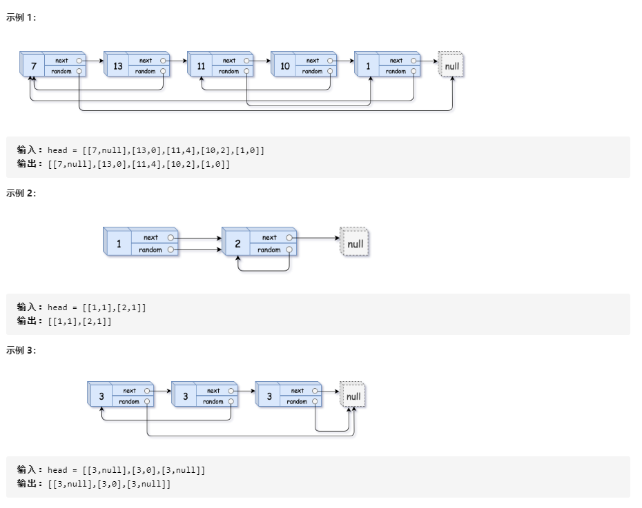
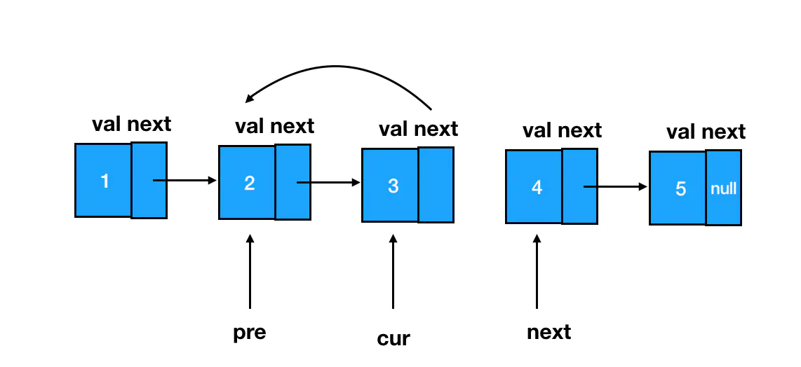
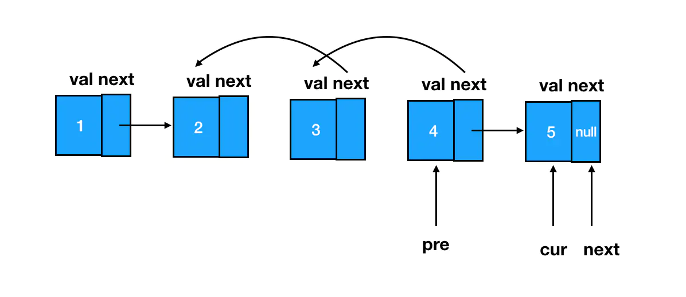
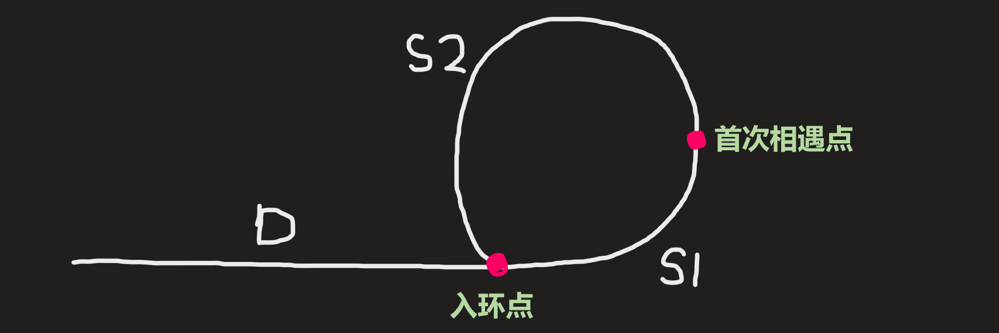
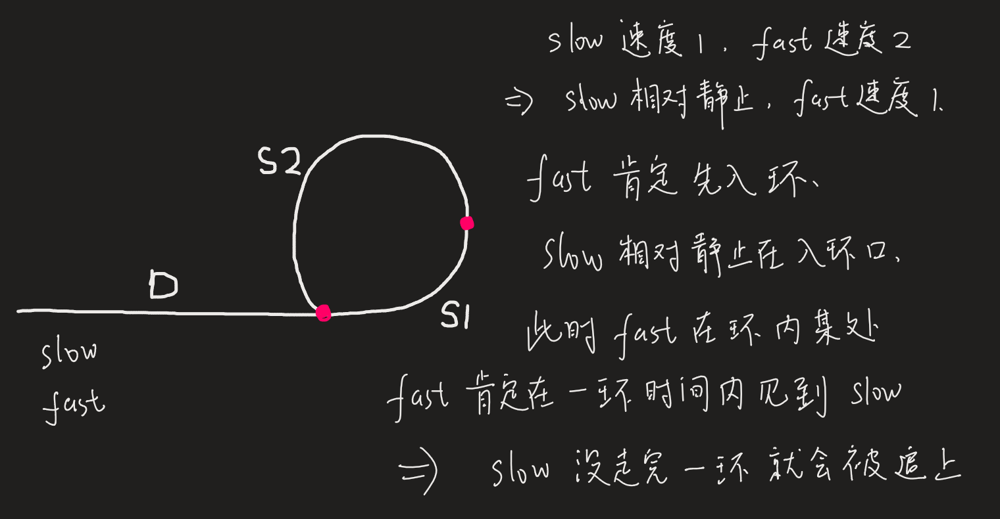
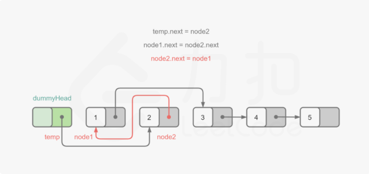
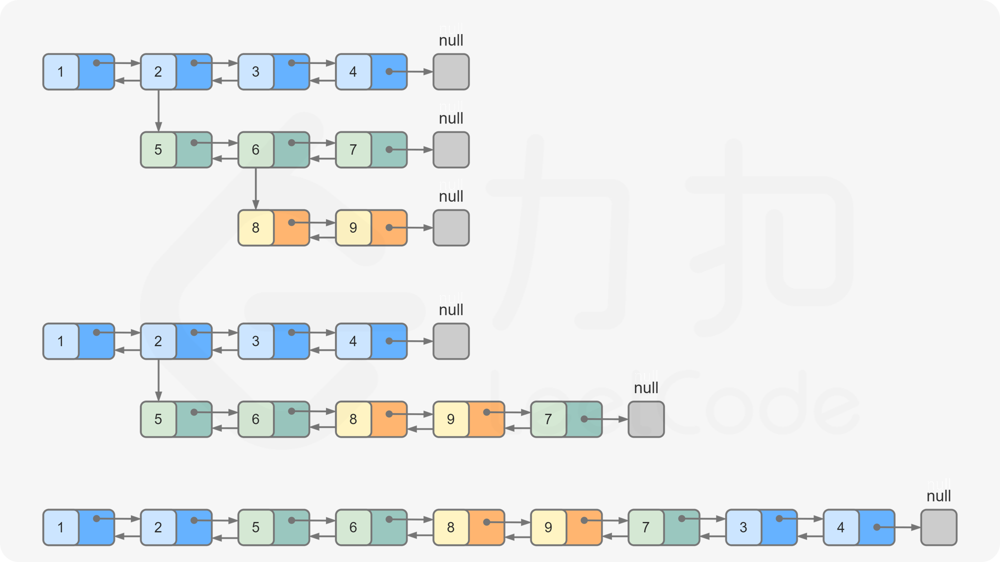

# 链表

**处理链表的本质，是处理链表结点之间的指针关系**。

## 链表基本操作

```js
class ListNode {
  constructor(val) {
    this.val = val
    this.next = null
  }
}

class LinkedList {
  constructor(list) {
    this.head = null
    this.size = 0
    list.forEach((val) => this.push(val))
  }
  // 在尾部追加元素
  push(val) {
    let node = new ListNode(val)
    let current = null
    if (!this.head) {
      this.head = node
    } else {
      current = this.head
      while (current.next !== null) {
        current = current.next
      }
      current.next = node
    }
    this.size++
  }
  // 查看链表
  toString() {
    if (!this.head) return this.head
    let str = this.head.val
    let current = this.head
    for (let i = 0; i < this.size; i++) {
      str += `->${current.val}`
      current = current.next
    }
    return str
  }
}

var rotateRight = function (head, k) {
  // 避免掉 空和只有一个元素的情况
  if (!head || !head.next) return head
  let size = 1
  let cur = head
  // 获取长度
  while (cur.next) {
    cur = cur.next
    size++
  }
  // 因为当k 大于长度时, 又是一个轮回, 所以对长度取余
  let _k = k % size
  // 排除k==0或为size的整数倍的情况
  if (_k === 0) return head
  let pre = head
  for (let i = 0; i < size - _k - 1; i++) {
    pre = pre.next
  }
  console.log(pre.next, 'pre.next') // 3 -> 4 -> 5 -> null
  console.log(head, 'head') // 1 -> 2 -> 3 -> 4 -> 5 -> null
  console.log(cur, 'cur') // 5 -> null
  let vnode = pre.next // 3 -> 4 -> 5 -> null
  pre.next = null
  console.log(pre) // 2 -> null
  console.log(head, 'head') // 1 -> 2 -> null
  cur.next = head
  console.log(cur) // 5 -> 1 -> 2 -> null
  return vnode
}

let list = [1, 2, 3, 4, 5],
  k = 3
let head = new LinkedList(list).head
console.log(rotateRight(head, k), '结果')
```

## [2. 两数相加](https://leetcode-cn.com/problems/add-two-numbers/)

### 方法一：正常思路

像做加法运算一样，做题

```js
/**
 * Definition for singly-linked list.
 * function ListNode(val) {
 *     this.val = val;
 *     this.next = null;
 * }
 */
/**
 * @param {ListNode} l1
 * @param {ListNode} l2
 * @return {ListNode}
 */
var addTwoNumbers = function(l1, l2) {
  let node = new ListNode('head')
  let temp = node //哑结点
  let add = 0 //是否进一
  let sum = 0 //新链表当前未取余的值 = 链表1值 + 链表2值 + add;

  //遍历，直到最长的都为空
  while (l1 || l2) {
    sum = (l1 ? l1.val : 0) + (l2 ? l2.val : 0) + add
    temp.next = new ListNode(sum % 10) //取余则为新链表的值
    temp = temp.next
    add = sum >= 10 ? 1 : 0
    l1 && (l1 = l1.next)
    l2 && (l2 = l2.next)
  }
  add && (temp.next = new ListNode(add))
  return node.next
}; 
```

### 方法二：位运算

思路和上一个相同，算是个微优化

```js
var addTwoNumbers = function (l1, l2) {
  let result = new ListNode('head')
  let str = result
  let val = 0

  while (l1 || l2 || val) {
    // 通过位运算符获取当前值 通过+=求和
    val += ~~(l1 && l1.val) + ~~(l2 && l2.val)
    // 当前节点的val则为当前和的余数
    str.next = new ListNode(val % 10)
    // 下一次循环的str
    str = str.next
    // 下一次循环的l1
    l1 = l1 && l1.next
    // 下一次循环的l2
    l2 = l2 && l2.next
    // 如果本次循环的和大于9 则进位1 因为true为1 false为0可以直接代入使用
    val = val > 9
  }
  return result.next
}
```

## 19. 删除链表的倒数第N个节点

### 题目描述

给定一个链表，删除链表的倒数第 n 个节点，并且返回链表的头结点。

示例：

```
给定一个链表: 1->2->3->4->5, 和 n = 2.

当删除了倒数第二个节点后，链表变为 1->2->3->5.
```

说明：

给定的 n 保证是有效的。

### 解法一：快慢指针

分析问题: 1->2->3->4->5

1. 删除头部, n = 5
2. 删除尾部, n = 1
3. 删除中间, n = 2
   思路:
4. 快慢指针,删除头部,边界处理问题极烦，增加一个node
5. 删除尾部和删除中间画图,你会发现一样。
   核心:
6. 找到要删除的节点,将其前一个节点，指向要删除节点的后一个节点

#### 解决方案一：添加 preHead 节点

```js
var removeNthFromEnd = function (head, n) {
  let preHead = new ListNode(0)
  preHead.next = head
  let fast = preHead,
    slow = preHead
  // 快先走 n+1 步
  while (n--) {
    fast = fast.next
  }
  // fast、slow 一起前进
  while (fast && fast.next) {
    fast = fast.next
    slow = slow.next
  }
  slow.next = slow.next.next
  return preHead.next
}
```

#### 解决方案二：单独处理倒数第 n 节点

```js
var removeNthFromEnd = function (head, n) {
  let fast = head,
    slow = head
  // 快先走 n 步
  while (--n) {
    fast = fast.next
  }
  // 其实和方案一就是这里的区别
  if (!fast.next) return head.next
  fast = fast.next
  // fast、slow 一起前进
  while (fast && fast.next) {
    fast = fast.next
    slow = slow.next
  }
  slow.next = slow.next.next
  return head
}
```

### 解法二：两次遍历

思路：
删除正数第n个节点
遍历链表，直到第n-1个节点，将第n-1个节点指向第n个节点即完成了删除操作
通过索引位置自减，直到0，就可以找到
删除倒数第n个节点

我们通过反转链表来删除第n个节点，即是删除了倒数第n个节点
查找节点
通过遍历位置得到
此处不需反转
举个栗子
1 -> 2 -> 3 -> 4 -> 5
删除倒数第2个节点
等价于
删除正数第4(5 - 2 + 1)个节点
因此此题转换成了删除正数第`(L - n + 1)`个节点
L为链表长度，需要通过遍历算得

```js
/**
 * Definition for singly-linked list.
 * function ListNode(val) {
 *     this.val = val;
 *     this.next = null;
 * }
 */
/**
 * @param {ListNode} head
 * @param {number} n
 * @return {ListNode}
 */

var removeNthFromEnd = function (head, n) {
    const dummy = new ListNode(null)
    dummy.next = head
    let length = 0
    let cur = head
    while(cur) {
        length++
        cur = cur.next
    }
    cur = dummy
    while(n !== length) {
        cur = cur.next
        length--
    }
    cur.next = cur.next.next

    return dummy.next
};

```

### 解法三：单链表的插入、删除、查找、反转等经典操作

- 反转链表
- 找到第n个，并删除
- 再反转链表

```js
/**
 * Definition for singly-linked list.
 * function ListNode(val) {
 *     this.val = val;
 *     this.next = null;
 * }
 */
/**
 * @param {ListNode} head
 * @param {number} n
 * @return {ListNode}
 */
var removeNthFromEnd = function (head, n) {
  // 反转链表
  let prev = null
  let curr = head
  var reverse = (prev, curr) => {
    while (curr) {
      let next = curr.next
      curr.next = prev
      prev = curr
      curr = next
    }
    return prev
  }
  let newHead = reverse(prev, curr)
  // 边界条件处理
  if (n == 1) {
    return reverse(null, newHead.next)
  }
  // 查询节点
  let findNodeByIndex = (currSearchTmp, n) => {
    let pos = 1
    while (currSearchTmp && pos != n) {
      currSearchTmp = currSearchTmp.next
      pos++
    }
    return currSearchTmp
  }
  let currSearch = findNodeByIndex(newHead, n)
  // 查找前一个节点
  let pre = findNodeByIndex(newHead, n - 1)
  // 删除节点
  pre.next = currSearch.next
  let prevNeed = null
  let currNeed = newHead
  // 反转回来
  return reverse(prevNeed, currNeed)
}
```

## 61. 旋转链表

### 题目描述

给定一个链表，旋转链表，将链表每个节点向右移动 k 个位置，其中 k 是非负数。

示例 1:

```
输入: 1->2->3->4->5->NULL, k = 2
输出: 4->5->1->2->3->NULL
解释:
向右旋转 1 步: 5->1->2->3->4->NULL
向右旋转 2 步: 4->5->1->2->3->NULL
```

示例 2:

```
输入: 0->1->2->NULL, k = 4
输出: 2->0->1->NULL
解释:
向右旋转 1 步: 2->0->1->NULL
向右旋转 2 步: 1->2->0->NULL
向右旋转 3 步: 0->1->2->NULL
向右旋转 4 步: 2->0->1->NULL
```

### 方法一：循环链表

思路：

变成循环链表以后，从head开始找到新的头和尾
因为k可能大于链表的长度，所以要用 `let n = k % size`，找到实际上要移动的次数
注意:因为是从头开始的，所以  新的尾结点 = 数组的长度 - 实际移动的次数，新的头结点 = 新的尾结点.next

```js
var rotateRight = function(head, k) {
  // 避免掉 空和只有一个元素的情况
  if(!head || !head.next) return head
  let size = 1 // 链表的长度，必须从1 开始，为了形成环，cur.next = head 此时，cur指向的是最后一个节点
  let cur = head
  while(cur.next) {
    cur = cur.next
    size++ // 获取链表的长度
  }
  // 因为当k 大于长度时, 又是一个轮回, 所以对长度取余
  let n = k % size
  cur.next = head // 形成一个环
  let index = 1
  let node = head

  while(index < (size - n)){
    node = node.next
    index++
  } 
  // 这一步很重要
  let newNode = node.next
  node.next = null  // 把环弄断
  return newNode
}
```

### 方法二：按题目思路来

就是按照题目的思路来弄
其实就是, 把最后一项删了, 然后把刚删掉的最后一项放到头部来
换成数组就很简单了如 [1,2,3,4] => [4,1,2,3], k有多少就弄多少遍, 当k大于长度时,就会重复, 所以可以k % 长度 来避免

```js
/**
 * Definition for singly-linked list.
 * function ListNode(val) {
 *     this.val = val;
 *     this.next = null;
 * }
 */
/**
 * @param {ListNode} head
 * @param {number} k
 * @return {ListNode}
 */
var rotateRight = function (head, k) {
  // 避免掉 空和只有一个元素的情况
  if (!head || !head.next) return head
  let size = 1
  let cur = head
  while (cur.next) {
    cur = cur.next
    size++
  }
  // 因为当k 大于长度时, 又是一个轮回
  let num = k % size
  let node = head
  // 拿掉最后一个, 把它放在头部, 重复num次
  while (num > 0) {
    let last = node
    // 拿到倒数第二个
    while (last.next && last.next.next) {
      last = last.next
    }
    let val = last.next.val
    // 去掉最后一项
    last.next = null
    // 把最后一项 往头部添加
    let vhead = new ListNode(val)
    vhead.next = node
    node = vhead
    num--
  }
  return node
}
```

## [82. 删除排序链表中的重复元素 II](https://leetcode-cn.com/problems/remove-duplicates-from-sorted-list-ii/)

### 方法一：递归

```js
var deleteDuplicates = function(head) {
  if (!head || !head.next) return head
  if (head.val === head.next.val) {
    while (head.next && head.next.val === head.val) head.next = head.next.next
    return deleteDuplicates(head.next)
  } else {
    head.next = deleteDuplicates(head.next)
  }
  return head
}
```

### 方法二：双指针

```js
/**
 * @param {ListNode} head
 * @return {ListNode}
 */
const deleteDuplicates = function(head) {
  // 极端情况：0个或1个结点，则不会重复，直接返回
  if (!head || !head.next) {
    return head
  }
  // dummy 登场
  let dummy = new ListNode()
  // dummy 永远指向头结点
  dummy.next = head
  // cur 从 dummy 开始遍历
  let cur = dummy
  // 当 cur 的后面有至少两个结点时
  while (cur.next && cur.next.next) {
    // 对 cur 后面的两个结点进行比较
    if (cur.next.val === cur.next.next.val) {
      // 若值重复，则记下这个值
      let val = cur.next.val
      // 反复地排查后面的元素是否存在多次重复该值的情况
      while (cur.next && cur.next.val === val) {
        // 若有，则删除
        cur.next = cur.next.next
      }
    } else {
      // 若不重复，则正常遍历
      cur = cur.next
    }
  }
  // 返回链表的起始结点
  return dummy.next
}
```

## 138. 复制带随机指针的链表

### 题目描述

给定一个链表，每个节点包含一个额外增加的随机指针，该指针可以指向链表中的任何节点或空节点。

要求返回这个链表的 深拷贝。 

我们用一个由 n 个节点组成的链表来表示输入/输出中的链表。每个节点用一个 [val, random_index] 表示：

- val：一个表示 `Node.val` 的整数。
- random_index：随机指针指向的节点索引（范围从 `0` 到 `n-1`）；如果不指向任何节点，则为  `null` 。



### 方法一：两次循环

- 优先处理特殊情况：当指向链表的head指针指向null时，直接返回null;
- 定义指向输入链表head的指针curr
- 定义输出的新的链表的空的node节点new Node();并使用temp指针指向新链表头节点；
- 定义一个map对象，存储当前的节点和新节点的对应关系；
- 第一次遍历：生成一个具有val和next属性的新的链表；同时记录当前节点和random属性的关系
- 第二次遍历：根据map()对象的映射关系，将random指针指向对应的节点或者null;

```js
var copyRandomList = function (head) {
  if (!head) return null
  let curr = head,
    node = new Node(),
    tmp = node, // 新的Node，tmp改变的是node
    map = new Map()

  while (curr) {
    tmp.val = curr.val
    tmp.next = curr.next ? new Node() : null
    map.set(curr, tmp) // 存储链表关系
    tmp = tmp.next
    curr = curr.next
  }

  tmp = node // 第二次循环开始前，需要让链表从头开始再循环
  curr = head

  while (curr) {
    tmp.random = curr.random ? map.get(curr.random) : null
    curr = curr.next
    tmp = tmp.next
  }

  return node
}
// curr 和 tmp 需要同时移动
```

```js
/**
 * // Definition for a Node.
 * function Node(val, next, random) {
 *    this.val = val;
 *    this.next = next;
 *    this.random = random;
 * };
 */

/**
 * @param {Node} head
 * @return {Node}
 */
var copyRandomList = function(head) {
 // 处理边界条件
    if (!head) return null
    // 初始化copy的头部结点
    let copyHead = new Node()
    // 初始化copy的游标结点
    let copyNode = copyHead
    // 初始化hashMap
    const hashMap = new Map()
    let curr = head
    // 首次循环，正常处理链表的复制
    while (curr) {
      copyNode.val = curr.val
      copyNode.next = curr.next ? new Node() : null
      hashMap.set(curr, copyNode)
      curr = curr.next
      copyNode = copyNode.next
    }
    // 将游标复位到head
    curr = head
    // 将copy链表的游标也复位到copyHead
    copyNode = copyHead
    // 再搞个循环，特殊处理random关系
    while (curr) {
      // 处理random的指向
      copyNode.random = curr.random ? hashMap.get(curr.random) : null
      // copyNode 和 curr 两个游标一起前进
      copyNode = copyNode.next
      curr = curr.next
    }

    // 注意这里返回的是copyHead而不是head
    return copyHead
};
```

## [206. 反转链表](https://leetcode-cn.com/problems/reverse-linked-list/)

- 题意解析: 反转给定链表.
- 输入处理: head为空直接返回空.



### 方法一： 迭代法

- 思路: 设置一个前指针prev和推进指针curr，推进直到curr为空，返回prev.

- 复杂度分析:
  
  - 时间: O(n). 逐个推进故 O(n).
  
  - 空间: O(1). 只用到了常数级额外空间故 O(1).

实现:

```js
var reverseList = function (head) {
  if (!head || !head.next) return head;
  let [prev, curr] = [null, head]
  while (curr) {
    let tmp = curr.next  // 1. 临时存储当前指针后续内容
    curr.next = prev      // 2. 反转链表
    prev = curr         // 3. 保存当前的值
    curr = tmp            // 4. 让链表继续往下走.next
  }
  return prev
}
```

简化实现：

```js
var reverseList = function (head) {
  if (!head || !head.next) return head;
  let [prev, curr] = [null, head]
  while (curr) {
    ;[curr.next, prev, curr] = [prev, curr, curr.next]
  }
  return prev
}
```

### 方法二: 自递归法 -- 反转后尾接

- 思路: 自递归无法存储推进状态所以无法尾递归，不断将 next 放入递归方法反转链表，结果.next = 当前节点. （Tip: 记得推进结果直到 next.next 为空）

- 复杂度分析:
  
  - 时间: O(n). 从最底层两个节点反转开始，每层时间复杂度均为 O(1), 总共 n-1 层递归，故时间复杂度为 O(n).
  - 空间: O(n). 递归调用栈消耗空间，共 n-1 层递归，故空间复杂度为 O(n).

```js
var reverseList = function (head) {
  if (!head || !head.next) return head
  let next = head.next // next节点，反转后是最后一个节点
  let reverseHead = reverseList(next)
  head.next = null // 裁减 head
  next.next = head // 尾接
  return reverseHead
}
```

### 方法三: 尾递归法

- 思路: 用 prev 和 curr 存储推进状态，直到 curr 为空则输出结果.
- 复杂度分析:
  - 时间: O(n). 等同于正常推进，故 O(n).
  - 空间: O(1). 尾递归方式，重复使用一个空间故空间复杂度为 O(1).

```js
var reverseList = function (head) {
  return reverse(null, head)
}
// 递归传递的是（递归后的next的值，和当前的值）
function reverse(prev, curr) {
  if (!curr) return prev
  // [curr.next, prev, curr] = [prev, curr.next, curr.next];
  let tmp = curr.next
  curr.next = prev
  return reverse(curr, tmp)
}
```

## [92. 反转链表 II](https://leetcode-cn.com/problems/reverse-linked-list-ii/)



### 方法一：迭代法

```js
/**
 * @param {ListNode} head
 * @param {number} m
 * @param {number} n
 * @return {ListNode}
 */
// 入参是头结点、m、n
const reverseBetween = function(head, m, n) {
    // 定义pre、cur，用leftHead来承接整个区间的前驱结点
    let pre,cur,leftHead
    // 别忘了用 dummy 
    const dummy = new ListNode()  
    // dummy后继结点是头结点
    dummy.next = head
    // p是一个游标，用于遍历，最初指向 dummy
    let p = dummy  
    // p往前走 m-1 步，走到整个区间的前驱结点处
    for(let i=0;i<m-1;i++){
        p = p.next
    }
    // 缓存这个前驱结点到 leftHead 里
    leftHead = p
    // start 是反转区间的第一个结点
    let start = leftHead.next  
    // pre 指向start
    pre = start
    // cur 指向 start 的下一个结点
    cur = pre.next
    // 开始重复反转动作
    for(let i=m;i<n;i++){
        let next = cur.next
        cur.next = pre
        pre = cur
        cur = next
    }
    //  leftHead 的后继结点此时为反转后的区间的第一个结点
    leftHead.next = pre
    // 将区间内反转后的最后一个结点 next 指向 cur
    start.next=cur
    // dummy.next 永远指向链表头结点
    return dummy.next
};
```

```js
var reverseBetween = function(head, left, right) {
    const newNode = new ListNode(0, head);
    let pre = newNode;
    for (let i = 0; i < left - 1; i++) {
        pre = pre.next;
    }
    // 当前节点current
    let cur = pre.next;
    while (left < right) {
        // cur+1节点
        const next = cur.next;
        // 断开cur与cur+1,使cur->cu2+2
        cur.next = cur.next.next;
        // cur+1 -> cur
        next.next = pre.next;
        // pre -> cur+1
        pre.next = next;
        left++;
    }
    return newNode.next;
}
```

## [142. 环形链表 II](https://leetcode-cn.com/problems/linked-list-cycle-ii/)

### 方法一：标记法

- 这个方法的前提是可以改变链表的结构（但是不符合题意，lc上却能通过）

```js
/**
 * @param {ListNode} head
 * @return {ListNode}
 */
const detectCycle = function(head) {
    while(head){
        if(head.flag){
            return head;
        }else{
            head.flag = true;
            head = head.next;
        }
    }
    return null;
};
```

### 方法二：快慢指针

也就是数学上的追击问题

- 两个快慢指针，从头节点出发，如果链表有环，快指针肯定可以在环内和慢指针相遇。没有环就不可能再相遇，相遇必在环内。
  
  
  
  - D：从头节点到入环点的距离
  - S1：从入环点到首次相遇点的距离
  - S2：从首次相遇点到入环点的距离
  
  「首次相遇时，慢指针一定还没走完一个环」，解释如下：
  
  

- 相遇时，慢指针走的距离：D+S1

- 假设相遇时快指针已经绕环 n 次，它走的距离：D+n(S1+S2)+S1

- 因为快指针的速度是 2 倍，所以相同时间走的距离也是 2 倍：
  
  - D+n(S1+S2)+S1 = 2(D+S1)
  - 即 (n-1)S1+ nS2=D

- 我们不关心绕了几次环，取 n = 1 这种特定情况，消掉 S1：
  
  - D=S2

- 怎么利用 D=S2 求入环点
  
  - 在循环的过程中，快慢指针相遇，位置相同了，可以确定出相遇点
  - 为了确定「入环点」，我们「人为制造」快慢指针在入环点相遇
  - 让快指针从头节点出发，速度改为和慢指针一样，慢指针留在首次相遇点，同时出发
  - 因为 D = S2 ，二者速度相同，所以会同时到达入环点

```js
/**
 * @param {ListNode} head
 * @return {ListNode}
 */
var detectCycle = function(head) {
  let slow = head
  let fast = head
  while (fast) {
    if (fast.next == null) {
      // fast.next走出链表了，说明无环
      return null
    }
    slow = slow.next // 慢指针走一步
    fast = fast.next.next // 慢指针走一步
    if (slow == fast) {
      // 首次相遇
      fast = head // 让快指针回到头节点
      while (true) {
        // 开启循环，让快慢指针相遇
        if (slow == fast) {
          // 相遇，在入环处
          return slow
        }
        slow = slow.next
        fast = fast.next // 快慢指针都走一步
      }
    }
  }
  return null
}
```

## [25. K 个一组翻转链表](https://leetcode-cn.com/problems/reverse-nodes-in-k-group/)

[题解]([Loading...](https://leetcode.com/problems/reverse-nodes-in-k-group/discuss/183356/Java-O(n)-solution-with-super-detailed-explanation-and-illustration))

```js
/**
 * @param {ListNode} head
 * @param {number} k
 * @return {ListNode}
 */
const reverseKGroup = function(head, k) {
  // 这个方法专门用来翻转指定范围（以head为起点）内的k个结点
  function reverse(head) {
      // 初始化 pre、cur、next三剑客
      let pre = null, cur = head, next = null  
      // 遍历当前范围结点
      while(cur) {
          // 缓存next
          next = cur.next  
          // 翻转当前结点的next指针
          cur.next = pre  
          // pre、cur各前进一步，为下一个指针的翻转做准备
          pre = cur  
          cur = next  
      }
      // 翻转到最后，pre会指向最末尾的结点，也就是翻转后的第一个结点
      return pre
  }
  // 有dummy指针好办事
  let dummy = new ListNode()  
  dummy.next = head 
  // pre用来缓存当前这一截k个结点的链表前驱的那个结点（不丢头）
  let pre = dummy
  // start指向k个一组的局部链表中的第一个
  let start = head
  // end指向k个一组的局部链表中的最后一个
  let end = head
  // next用来缓存当前这一截k个结点的链表后继的那个结点（不丢尾）
  let next = head  
  // 当后继结点存在时，持续遍历
  while(next) {
      // 找到k个结点中的最后一个
      for(let i=1;i<k&&end;i++) {
          end = end.next
      }
      // 如果不满k个，直接返回
      if(!end) {
         break
      } 
      // 缓存这k个结点的后继结点
      next = end.next  
      // 这一步把end.next置为null，是为了配合reverse方法
      end.next = null  
      // 手动把end指向start（因为下面reverse完start就会改变）
      end = start 
      // 以start为起点翻转k个结点
      start = reverse(start) 
      // 接上尾巴
      end.next = next  
      // 接上头
      pre.next = start 
      // pre、start、end一起前进，为下一次翻转做准备 
      pre = end
      start = next  
      end = start
  }
  // dummy.next指向的永远是链表的第一个结点
  return dummy.next
};
```

这两个方法思路相同，交换的方式稍有区别

```js
const myReverse = (head, tail) => {
    let prev = tail.next;
    let p = head;
    while (prev !== tail) {
        const nex = p.next;
        p.next = prev;
        prev = p;
        p = nex;
    }
    return [tail, head];
}
var reverseKGroup = function(head, k) {
    const dummy = new ListNode(0);
    dummy.next = head;
    let pre = dummy;

    while (head) {
        let tail = pre;
        // 查看剩余部分长度是否大于等于 k
        for (let i = 0; i < k; ++i) {
            tail = tail.next;
            if (!tail) {
                return dummy.next;
            }
        }
        const nex = tail.next;
        [head, tail] = myReverse(head, tail);
        // 把子链表重新接回原链表
        pre.next = head;
        tail.next = nex;
        pre = tail;
        head = tail.next;
    }
    return dummy.next;
}
```

```js
/**
 * @param {ListNode} head
 * @param {number} k
 * @return {ListNode}
 */
var reverseKGroup = function(head, k) {
  // 标兵
  let dummy = new ListNode()
  dummy.next = head
  let [start, end] = [dummy, dummy.next]
  let count = 0
  while(end) {
    count++
    if (count % k === 0) {
      start = reverseList(start, end.next)
      end = start.next
    } else {
      end = end.next
    }
  }
  return dummy.next

  // 翻转stat -> end的链表
  function reverseList(start, end) {
    let [pre, cur] = [start, start.next]
    const first = cur
    while(cur !== end) {
      let next = cur.next
      cur.next = pre
      pre = cur
      cur = next
    }
    start.next = pre
    first.next = cur
    return first
  }
};
```

## [24. 两两交换链表中的节点](https://leetcode-cn.com/problems/swap-nodes-in-pairs/)

### 方法一：递归

```js
var swapPairs = function(head) {
    if (head === null|| head.next === null) {
        return head;
    }
    const newHead = head.next;
    head.next = swapPairs(newHead.next);
    newHead.next = head;
    return newHead;
};
```

### 方法二：迭代



.png)

```js
var swapPairs = function(head) {
    const dummyHead = new ListNode(0);
    dummyHead.next = head;
    let temp = dummyHead;
    while (temp.next !== null && temp.next.next !== null) {
        const node1 = temp.next;
        const node2 = temp.next.next;
        // 注意交换顺序
        temp.next = node2;
        node1.next = node2.next;
        node2.next = node1;
        temp = node1;
    }
    return dummyHead.next;
};
```

## [剑指 Offer 25. 合并两个排序的链表](https://leetcode-cn.com/problems/he-bing-liang-ge-pai-xu-de-lian-biao-lcof/)

### 方法一：迭代

```js
const mergeTwoLists = (l1, l2) => {
    // 定义一个虚拟节点，最后返回虚拟节点的下一个节点
    const res = new ListNode(0);
    // 定义p指向虚拟节点
    let p = res;
    // 定义p1,p2分别指向两个链表头部
    let [p1, p2] = [l1, l2];
    // 当p1, p2都有值的时候
    while (p1 && p2) {
        // 如果p1指向的值小，则p指向p1的值
        // p1右移
        // 否则p指向p2的值，p2右移
        if (p1.val < p2.val) {
            p.next = p1;
            p1 = p1.next;
        } else {
            p.next = p2;
            p2 = p2.next;
        }
        // 记得p也要右移
        p = p.next;
    }
    // 到最后退出循环了，p1,p2肯定有且只有一个是null
    // 那么另一个不是null的还没有连接到p上
    // 把p再连接到不是null的那个
    p.next = p1 ? p1 : p2;
    // 返回虚拟节点的下一个节点
    return res.next;
};
```

### 方法二：递归

```js
const mergeTwoLists = (l1, l2) => { 
    // 当其中有null 则返回有效值
    if (!l1 || !l2) return l1 || l2
    // 进行大小对比
    if (l1.val < l2.val) {
        l1.next = mergeTwoLists(l1.next, l2)
        return l1
    } else {
        l2.next = mergeTwoLists(l1, l2.next)
        return l2
    }
};
```

## [146. LRU 缓存机制](https://leetcode-cn.com/problems/lru-cache/)

伪代码

```
// put

if key 存在:
    更新节点值
    把节点移到链表头部

else:
    if 缓存满了:
        移除最后一个节点
        删除它在哈希表中的映射

    新建一个节点
    在哈希表中增加映射
    把节点加到链表头部


// get

if key 存在:
    返回节点值
    把节点移到链表头部
else:
    返回 -1
```

### 方法一：哈希表 + 双向链表

```js
class DoubleLinkedListNode {
    constructor(key, value) {
        this.key = key
        this.value = value
        this.prev = null
        this.next = null
    }
}

class LRUCache {
    constructor(capacity) {
        this.capacity = capacity
        this.usedSpace = 0
        // Mappings of key->node.
        this.hashmap = {}
        this.dummyHead = new DoubleLinkedListNode(null, null)
        this.dummyTail = new DoubleLinkedListNode(null, null)
        this.dummyHead.next = this.dummyTail
        this.dummyTail.prev = this.dummyHead
    }

    _isFull() {
        return this.usedSpace === this.capacity
    }

    _removeNode(node) {
        node.prev.next = node.next
        node.next.prev = node.prev
        node.prev = null
        node.next = null
        return node
    }

    _addToHead(node) {
        const head = this.dummyHead.next
        node.next = head
        head.prev = node
        node.prev = this.dummyHead
        this.dummyHead.next = node
    }

    get(key) {
        if (key in this.hashmap) {
            const node = this.hashmap[key]
            this._addToHead(this._removeNode(node))
            return node.value
        }
        else {
            return -1
        }
    }

    put(key, value) {
        if (key in this.hashmap) {
            // If key exists, update the corresponding node and move it to the head.
            const node = this.hashmap[key]
            node.value = value
            this._addToHead(this._removeNode(node))
        }
        else {
           // If it's a new key.
            if (this._isFull()) {
                // If the cache is full, remove the tail node.
                const node = this.dummyTail.prev
                delete this.hashmap[node.key]
                this._removeNode(node)
                this.usedSpace--
            }
            // Create a new node and add it to the head.
            const node = new DoubleLinkedListNode(key, value)
            this.hashmap[key] = node
            this._addToHead(node)
            this.usedSpace++
        }
    }
}
```

```js
class ListNode {
  constructor(key, value) {
    this.key = key
    this.value = value
    this.next = null
    this.prev = null
  }
}

class LRUCache {
  constructor(capacity) {
    this.capacity = capacity
    this.hash = {}
    this.count = 0
    this.dummyHead = new ListNode()
    this.dummyTail = new ListNode()
    this.dummyHead.next = this.dummyTail
    this.dummyTail.prev = this.dummyHead
  }

  get(key) {
    let node = this.hash[key]
    if (node == null) return -1
    this.moveToHead(node)
    return node.value
  }

  put(key, value) {
    let node = this.hash[key]
    if (node == null) {
      if (this.count == this.capacity) {
        this.removeLRUItem()
      }
      let newNode = new ListNode(key, value)
      this.hash[key] = newNode
      this.addToHead(newNode)
      this.count++
    } else {
      node.value = value
      this.moveToHead(node)
    }
  }

  moveToHead(node) {
    this.removeFromList(node)
    this.addToHead(node)
  }

  removeFromList(node) {
    let temp1 = node.prev
    let temp2 = node.next
    temp1.next = temp2
    temp2.prev = temp1
  }

  addToHead(node) {
    node.prev = this.dummyHead
    node.next = this.dummyHead.next
    this.dummyHead.next.prev = node
    this.dummyHead.next = node
  }

  removeLRUItem() {
    let tail = this.popTail()
    delete this.hash[tail.key]
    this.count--
  }

  popTail() {
    let tail = this.dummyTail.prev
    this.removeFromList(tail)
    return tail
  }
}
```

### 方法二：使用库函数

```js
/**
 * @param {number} capacity
 */
var LRUCache = function(capacity) {
    this.capacity = capacity;
    this.map = new Map();
};

/** 
 * @param {number} key
 * @return {number}
 */
LRUCache.prototype.get = function(key) {
    if(this.map.has(key)){
         let temp=this.map.get(key)
         this.map.delete(key);
         this.map.set(key, temp);
         return temp
    }else{
        return -1
    }
};

/** 
 * @param {number} key 
 * @param {number} value
 * @return {void}
 */
LRUCache.prototype.put = function(key, value) {
    if(this.map.has(key)){
        this.map.delete(key);
    }
    this.map.set(key,value);
    if(this.map.size > this.capacity){
        this.map.delete(this.map.keys().next().value);
    }
};

/**
 * Your LRUCache object will be instantiated and called as such:
 * var obj = new LRUCache(capacity)
 * var param_1 = obj.get(key)
 * obj.put(key,value)
 */
```

## [147. 对链表进行插入排序](https://leetcode-cn.com/problems/insertion-sort-list/)

```js
var insertionSortList = function(head) {
    if (head === null) {
        return head;
    }
    const dummyHead = new ListNode(0);
    dummyHead.next = head;
    // lastSorted需要开始排序的位置，标识位
    let lastSorted = head, curr = head.next;
    while (curr !== null) {
        if (lastSorted.val <= curr.val) {
            lastSorted = lastSorted.next;
        } else {
            let prev = dummyHead;
            // 在dummyHead中找到要开始排序的位置的前一个位置
            while (prev.next.val <= curr.val) {
                prev = prev.next;
            }
            lastSorted.next = curr.next;
            curr.next = prev.next;
            prev.next = curr;
        }
        // 循环的条件
        curr = lastSorted.next;
    }
    return dummyHead.next;
};


/**
 * Definition for singly-linked list.
 * function ListNode(val, next) {
 *     this.val = (val===undefined ? 0 : val)
 *     this.next = (next===undefined ? null : next)
 * }
 */
/**
 * @param {ListNode} head
 * @return {ListNode}
 */
var insertionSortList = function(head) {
    // current 当前需要找到位置插入的节点
    // currentPre 当前插入节点之前的节点
    let current = head.next, currentPre = head;
    if(!current) return head;

    // 正向判断
    while(current) {
        // compareHead 用来从头部往current节点之间遍历的节点指针
        // shouldUpdateCurrentPre 用来判断该current是否需要移动位置
        // 需要移动位置则currentPre无需更新, 不移动位置则需要将currentPre更新
        let compareHead = head, shouldUpdateCurrentPre = true;
        // currentNext 暂存下个节点， headPre暂存 compareHead移位之前的节点，找到插入位置需要更新compareHead 与 current的位置
        let currentNext = current.next, headPre = null;

        // head 往后寻找值比 current大的节点
        while(compareHead !== current) {
            if(compareHead.val > current.val) {
                // 如果current插入位置不是头节点之前
                if(headPre) {
                    // 更新compareHead 与 current位置
                    headPre.next = current;
                    current.next = compareHead;
                }else {
                    // 插入位置是头结点之前 更新current与头结点位置
                    let tempNode = head;
                    head = current;
                    current.next = tempNode;
                }
                // 移出current之后 前后节点连接
                currentPre.next = currentNext;
                // 不需要更新currentPre
                shouldUpdateCurrentPre = false;
                break;
            }
            // 赋值headPre
            headPre = compareHead;
            // compareHead后移
            compareHead = compareHead.next;
        }
        // 更新currentPre
        shouldUpdateCurrentPre && (currentPre = current);
        // 更新current
        current = currentNext;
    }

    return head;
};
```

## [148. 排序链表](https://leetcode-cn.com/problems/sort-list/)

### 方法一：归并排序

- 链表的归并排序，可用快慢指针实现
  
  - `慢指针`每次移1位，`快指针`移`2`位
  - `快指针`到尾时，慢指针在`中间`

- 将链表中间打断，递归两个子链表继续二分
  
  - 直到子链表只剩两个节点（最后一个子链表可能更少）

- 回溯阶段，先对两个节点的子链表排序，成升序序列
  
  - 不断向上用双指针合并升序序列

- 用虚拟链表.next指向链表头部，就不用关心头部节点是谁了

```js
var sortList = function (head) {
    if (!head || !head.next) return head
    var p0 = head, p1 = head.next
    while(p1 && p1.next) {
        p0 = p0.next
        p1 = p1.next.next
    }
    var mid = p0.next
    p0.next = null
    // 对链表进行二分
    p0 = sortList(head)
    p1 = sortList(mid)
    return merge(p0, p1)
};

function merge(l1, l2) {
    const dummy = new ListNode(0);
    let prev = dummy;
    while (l1 && l2) {
        if (l1.val < l2.val) {
            prev.next = l1;
            l1 = l1.next;
        } else {
            prev.next = l2;
            l2 = l2.next;
        }
        prev = prev.next;
    }
    if (l1) prev.next = l1;
    if (l2) prev.next = l2;
    return dummy.next;
}
```

```js
var sortList = function(head) {
    if (!head || !head.next) return head
    var p0 = head, p1 = head.next
    while(p1 && p1.next) p0 = p0.next, p1 = p1.next.next
    var mid = p0.next
    p0.next = null
    p0 = sortList(head), p1 = sortList(mid)
    var n = new ListNode(0), r = n
    while(p0 || p1) !p1 || p0 && p0.val < p1.val ? (n.next = p0, p0 = p0.next) : (n.next = p1, p1 = p1.next), n = n.next
    return r.next
};

var sortList = function(head) {
    if (!head) return head
    var r = new ListNode(0, head), len = 0;
    while (head) head = head.next, len++
    for (var i = 1; i < len; i *= 2) {
        var p = r, n = r.next;
        while (n) {
            var p0 = n, p1, next = null
            for (let j = 1; j < i && n.next; j++) n = n.next
            p1 = n.next, n.next = null, n = p1
            for (let j = 1; j < i && n && n.next; j++) n = n.next
            if (n) next = n.next, n.next = null
            while (p0 || p1) !p0 || p1 && p1.val < p0.val ? (p.next = p1, p1 = p1.next) : (p.next = p0, p0 = p0.next), p = p.next
            n = next
        }
    }
    return r.next
};
```

### 方法二： sort

```js
// 这个方法看看就好
var sortList = function(head, r = []) {
    if (!head) return null
    while (head) {
        r.push(head)
        var tmp = head.next
        head.next = null
        head = tmp
    }
    r.sort((a, b) => a.val - b.val).reduce((p, v) => p.next = v)
    return r[0]
};
```

### 方法三：插入排序

```js
// 简化版
var sortList = function(head) {
    return sort(head, new ListNode(0))
};
var sort = (cur, start) => {
    while (cur) {
        var next = cur.next, left = start 
        while(left.next && left.next.val < cur.val) left = left.next
        cur.next = left.next
        left.next = cur
        cur = next
    }
    return start.next
}

// 优化版
var sortList = function(head) {
    var start = new ListNode(0)
    start.next = head
    return sort(head, start, head)
};
var sort = (cur, start, max) => {
    while (cur) {
        var next = cur.next
        if (max.val <= cur.val) max = cur
        else {
            var left = start
            while(left.next && left.next.val < cur.val) left = left.next
            max.next = cur.next
            cur.next = left.next
            left.next = cur
        }
        cur = next
    }
    return start.next
}
```

### 方法四：堆排序

```js
var sortList = function(head) {
    if (!head) return head
    var q = new PriorityQueue()
    while(head) q.add(head.val, head), head = head.next
    var start = prev = q.shift().second, t
    while(t = q.shift()) prev = prev.next = t.second
    prev.next = null
    return start
};
class PriorityQueue {
    constructor(a) {
        this.q = []
        a && this._build(a)
    }
    add(v, second) { // 添加
        this.q.push({v, second}) // 添加 值（比较用） 和 第二参数（索引）
        this._up(this.q.length - 1) // 放入 二叉树的尾部，然后 上浮
    }
    shift() { // 弹出
        var n = this.q.shift() // 弹出 根节点
        if (this.q.length) { // 如果还有节点
            this.q.unshift(this.q.pop()) // 将 最尾部的节点 放到根节点位置
            this._down(0) // 下沉 根节点
        }
        return n
    }
    first() { // 根节点的值
        return this.q[0].v 
    }
    empty() { // 是否为空
        return this.q.length === 0
    }
    length() { // 返回队列长度
        return this.q.length
    }
    _build(a) { // 初始化
        this.q.push({v:a[0]}) // 先给空队列放入第0个元素
        for (var i = 1; i < a.length; i++) this.q.unshift({v:a[i]}), this._down(0)
        // 从第1个元素起，把新元素放在根节点，然后下沉 根节点
    }
    _swap(l, r, t) { // 交换
        t = this.q[l], this.q[l] = this.q[r], this.q[r] = t // 交换两个节点
    }
    _down(i){ // 下沉
        var t = this.q.length - 2 >> 1, min, minI // 叶子节点的根节点索引，下沉到 叶子节点的根节点停止
        while(i <= t){
            var l = i * 2 + 1, r = l + 1 // 左子节点的索引 = 当前节点索引 * 2 + 1，右子节点的索引 = 左子节点的索引 + 1
            if ((this.q[l] ? this.q[l].v : Infinity) < (this.q[r] ? this.q[r].v : Infinity))
                 min = this.q[l].v, minI = l
            else min = this.q[r].v, minI = r // 找到 左子节点 和 右子节点的 较小者
            if (this.q[i].v > min) this._swap(i, minI), i = minI // 当前节点的 左子节点 或 右子节点 比 它小，交换 
            else break
        }
    }
    _up(i) { // 上浮
        while(i > 0){ // 不能超过根节点
            var t = i - 1 >> 1 // 当前节点的 根节点索引 = 当前节点索引 - 1 的一半
            if (this.q[i].v < this.q[t].v) this._swap(i, t), i = t // 当前节点值 比 它的根节点 小，交换
            else break
        }
    }
}
```

## [725. 分隔链表](https://leetcode-cn.com/problems/split-linked-list-in-parts/)

分隔链表时，从链表的头结点开始遍历，记当前结点为 \textit{curr}curr，对于每个部分，进行如下操作：

- 将 `curr` 作为当前部分的头结点；
- 计算当前部分的长度 `partSize`；
- 将 `curr` 向后移动`partSize` 步，则`curr` 为当前部分的尾结点；
- 当 `curr` 到达当前部分的尾结点时，需要拆分 `curr `和后面一个结点之间的连接关系，在拆分之前需要存储 `curr` 的后一个结点 `next`；
- 令 `curr` 的 `next` 指针指向 \text{null}null，完成`curr `和 `next` 的拆分；
- 将 `next` 赋值给 `curr`。

完成上述操作之后，即得到分隔链表后的一个部分。重复上述操作，直到分隔出 kk 个部分，或者链表遍历结束，即 `curr` 指向 `null`。

```js
/**
 * Definition for singly-linked list.
 * function ListNode(val, next) {
 *     this.val = (val===undefined ? 0 : val)
 *     this.next = (next===undefined ? null : next)
 * }
 */
/**
 * @param {ListNode} head
 * @param {number} k
 * @return {ListNode[]}
 */
var splitListToParts = function(head, k) {
  let n = 0
  let temp = head
  while (temp != null) {
    n++
    temp = temp.next
  }
  let quotient = Math.floor(n / k), remainder = n % k

  const parts = new Array(k).fill(null)
  let curr = head
  for(let i = 0; i < k && curr != null; i++) {
    parts[i] = curr

    let partSize = quotient + (i < remainder ? 1 : 0)
    for(let j = 1; j < partSize; j++) {
      curr = curr.next
    }
    const next = curr.next
    curr.next = null
    curr = next
  }
  return parts
}
```

## [234. 回文链表](https://leetcode-cn.com/problems/palindrome-linked-list/)

### 方法一： 快慢指针

```js
// 翻转链表
const reverseList = (head) => {
  let prev = null
  let curr = head
  while (curr !== null) {
    let nextTemp = curr.next
    curr.next = prev
    prev = curr
    curr = nextTemp
  }
  return prev
}

const endOfFirstHalf = (head) => {
  let fast = head
  let slow = head
  while (fast.next !== null && fast.next.next !== null) {
    fast = fast.next.next
    slow = slow.next
  }
  return slow
}

var isPalindrome = function (head) {
  if (head == null) return true

  // 找到前半部分链表的尾节点并反转后半部分链表
  const firstHalfEnd = endOfFirstHalf(head)
  const secondHalfStart = reverseList(firstHalfEnd.next)

  // 判断是否回文
  let p1 = head
  let p2 = secondHalfStart
  let result = true
  while (result && p2 != null) {
    if (p1.val != p2.val) result = false
    p1 = p1.next
    p2 = p2.next
  }

  // 还原链表并返回结果
  firstHalfEnd.next = reverseList(secondHalfStart)
  return result
}
```

```js
var isPalindrome = function (head) {
    if (!head || !head.next) {
        return true;
    };
    let pre = null;
    let slow = head;
    let fast = head;
    while (fast && fast.next) {
        pre = slow;
        slow = slow.next;
        fast = fast.next.next;
    }
    pre.next = null;
    let l1 = head;
    let l2 = reverseList(slow);
    while (l1 && l2) {
        if (l1.val !== l2.val) {
            return false;
        }
        l1 = l1.next;
        l2 = l2.next;
    }
    return true;
};
function reverseList(root) {
    let dummy = new ListNode(0);
    let curr = root;
    dummy.next = curr;
    while (curr) {
        let next = curr.next;
        curr.next = dummy.next;
        dummy.next = curr;
        curr = next;
    }
    return dummy.next;
}
```

### 方法二：递归

```js
let frontPointer

const recursivelyCheck = (currentNode) => {
  if (currentNode !== null) {
    if (!recursivelyCheck(currentNode.next)) {
      return false
    }
    if (currentNode.val !== frontPointer.val) {
      return false
    }
    frontPointer = frontPointer.next
  }
  return true
}

var isPalindrome = function (head) {
  frontPointer = head
  return recursivelyCheck(head)
}
```

### 方法三：链表转数组

```js
var isPalindrome = function (head) {
  const vals = []
  while (head !== null) {
    vals.push(head.val)
    head = head.next
  }
  for (let i = 0, j = vals.length - 1; i < j; ++i, --j) {
    if (vals[i] !== vals[j]) {
      return false
    }
  }
  return true
}
```

## [430. 扁平化多级双向链表](https://leetcode-cn.com/problems/flatten-a-multilevel-doubly-linked-list/)

整体思路类似于二叉树的前序遍历

### 方法一：深度优先搜索

当我们遍历到某个节点 `node` 时，如果它的 `child` 成员不为空，那么我们需要将 `child`  指向的链表结构进行扁平化，并且插入 `node` 与 `node`的下一个节点之间。

因此，我们在遇到`child`  成员不为空的节点时，就要先去处理 `child`  指向的链表结构，这就是一个「深度优先搜索」的过程。当我们完成了对 `child`  指向的链表结构的扁平化之后，就可以「回溯」到`node`节点。

为了能够将扁平化的链表插入 `node` 与 `node` 的下一个节点之间，我们需要知道扁平化的链表的最后一个节点`last `，随后进行如下的三步操作：

- 将 `node` 与 `node` 的下一个节点 `next` 断开：

- 将`node` 与 `child` 相连；

- 将 `last `与 `next` 相连。

这样一来，我们就可以将扁平化的链表成功地插入。

需要注意的是， `node` 可能没有下一个节点，即 `next`  为空。此时，我们只需进行第二步操作。

此外，在插入扁平化的链表后，我们需要将 `node`  的 `child` 成员置为空。



```js
/**
 * // Definition for a Node.
 * function Node(val,prev,next,child) {
 *    this.val = val;
 *    this.prev = prev;
 *    this.next = next;
 *    this.child = child;
 * };
 */

/**
 * @param {Node} head
 * @return {Node}
 */
var flatten = function (head) {
  const dfs = (node) => {
    let cur = node
    // 记录链表的最后一个节点
    let last = null

    while (cur) {
      let next = cur.next
      //  如果有子节点，那么首先处理子节点
      if (cur.child) {
        const childLast = dfs(cur.child)

        next = cur.next
        //  将 node 与 child 相连
        cur.next = cur.child
        cur.child.prev = cur

        //  如果 next 不为空，就将 last 与 next 相连
        if (next != null) {
          childLast.next = next
          next.prev = childLast
        }

        // 将 child 置为空
        cur.child = null
        last = childLast
      } else {
        last = cur
      }
      cur = next
    }
    return last
  }

  dfs(head)
  return head
}
```

## [面试题 02.06. 回文链表](https://leetcode-cn.com/problems/palindrome-linked-list-lcci/)

### 方法一：将值复制到数组中后用双指针法

```js
var isPalindrome = function(head) {
    const vals = [];
    while (head !== null) {
        vals.push(head.val);
        head = head.next;
    }
    for (let i = 0, j = vals.length - 1; i < j; ++i, --j) {
        if (vals[i] !== vals[j]) {
            return false;
        }
    }
    return true;
};
```

### 方法二：递归

```js
let frontPointer;

const recursivelyCheck = (currentNode) => {
    if (currentNode !== null) {
        if (!recursivelyCheck(currentNode.next)) {
            return false;
        }
        if (currentNode.val !== frontPointer.val) {
            return false;
        }
        frontPointer = frontPointer.next;
    }
    return true;
}

var isPalindrome = function(head) {
    frontPointer = head;
    return recursivelyCheck(head);
};
```

### 方法三：快慢指针

整个流程可以分为以下五个步骤：

1. 找到前半部分链表的尾节点。
2. 反转后半部分链表。
3. 判断是否回文。
4. 恢复链表。
5. 返回结果。

```js
const reverseList = (head) => {
    let prev = null;
    let curr = head;
    while (curr !== null) {
        let nextTemp = curr.next;
        curr.next = prev;
        prev = curr;
        curr = nextTemp;
    }
    return prev;
}

const endOfFirstHalf = (head) => {
    let fast = head;
    let slow = head;
    while (fast.next !== null && fast.next.next !== null) {
        fast = fast.next.next;
        slow = slow.next;
    }
    return slow;
}

var isPalindrome = function(head) {
    if (head == null) return true;

    // 找到前半部分链表的尾节点并反转后半部分链表
    const firstHalfEnd = endOfFirstHalf(head);
    const secondHalfStart = reverseList(firstHalfEnd.next);

    // 判断是否回文
    let p1 = head;
    let p2 = secondHalfStart;
    let result = true;
    while (result && p2 != null) {
        if (p1.val != p2.val) result = false;
        p1 = p1.next;
        p2 = p2.next;
    }        

    // 还原链表并返回结果
    firstHalfEnd.next = reverseList(secondHalfStart);
    return result;
};
```

## [面试题 02.05. 链表求和](https://leetcode-cn.com/problems/sum-lists-lcci/)

### 方法一：按题意解

```js
/**
 * Definition for singly-linked list.
 * function ListNode(val) {
 *     this.val = val;
 *     this.next = null;
 * }
 */
/**
 * @param {ListNode} l1
 * @param {ListNode} l2
 * @return {ListNode}
 */
var addTwoNumbers = function(l1, l2) {
    let dummy = new ListNode(-1)
    let res = dummy
    let s = 0
    while(l1 || l2) {
        const val1 = l1 ? l1.val : 0;
        const val2 = l2 ? l2.val : 0;
        let value = val1 + val2 + s
        s = Math.floor(value/10)
        dummy.next = new ListNode(value % 10)
        dummy = dummy.next
        l1 = l1 ? l1.next : 0
        l2 = l2 ? l2.next : 0
    }
    if(s) dummy.next = new ListNode(s)
    return res.next
}
```

### 

## [445. 两数相加 II](https://leetcode-cn.com/problems/add-two-numbers-ii/)

利用栈先进后出，计算每一位的和，累加过程处理与反向一致。每一步处理连接节点摆放位置不同。

```js
/**
 * Definition for singly-linked list.
 * function ListNode(val, next) {
 *     this.val = (val===undefined ? 0 : val)
 *     this.next = (next===undefined ? null : next)
 * }
 */
/**
 * @param {ListNode} l1
 * @param {ListNode} l2
 * @return {ListNode}
 */
var addTwoNumbers = function(l1, l2) {
    let dummy = new ListNode(-1)
    let res = dummy
    let s = 0, stack1 = [], stack2 = []

    // 利用栈去存值
    while (l1 != null) {
        stack1.push(l1.val)
        l1 = l1.next
    }

    while (l2 != null) {
        stack2.push(l2.val)
        l2 = l2.next
    }

    let ansList = null

    while(stack1.length || stack2.length || s !== 0) {
        const val1 = stack1.length ? stack1.pop() : 0;
        const val2 = stack2.length ? stack2.pop() : 0;
        let value = val1 + val2 + s
        s = Math.floor(value/10)
        // 注意这里也和逆序的地方不一样，返回的结果也要是从高位到低位
        const curNode = new ListNode(value % 10)
        curNode.next = ansList
        ansList = curNode
    }
    return ansList
}
```

## [86. 分隔链表](https://leetcode-cn.com/problems/partition-list/)

### 方法一：快慢指针

```js
/**
 * Definition for singly-linked list.
 * function ListNode(val, next) {
 *     this.val = (val===undefined ? 0 : val)
 *     this.next = (next===undefined ? null : next)
 * }
 */
/**
 * @param {ListNode} head
 * @param {number} x
 * @return {ListNode}
 */
var partition = function(head, x) {
    let fast = new ListNode(0)
    let slow = new ListNode(0)
    let fastHead = fast
    let slowHead = slow

    while(head) {
        if(head.val < x) {
            slow.next = head
            slow = slow.next
        }else {
            fast.next = head
            fast = fast.next
        }
        head = head.next
    }

    fast.next = null
    slow.next = fastHead.next
    return slowHead.next
}
```
